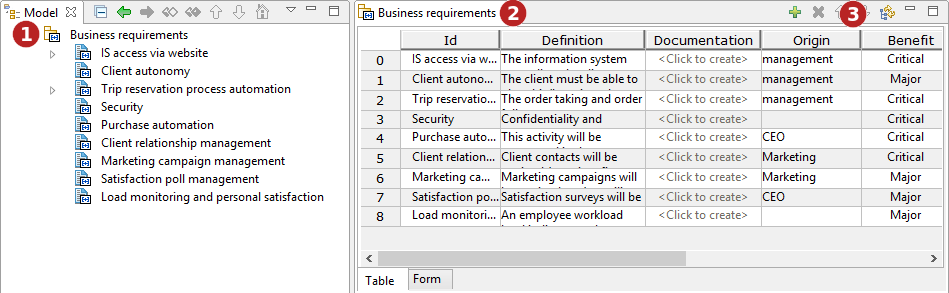
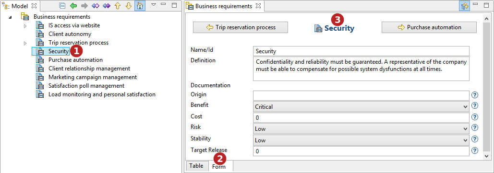

// Disable all captions for figures.
:!figure-caption:
// Path to the stylesheet files
:stylesdir: .

= The Analyst editor

.A Requirement table

*Keys:*

1. Double-click on a container to display its editor.
2. The editor is open on the container and display its elements with their properties.
3. Use the ' image:images/attachment/analyst41/User_Documentation_en/Analyst_editor/add.png[add.png] ' button to create a new element, '  ' to delete an existing one and ' image:images/attachment/analyst41/User_Documentation_en/Analyst_editor/moveup.png[moveup.png] ' and '  ' to mode up move down elements, if ' image:images/attachment/analyst41/User_Documentation_en/Analyst_editor/syncexplorer.png[syncexplorer.png] ' is checked, the Analyst editor while be synchronized with the model explorer.

.A Requirement form

*Keys:*

1. Select an requirement.
2. Click on the 'Form' tab to display the requirement form.
3. Use '  ' and '  ' to navigate through the requirements.
