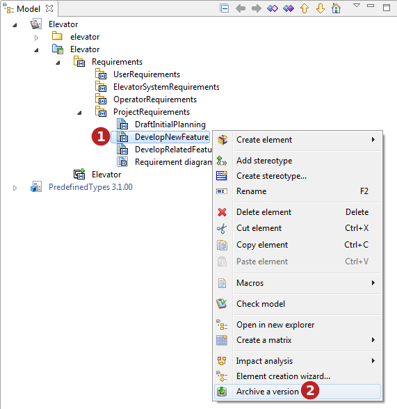
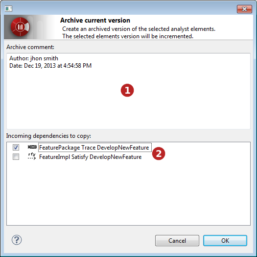
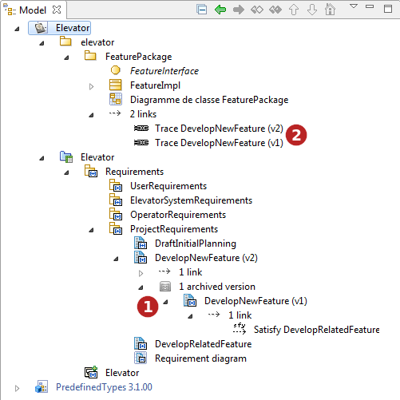

// Disable all captions for figures.
:!figure-caption:
// Path to the stylesheet files
:stylesdir: .

= Archive a version

== Introduction

This command allows you to make an archive of the selected analyst elements before modifying them. You can them modify the original analyst element and be able to compare it with its previous versions.

.Archive a version command

*Steps:*

1. Select an Analyst element.
2. Run the *Archive a version* command. 

== Archive dialog

The dialog box allows you to enter a comment. This comment will be added as a "comment" note on each archived analyst element.

When archiving analyst elements, Dependencies starting from theses elements are copied with them. Dependencies between the elements to archive are copied as well.

The "Archive" dialog allows you to choose incoming dependencies that should be copied too. +
The source element has then 2 Dependencies : one towards the original analyst element and one towards the archived version.

.Archive a version dialog box

*Steps:*

1. Enter a comment
2. Choose the incoming dependencies you want to archive too. 

== Explorer

The archived versions of an analyst element can be found in the browser under the "archived versions" tree item.

.Archived versions in the explorer

*Keys:*

1.  Archived analyst elements.
2.  Archived incoming dependencies.

*Note:* Archived analyst elements can be unmasked in a diagram as other analyst elements. You can then unmask many versions of the same analyst element in a diagram to compare them.
