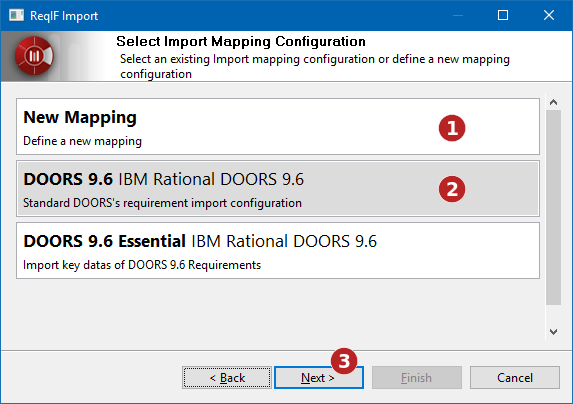
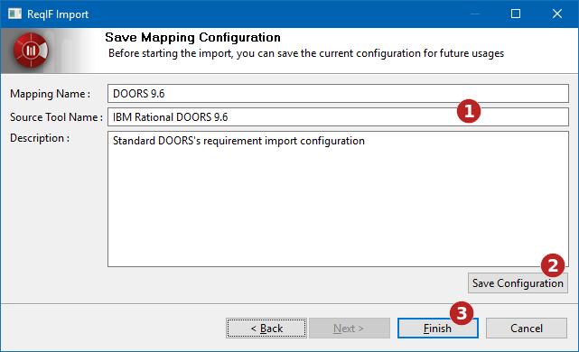
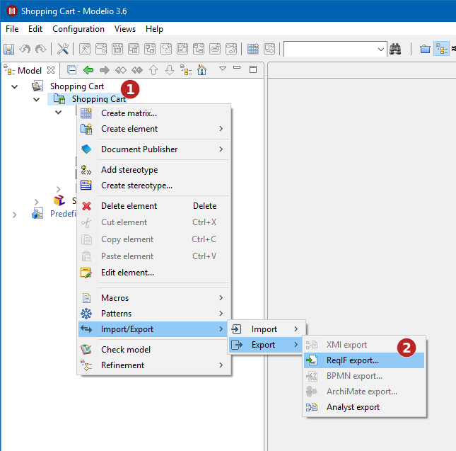
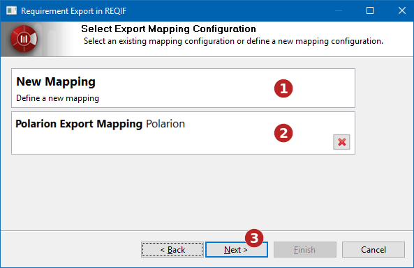

// Disable all captions for figures.
:!figure-caption:
// Path to the stylesheet files
:stylesdir: .

= ReqIF import and export

= ReqIF import

Modelio offers a feature to import requirements defined in ReqIF format. This will allow you to import requirements from major modeling tools such as DOORS, into Modelio.

Requirements are typed. Their type defines a list of properties of each requirement. To import requirements from a tool, you will have to set a mapping between the types provided by the external tool and ones defined in Modelio.

== Running the ReqIF import command

The ReqIF import command is available in the context menu of the Analyst sub-project:

image::images/attachment/analyst41/User_Documentation_en/Import_and_Export/ReqIF_import_and_export/reqif_import_000.png[reqif_import_000.png]

*Steps:*

1. Right-click on the Analyst sub-project. +
2. Run the "ReqIF import..." command.

== Selecting a file to import

image::images/attachment/analyst41/User_Documentation_en/Import_and_Export/ReqIF_import_and_export/reqif_import_001.png[reqif_import_001.png]

*Steps:*

1. Select the file to import. +
2. Proceed to the mapping selection.

== Selecting a mapping

To set a mapping of requirements types, Modelio provides several standard mappings for the main tools on the market, but also lets you define your own mappings. User-defined mapping can be saved for future use.

*Steps:*

1. Define a new mapping.
2. Or use an existing mapping.
3. Proceed to mapping configuration.

== Mapping configuration

The mapping configuration view is used to define how Modelio will process each of the types of requirements declared in the imported file.

For each type in the imported file, Modelio can:

* Create a new type in Modelio based on the imported type definition.
* Map the external type to an existing Modelio type.

In the second case, it will be required to define a mapping between each properties of the imported type, and the properties of the Modelio type.

Finally in Modelio, Requirements are organized in Requirements Containers. Some others Requirements tools use specific types to identify structural containers. These types can also be mapped in the mapping configuration.

image::images/attachment/analyst41/User_Documentation_en/Import_and_Export/ReqIF_import_and_export/reqif_import_003.png[reqif_import_003.png]

*Steps:*

1. The types of the imported file are presented in a specific tab.
2. Indicates if the type is a structural type.
3. Choose whether the external type has to be imported in Modelio or mapped to an existing Modelio type.
4. If the external type is imported, specify the name of the type in Modelio.
5. List of properties defined in the external type. A mapping must be defined for each of these properties.
6. Select the mapping of the properties.

* If the external type is imported into Modelio, an external property can be:
** Ignored: it will not be imported
** Mapped to Modelio Name or Requirement Definition
** Mapped to a newly created property (In this case, the name of the new property can be specified (  )
* If the external type is mapped to a Modelio type, an external property can be:
** Ignored : it will not be imported
** Mapped to a property of the Modelio type

== Saving a mapping

Once a specific import mapping has been defined, it can be saved for future use.

*Steps:*

1. Define a name, source tool and description for this mapping.
2. Save the mapping configuration.
3. Initiate the import process.

= ReqIF export

Modelio also offers a ReqIF export feature. This will allow you to export requirements from Modelio to major modeling tools such as DOORS.

Requirements are typed. This type defines the list of properties of each requirement. To export requirements to an external tool, you will have to set a mapping between the types provided by the external tool and ones defined in Modelio.

== Running the ReqIF export command

The ReqIF export command is available in the context menu of the Analyst sub-project:

*Steps:*

1. Right-click on the Analyst sub-project.
2. Run the "ReqIF export..." command.

== Selecting the export target

image::images/attachment/analyst41/User_Documentation_en/Import_and_Export/ReqIF_import_and_export/reqif_export_001.png[reqif_export_001.png]

*Steps:*

1. Select the path of the exported ReqIF file.
2. Proceed to mapping selection.

== Selecting an export mapping

Modelio provides several standard mappings for the main tools on the market, but also lets you define new export mappings. User-defined mappings can be saved for future use.

*Steps:*

1. Define a new export mapping.
2. Or use an existing export mapping.
3. Proceed to mapping configuration.

== Mapping configuration

The export mapping configuration view is used to define how each of the types of requirements used in Modelio will be exported in the ReqIF file.

For each type in Modelio, the export process can:

* Create a new type in the exported file based on the Modelio type definition.
* Map the Modelio type to a type supported by the targeted tool. In this case a template file of the external tool has to be registered, so that Modelio knows the types it supports (For example, a ReqIF file containing the list of types the external tool supports).

In the second case, it is necessary to define a mapping between the properties of the Modelio type and properties of the external type.

image::images/attachment/analyst41/User_Documentation_en/Import_and_Export/ReqIF_import_and_export/reqif_export_003.png[reqif_export_003.png]

*Steps:*

1. Select or add a template file: a ReqIF file exported by the target tool.
2. Select the Modelio property type to configure.
3. Choose whether the Modelio property type will be exported as a new type or mapped to a type defined in a specific template. In the first case, the name of the new exported type can be specified.
4. List of properties defined in the Modelio property type. A mapping must be defined for each of these properties.
5. Select the mapping of the properties.
* If the Modelio property type is exported as a new type, a property can be:
** Ignored: it will not be exported.
** Mapped to a newly created property (In this case, the name of the new property can be specified (  )).
* If the Modelio property type is mapped to a type defined in the selected template, a property can be:
** Ignored: it will not be exported.
** Mapped to a property defined in the selected template file.
6. Finish mapping configuration.

== Saving a mapping

Once a specific export mapping has been defined, it can be saved for future use.

image::images/attachment/analyst41/User_Documentation_en/Import_and_Export/ReqIF_import_and_export/reqif_export_004.png[reqif_export_004.png]

*Steps:*

1. Define a name, targeted tool name, and description for this mapping.
2. Save the mapping configuration.
3. Initiate the export process.
