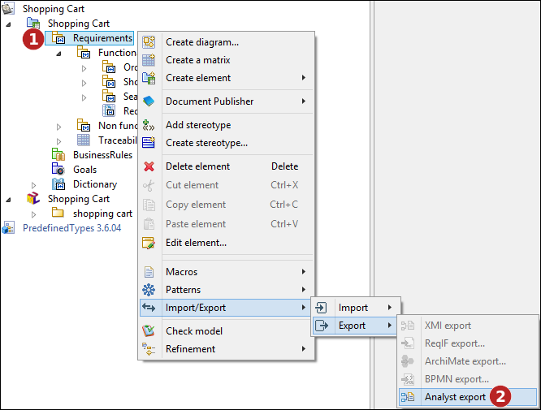

// Disable all captions for figures.
:!figure-caption:
// Path to the stylesheet files
:stylesdir: .

= Importing and exporting XML files

The "Import Analyst model" command imports the elements contained in a specified XML file into the element on which the command is being run.

The "Export Analyst model" command exports an element and the elements it contains into an XML file. This XML file is then available for future XML file import operations.

These commands can only be run on analyst containers.

.Importing/exporting XML files

*Steps:*

1. Right-click on the element you wish export/import.
2. Use either the Export or Import Analyst model commands from the 'Import/Export' menu.

=== DTD structure

The following is the DTD used in the import/export of Analyst elements.

[source,xml]
----
<?xml version="1.0" encoding="UTF-8"?>
	<!--
	***********************************************
	** XML Requirement exchange DTD **
	** Copyright Docaposte 2008-2023 **
	***********************************************
	-->
	<!ELEMENT RequirementsModel (Info*, RootPropertySet, RequirementContainer?, Dictionary?, Info*)>
	 <!ATTLIST RequirementsModel
	Origin CDATA #REQUIRED
	>
	<!ELEMENT RootPropertySet (PropertySet*, RootEnumeration)>
	<!ELEMENT PropertySet (Info*, Description?, Property*)>
	 <!ATTLIST PropertySet
	ID ID #REQUIRED
	Name CDATA #REQUIRED
	>
	<!ELEMENT Property (Info*, Description?)>
	 <!ATTLIST Property
	ID ID #REQUIRED
	Name CDATA #REQUIRED
	Type (integer | text | multiText | date | enumeration | real) #REQUIRED
	DefaultValue CDATA #IMPLIED
	EnumerationTypeID IDREF #IMPLIED
	isEditable (true | false) #IMPLIED
	applicableFor (Containers | Requirements | ContainersAndRequirements) #IMPLIED
	>
	<!ELEMENT Description (#PCDATA)>
	<!ELEMENT Info (#PCDATA)>
	 <!ATTLIST Info
	Vendor CDATA #REQUIRED
	Key CDATA #REQUIRED
	Value CDATA #IMPLIED
	>
	<!ELEMENT RootEnumeration (Enumeration*)>
	<!ELEMENT Enumeration (Description?, (Info | EnumerationLitteral)*)>
	 <!ATTLIST Enumeration
	ID ID #REQUIRED
	Name CDATA #REQUIRED
	>
	<!ELEMENT EnumerationLitteral (Info*, Description?)>
	 <!ATTLIST EnumerationLitteral
	ID ID #REQUIRED
	Name CDATA #REQUIRED
	>
	<!ELEMENT RequirementContainer (Info*, Description?, (PropertyValue | Info | RequirementContainer | BusinessRuleContainer | GoalContainer | Requirement | BusinessRule | Goal)*, Traceability*)>
	 <!ATTLIST RequirementContainer
	ID ID #REQUIRED
	Name CDATA #REQUIRED
	PropertySetID IDREF #IMPLIED
	>
	<!ELEMENT BusinessRuleContainer (Info*, Description?, (PropertyValue | Info | BusinessRuleContainer | BusinessRule)*, Traceability*)>
	 <!ATTLIST BusinessRuleContainer
	ID ID #REQUIRED
	Name CDATA #REQUIRED
	PropertySetID IDREF #IMPLIED
	>
	<!ELEMENT GoalContainer (Info*, Description?, (PropertyValue | Info | GoalContainer | Goal)*, Traceability*)>
	 <!ATTLIST GoalContainer
	ID ID #REQUIRED
	Name CDATA #REQUIRED
	PropertySetID IDREF #IMPLIED
	>
	<!ELEMENT Dictionary (Info*, Description?, (Info | Dictionary | Term | PropertyValue)*, Traceability*)>
	 <!ATTLIST Dictionary
	ID ID #REQUIRED
	Name CDATA #REQUIRED
	PropertySetID IDREF #IMPLIED
	>
	<!ELEMENT Requirement (Info*, Description?, (Info | PropertyValue | Traceability)*)>
	 <!ATTLIST Requirement
	ID ID #REQUIRED
	Name CDATA #REQUIRED
	>
	<!ELEMENT BusinessRule (Info*, Description?, (Info | PropertyValue | Traceability)*)>
	 <!ATTLIST BusinessRule
	ID ID #REQUIRED
	Name CDATA #REQUIRED
	>
	<!ELEMENT Goal (Info*, Description?, (Info | PropertyValue | Traceability)*)>
	 <!ATTLIST Goal
	ID ID #REQUIRED
	Name CDATA #REQUIRED
	>
	<!ELEMENT Term (Info*, Description?, (Info | PropertyValue | Traceability)*)>
	 <!ATTLIST Term
	ID ID #REQUIRED
	Name CDATA #REQUIRED
	>
	<!ELEMENT PropertyValue (Info*)>
	 <!ATTLIST PropertyValue
	PropertyID IDREF #REQUIRED
	Value CDATA #REQUIRED
	>
	<!ELEMENT Traceability (Info*)>
	 <!ATTLIST Traceability
	DestinationID IDREF #IMPLIED
	>
</xml>
----
