// Disable all captions for figures.
:!figure-caption:
// Path to the stylesheet files
:stylesdir: .

= Using Word with Modelio Analyst

== Introduction

Word can be used with the Analyst module, providing you with a means of marking elements in existing Word documents as being requirement containers or requirements. Word documents can then be generated as XML files, which you can then import into Modelio, in order to automatically build the corresponding Requirement Analyst project.

A dedicated model is provided for coupling Word to Requirement Analyst:

1.   <<User_Documentation_en_MS_Word_bridge.adoc#Coupling_Word2013,Coupling Word 2013 to Analyst>>
2.   <<User_Documentation_en_MS_Word_bridge.adoc#Coupling_Word2007,Coupling Word 2007 to Analyst>>
3.   <<User_Documentation_en_MS_Word_bridge.adoc#Coupling_Word2002,Coupling Word 2002 to Analyst>>

 
== Coupling Word 2013 to Analyst

Add the "Modelio Analyst Model 2013.dot" model to a Word 2013 document

.Coupling Word 2007 to Analyst
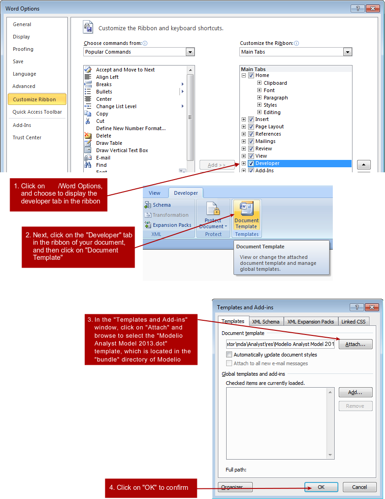

Add the "Modelio Analyst Model.dot" model to a Word 2007 document

.Adding the "Modelio Analyst Model.dot" file to a Word 2007 document
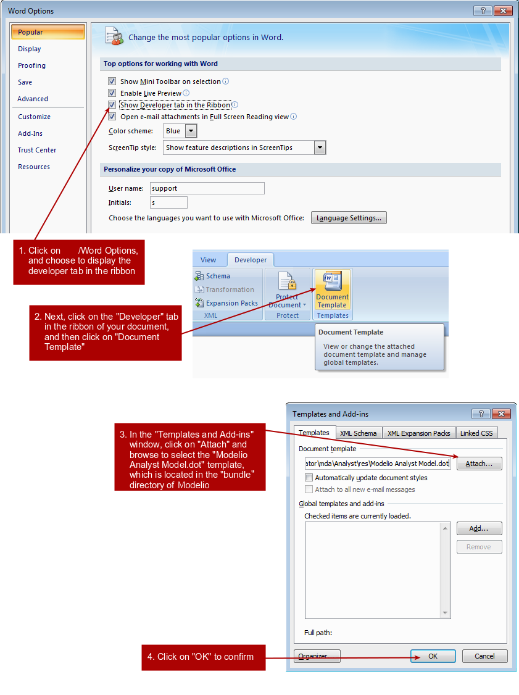

The result of this operation in your Word 2007 document is shown below.

.The Modelio toolbar available in your Word 2007 document
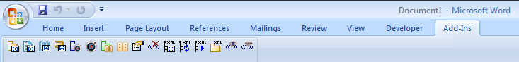

== [[Coupling_Word2002]] Coupling Word 2002 to Analyst

Add the "Modelio Analyst Model 2002.dot" model to a Word 2002 document

.Adding the "Modelio Analyst Model.dot" file to a Word 2002 document
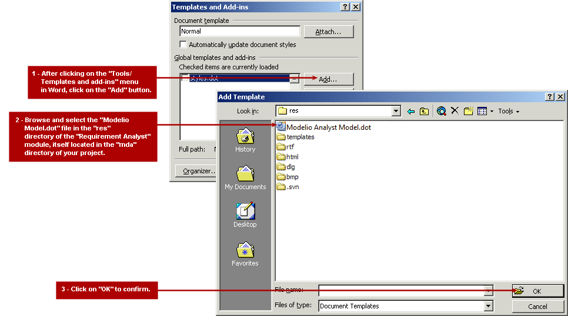

The result of this operation is shown below.

.The "Modelio Analyst Model.dot" model can now be selected
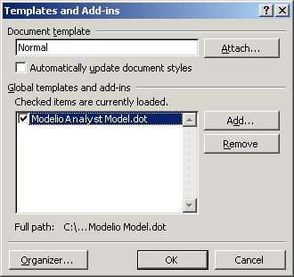

After making sure that the associated tickbox is checked, just click on "OK" to apply this model to your existing Word document. The result of this operation in Word is shown below.

.The Modelio toolbar available in your Word 2002 document
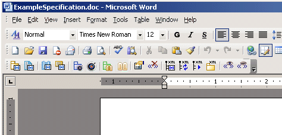

== Tagging elements in a Word document

===== Marking an element as being a requirement container or a requirement

To mark an element in a Word document as being a requirement container or a requirement, carry out the following steps:

1.  Highlight the definition of the element in the Word document and then click on the corresponding marker icon.
2.  Define a name for the element. By default, the first word in the description is suggested as the element name.

The following screenshot shows an example of a requirement container being marked in a Word document.

.Marking an element as being a requirement container
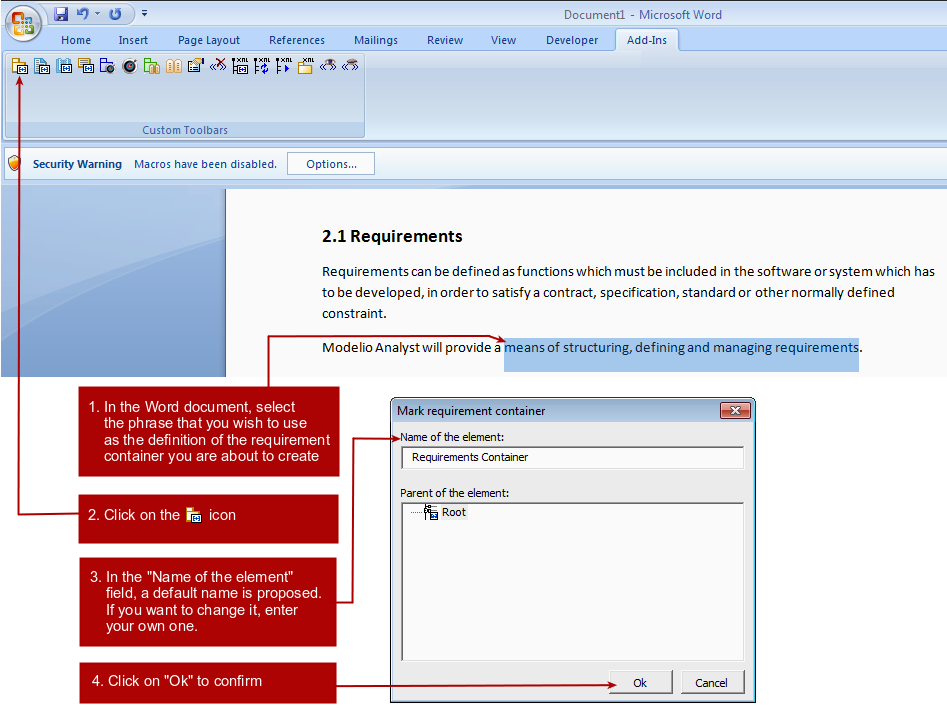

The result of this operation is shown below.

.The newly marked requirement container
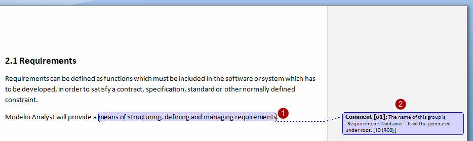

*Steps:*

1. The selected element is then displayed over a coloured background and with a reference in brackets after it.
2. An information panel appears, informing you of the name of the element and its position in the hierarchy. 

== Managing tagged elements

===== Basic hierarchy

Before marking any elements in your Word document, a basic hierarchy already exists, as shown in the screenshot below (this window is opened by clicking on the image:images/attachment/analyst41/User_Documentation_en/MS_Word_bridge/Analyst-MS_Word_bridge_req_hier.png[Analyst-MS_Word_bridge_req_hier.png] icon in the Analyst toolbar).

.The basic hierarchy window
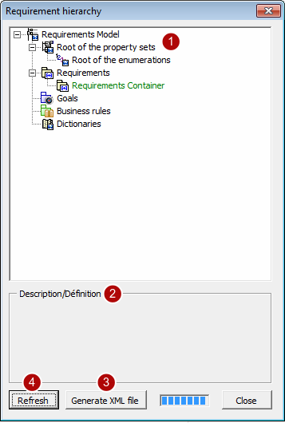

*Keys:*

1. The basic hierarchy of elements, consisting of:
* a root for property sets
* a root for enumerations
* a root for requirements
* a root for goal containers
* a root for business rules
* a root for dictionaries
2.  A field which shows the description of an element.
3.  A "Generate XML file" button, used to generate the XML file which can then be imported into Modelio.
4.  A "Refresh" button, used to refresh the view. [[Defining-the-properties-of-a-marked-element]]

===== Defining the properties of a marked element

When marking elements in a Word document, you can select where you wish the element to be located:

* Requirement containers can be located either under the root requirement container or under a requirement container already marked in the document.
* Requirements can be located either under the root requirement container or under a requirement container already marked in the document.

The following screenshot illustrates the marking of a requirement and the selection of its location.

.Marking a requirement in the "Initial phase" requirement container
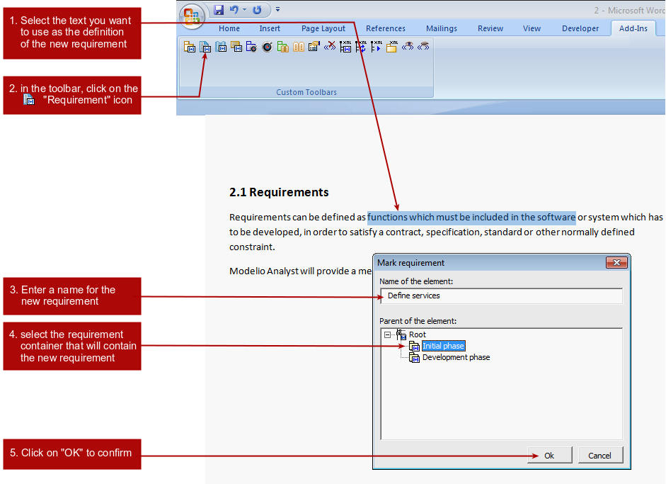

The new requirement is then located inside the selected requirement container in the hierarchy window, as shown in the screenshot below.

.The hierarchy window now shows the new requirement
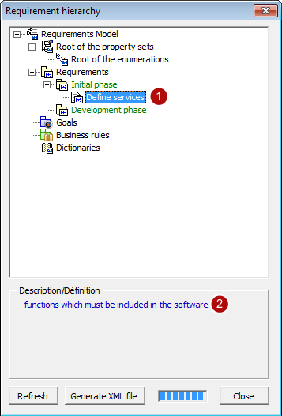

*Keys:*

1. Everything marked by you (in other words, everything which is not the basic hierarchy) appears in green.
2. The description of the marked element appears in the "Description/Definition" field.

*Note:* If you click on an element in the hierarchy window, the element is automatically selected in the Word document. This can be particularly useful if you are working with large documents. 

===== Modifying the properties of a marked element

If you want to change the properties (name and location) of a marked element, click on a marked element and then click on the "Display properties" icon in the toolbar.

For example, let's imagine we want to change the name and location of the requirement marked in the previous example. Simply carry out the steps shown below.

.Modifying the properties of a requirement
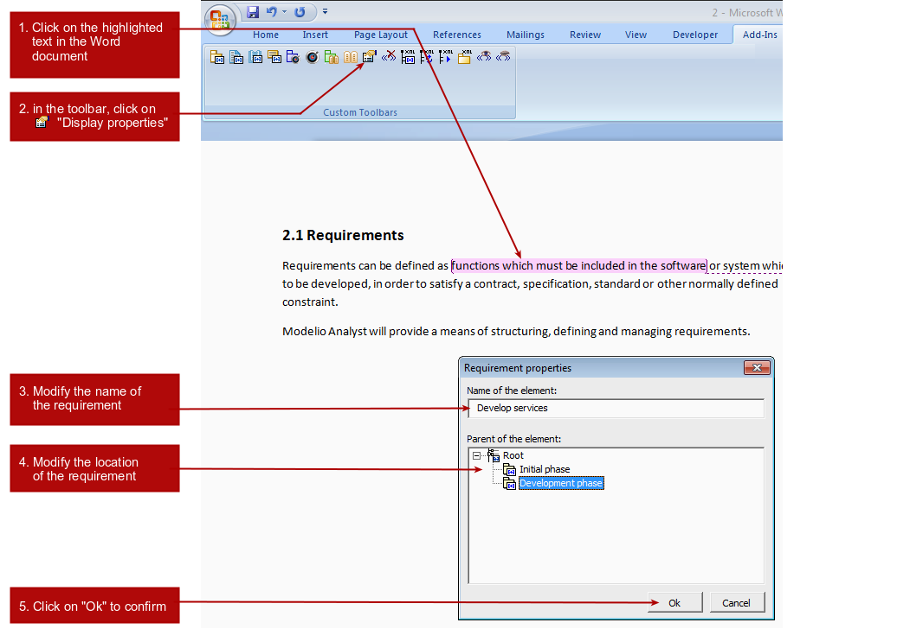

*Note:* If the hierarchy window is already open when modifications are made, it must be closed and then re-opened before changes become visible.

== Generating the XML file

===== Generating the XML file

Once you have finished marking Word elements as being requirement containers and requirements, the next step is to generate the corresponding XML file which will be imported into Modelio.

.Generating the XML file
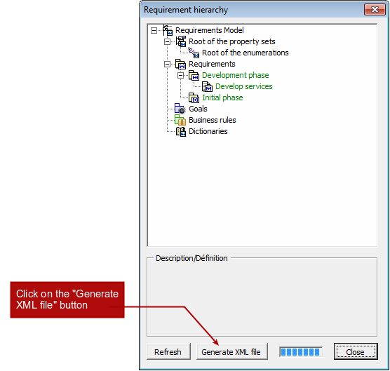

*Note:* The XML file is generated where the original Word document is located. 

== Other Analyst functions available in Word

===== Deleting markers

To delete markers added to elements in a Word document, the image:images/attachment/analyst41/User_Documentation_en/MS_Word_bridge/Analyst-MS_Word_bridge_worddel.gif[Analyst-MS_Word_bridge_worddel.gif] "Delete marker" icon is used. Just position the cursor over a marked element or highlight a marked element, and then click on this icon. The selected marked element is deleted. [[Selecting-elements-in-the-Modelio-hierarchy]]

===== Selecting elements in the Modelio hierarchy

To select elements from the Word document in the Modelio hierarchy window, the image:images/attachment/analyst41/User_Documentation_en/MS_Word_bridge/Analyst-MS_Word_bridge_wordshie.gif[Analyst-MS_Word_bridge_wordshie.gif] "Select in hierarchy" icon is used. Just click on a marked element, and then click on this icon. The focus automatically jumps to the selected element in the requirement hierarchy. [[Launching-XML-generation]]

===== Launching XML generation

The 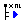 "Generate XML file" icon launches the generation of your XML file. This button is the equivalent of the "Generate XML File" button in the hierarchy window. [[Modifying-the-generated-XML-file]]

===== Modifying the generated XML file

The image:images/attachment/analyst41/User_Documentation_en/MS_Word_bridge/Analyst-MS_Word_bridge_changexml.gif[Analyst-MS_Word_bridge_changexml.gif] "Change generated XML file" icon opens the window used to configure the name and location of the XML file generated. This window is shown in the screenshot below.

.The "Modify XML file generated" window
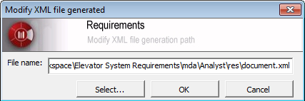

To change the name or location of your XML file, just enter the new information in this window and press "OK" to confirm. [[Showing-markers]]

===== Showing markers

If markers are not visible in a Word document, the 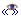 "Show markers" icon can be used to make them appear. Just click on this icon, and all marked elements in the document will be highlighted. [[Masking-markers]]

===== Masking markers

If markers are visible in a Word document, the 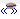 "Mask markers" icon can be used to no longer display them. Simply click on this icon, and marked elements in the document will no longer be highlighted.
