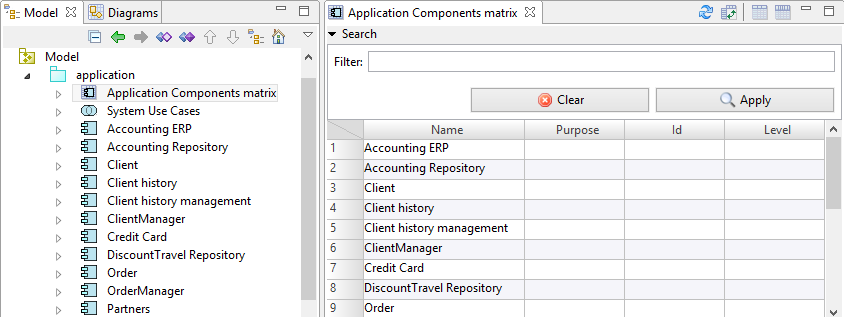
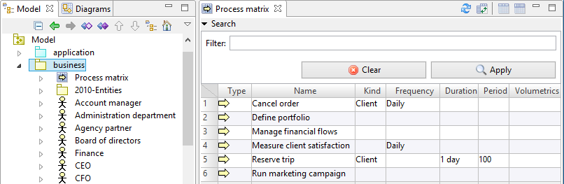

// Disable all captions for figures.
:!figure-caption:
// Path to the stylesheet files
:stylesdir: .

= ArchiMate Matrices

Modelio ArchiMate comes with 3 kinds of matrices:

*  <<User_Documentation_en_ArchiMateMatrices.adoc#HNomenclatures,Nomenclatures>>
*  <<User_Documentation_en_ArchiMateMatrices.adoc#HApplicationComponentmatrix,Application Component matrix>>
*  <<User_Documentation_en_ArchiMateMatrices.adoc#HProcessmatrix,Process matrix>>
*  <<User_Documentation_en_ArchiMateMatrices.adoc#HFlowmatrix,Flow matrix>>

== Nomenclatures

Nomenclatures display information about elements in table format on a part or a whole ArchiMate model. +
The content is filtered depending on the nomenclature location and a configurable filter. +
The nomenclature may also serve in the definition of a generated document.

=== Usage

A nomenclature may be created on:

* an ArchiMate Model: the nomenclature will include the whole model content;
* a layer: the nomenclature will include the layer content;
* a view point: the nomenclature will include the elements represented in the viewpoint diagrams.

=== Description

image::images/attachment/archimate41/User_Documentation_en/ArchiMateMatrices/Nomenclature.png[Nomenclature.png]

The nomenclature view is divided in 3 parts: the configuration area, the search area and the table.

==== Configuration area

This area is used to filter the nomenclature content by layer, element kind and view point when applicable.

* *Layers* : Filters the table to display only elements in the selected layers. It also removes those who can't belong to the selected layers from the element kind list.
* *Kinds* : Filters the table to display only elements of the selected kind.
* *Current view point* : This option is available only when the nomenclature is located in a view point. Filters the table to display only elements represented in diagrams in the view point.

==== Search area

You may filter displayed elements by typing a part of the name.

==== Table

The table displays the filtered elements.

You may sort by columns by double-clicking on the header.

Right-clicking on a column header displays a context menu letting you to choose the displayed columns.

== Application Component matrix

This matrix displays Application Components and their properties in table format, on a part or a whole ArchiMate model.

The content is filtered depending on the matrix location.

=== Usage

An Application Component matrix may be created on:

* an ArchiMate Model: the matrix will display every Application Component that is part of the model;
* an Application layer: the matrix will include every Application Component in this layer;
* a view point: the matrix will include all Application Components represented in the viewpoint diagrams.

=== Description

The matrix view is divided in 2 parts: the search area and the table.

==== Search area

You may filter displayed processes by typing a part of their name.

==== Table

The table displays the filtered elements. Each property can be edited directly in the matrix.

You may sort by columns by double-clicking on the header.

Right-clicking on a column header displays a context menu allowing you to choose the displayed columns.

== Process matrix

This matrix displays Processes and their properties in table format, on a part or a whole ArchiMate model.

The content is filtered depending on the matrix location.

=== Usage

A Process matrix may be created on:

* an ArchiMate Model: the matrix will display every Process that is part of the model;
* an Application, Business or Technology layer: the matrix will include every Process in this layer;
* a view point: the matrix will include all Processes represented in the viewpoint diagrams.

=== Description

The matrix view is divided in 2 parts: the search area and the table.

==== Search area

You may filter displayed processes by typing a part of their name.

==== Table

The table displays the filtered elements. Each property can be edited directly in the matrix.

You may sort by columns by double-clicking on the header.

Right-clicking on a column header displays a context menu allowing you to choose the displayed columns.

== Flow matrix

This matrix displays Flow relationships in table format, on a part or a whole ArchiMate model.

The content is filtered depending on the matrix location.

=== Usage

A Flow matrix may be created on:

* an ArchiMate Model: the matrix will display every Flow that is part of the model;
* any layer: the matrix will include every Flow starting from an element belonging to this layer;
* a view point: the matrix will include all Flows represented in the viewpoint diagrams.

=== Description

image::images/attachment/archimate41/User_Documentation_en/ArchiMateMatrices/FlowMatrix.png[FlowMatrix.png]

The matrix view is divided in 2 parts: the search area and the table.

==== Search area

You may filter displayed flows by typing a part of their name.

==== Table

The table displays the filtered elements, including the flow sources and targets.

You may sort by columns by double-clicking on the header.

Right-clicking on a column header displays a context menu allowing you to choose the displayed columns.
