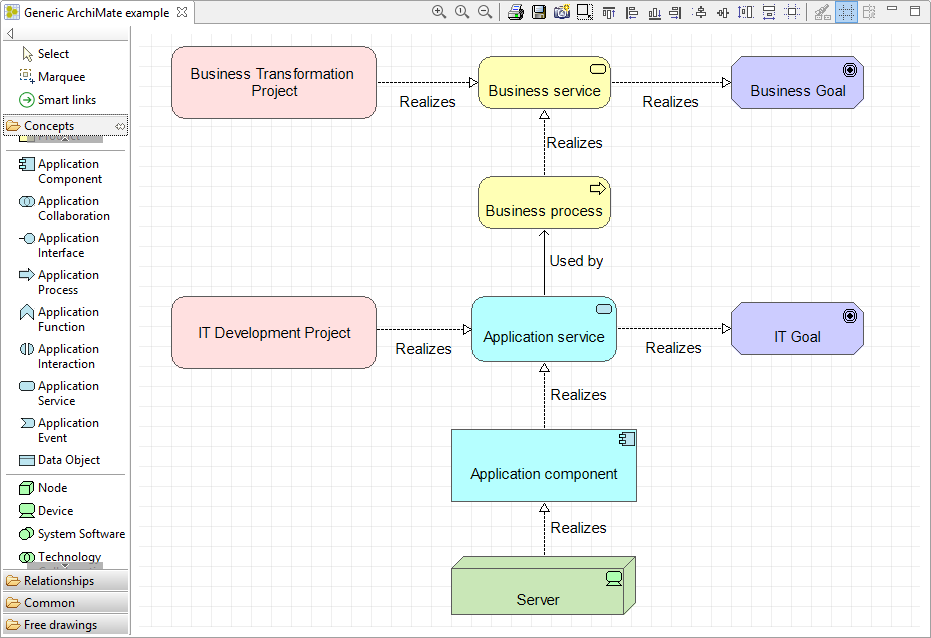
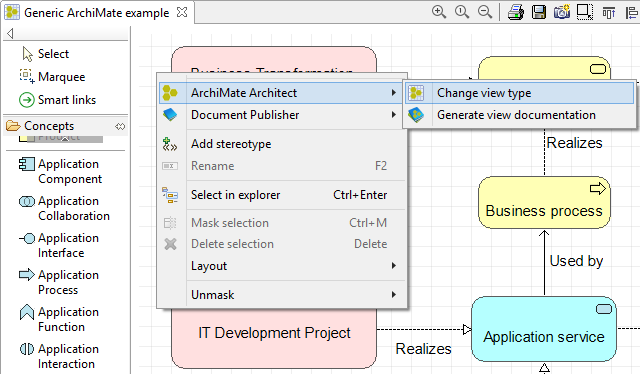
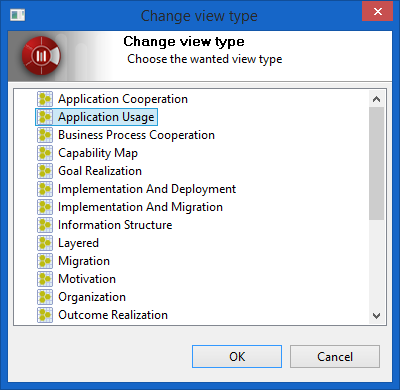
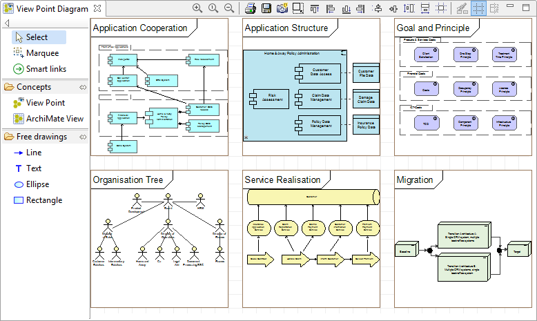

// Disable all captions for figures.
:!figure-caption:
// Path to the stylesheet files
:stylesdir: .

= Modelio ArchiMate views

In ArchiMate *views* are a partial representation of the model, just like UML diagrams. They are pictures of a set of model element displayed together according to business, user profile or interest criteria.

In Modelio, ArchiMate views are always organized in <<User_Documentation_en_ArchimateModel.adoc#,ViewPoints>>. They intend to convey information about a specific part of the model for specific stakeholdes, with a particular purpose.

= ArchiMate global view

The easiest way to create ArchiMate model in Modelio is through an ArchiMate global view.

It is used to create any kind of ArchiMate elements, regardless of their layer. As soon as a new element is created in the view, it is automatically attached to the corresponding layer in the model itself.

.An example of ArchiMate global view

This view is used to create any kind of ArchiMate elements, regardless of their layer. As soon as a new element is created in the view, it is automatically attached to the corresponding layer in the model itself.

*Note:* When the ArchiMate model is part of a SVN fragment, using the "Get Lock" or "Commit" commands on the view itself with the "recursive" option checked applies to the view AND all elements displayed in it.

== Changing view type

Being able to create every element in a view is a good thing, but sometimes it is better to handle only a specific aspect at a time.

On the ArchiMate view itself, it is therefore possible to change the view type, i.e. changing the point you are looking the model from.

.Changing the view type

Launching the "change view type..." command opens the following dialog box to select a new view type:

.Choosing Application Usage as specialized view type

The list of view types to choose from is Modelio's interpretation of the _informative example viewpoints_ defined in the ArchiMate 3.1 specification (https://pubs.opengroup.org/architecture/archimate3-doc/), This concept has been split from ArchiMate's Viewpoint definition, and they should not be confused. See <<User_Documentation_en_ArchimateModel.adoc#,Modelio's ViewPoint definition>> for more information.

Once the new type is chosen, the view itself changes:

.An example of Application Usage view
image::images/attachment/archimate41/User_Documentation_en/ArchimateDiagram/ApplicationUsageDiagram.png[ApplicationUsageDiagram.png]

In this example, two main changes are to be noticed:

1.  The palette contains only a subset of the ArchiMate concepts and relationships, relevant in an Application Usage view.
2.  Concepts that can't be created in this view are automatically shown with a transparent background, indicating they are outside of the selected aspect.

Once the work on this aspect of the model is done, launch the command again switch to another one, or go back to the universal global view.

*Note:* from a technical point of view, the view type is represented as a stereotype applied on the view itself, meaning it is possible to define new view types in a module!

=  ArchiMate View Point diagram

In Modelio, viewpoints might contain numerous ArchiMate views, but ViewPoint diagrams exist to have an instant overview of all these diagrams.

.An example of View Point diagram

A View Point diagram automatically displays:

* thumbnails for each ArchiMate views existing as siblings of the View Point diagram.
* child View Points of the diagram's owner View Point.

In a nutshell, a View Point diagram can be used as a graphical table of contents, making easy to find a specific view even in a huge model...

*Note:* Double click on a thumbnail to open the corresponding view.

== Configuring a View Point diagram

When selecting a View Point diagram, some layout configuration becomes available in the symbol view:

It is used to create any kind of ArchiMate elements, regardless of their layer. As soon as a new element is created in the view, it is automatically attached to the corresponding layer in the model itself.

It is used to create any kind of ArchiMate elements, regardless of their layer. As soon as a new element is created in the view, it is automatically attached to the corresponding layer in the model itself.

*Note:* When the ArchiMate model is part of a SVN fragment, using the "Get Lock" or "Commit" commands on the view itself with the "recursive" option checked applies to the view AND all elements displayed in it.

*Note:* When the ArchiMate model is part of a SVN fragment, using the "Get Lock" or "Commit" commands on the view itself with the "recursive" option checked applies to the view AND all elements displayed in it.

.Configuring a View Point diagram
image::images/attachment/archimate41/User_Documentation_en/ArchimateDiagram/Symbol.png[Symbol.png]

=== Automatic layout

With the automatic layout on, all elements are organized in a table. The number of columns can be edited according to your needs, as well as the default size for all elements.

The diagram only accepts creation of View Points and ArchiMate views, it should not be possible to unmask anything else in it.

=== Manual layout

With the automatic layout off, it becomes possible to unmask only a subset of views or sub View Points in the diagram, instead of displaying all of them.

It can also be used to simply change the diagram's general organization, grouping views by whatever criteria you want rather than having them in the model's order.
