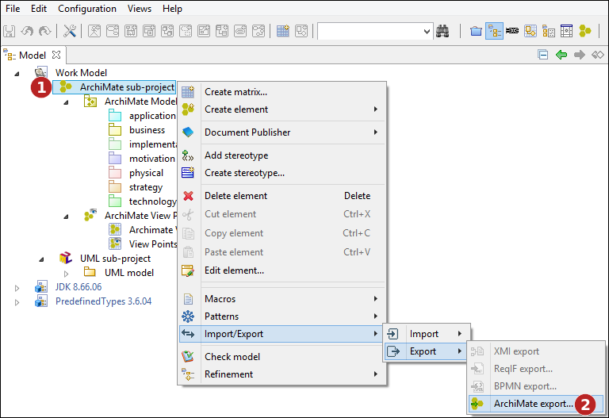

// Disable all captions for figures.
:!figure-caption:
// Path to the stylesheet files
:stylesdir: .

= ArchiMate exchange

Modelio offers a feature to exchange ArchiMate models defined with the Open Group ArchiMate Model Exchange File Format. This will allow you to exchange models with other modeling tools such as Archi.

== Supported format and versions

The ArchiMate exchange feature supports the 2.1, 3.0 and 3.1 ArchiMate Model Exchange File Formats, as defined by the Open Group (https://www.opengroup.org/xsd/archimate/),

== Running the ArchiMate import command

The ArchiMate import command is available in the context menu of an ArchiMate sub-project, or of a work model:

image::images/attachment/archimate41/User_Documentation_en/ImportExport/ImportArchiMate.png[ImportArchiMate.png]

*Steps:*

1. Right-click on the work model or on the ArchiMate sub-project. +
2. Run the "ArchiMate import..." command.

=== Selecting a file to import

image::images/attachment/archimate41/User_Documentation_en/ImportExport/ArchiMateImportFile.png[ArchiMateImportFile.png]

*Steps:*

1. Select the file to import. +
2. Indicate the format of the file to import. +
3. Whether or not the import should keep the identifiers defined in the imported file, or map them to new modelio identifiers (UUIDs). +
4. Launch import.

*Note:* when keeping identifiers, each element already existing in the model and having the same identifier as an imported element will automatically be updated.

== Running the ArchiMate export command

The ArchiMate export command is available in the context menu of an ArchiMate sub-project or an ArchiMate model:

*Steps:*

1. Right-click on the ArchiMate sub-project. +
2. Run the "ArchiMate export..." command.

=== Selecting the export target

image::images/attachment/archimate41/User_Documentation_en/ImportExport/ArchiMateExportFile.png[ArchiMateExportFile.png]

*Steps:*

1. Select the path of the exported ArchiMate file. +
2. Indicate the format of the file to export. +
3. Launch export.
