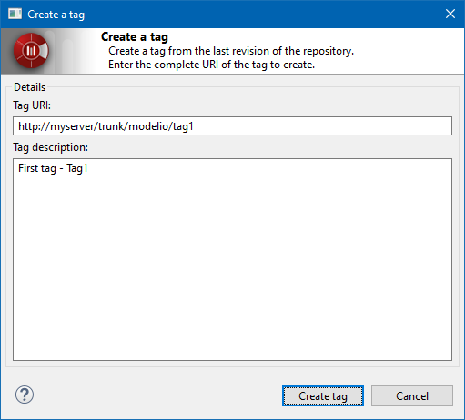

// Disable all captions for figures.
:!figure-caption:
// Path to the stylesheet files
:stylesdir: .

= The "Create a tag" command

===== Description

This command allows a user with sufficient rights to create a tag or branch for the model.

A dialog box allows the user to enter the complete tag URL and a description. The tag URL must be an absolute URL that must be inside the repository. The tag/branch is created for the latest repository revision. [[Conditions-and-restrictions]]

===== Conditions and restrictions

The command can only be run on elements that are not modified. [[User-interface]]

===== User interface

The "Create a tag" command opens the following window:

.The "Create a tag" window

===== Behavior

The "Create a tag" command create an tag or branch for the model.
