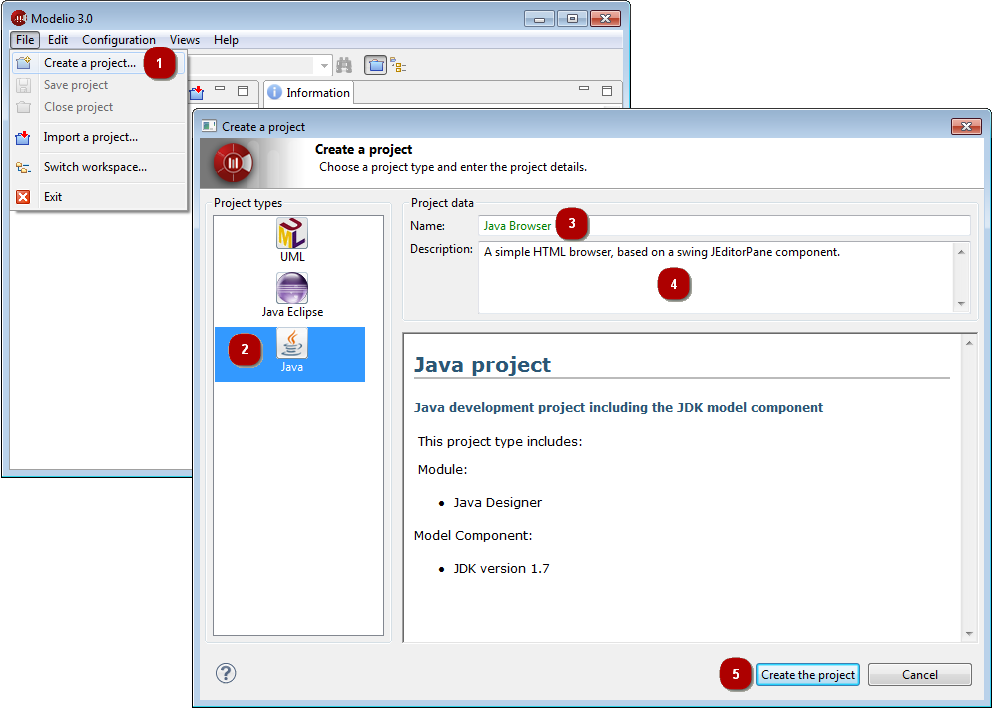

// Disable all captions for figures.
:!figure-caption:
// Path to the stylesheet files
:stylesdir: .

= Creating a project

.Creating a new project

*Steps:*

1. Click on "File\Create a project...".
2. Choose the Project type to use for your project.
3. Enter the name of the project.
4. enter the description of the project.
5. Click on "Create" to create and open the project.

*Note:* Each project name is unique, and it is not possible to create two projects with the same name.
