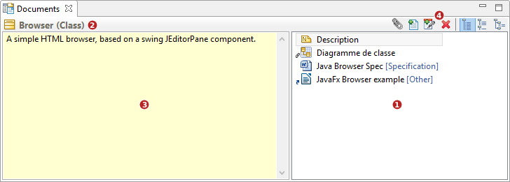
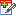
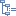

// Disable all captions for figures.
:!figure-caption:
// Path to the stylesheet files
:stylesdir: .

= Document View

The document view is shown in the figure below:

The document view is composed of:

1.  A Documentation item list showing the available documentation items available for the model element currently selected in the application
2.  A context reminder (ie the currently selected element whose documentation items are currently displayed)
3.  A direct edition area for Description notes or a preview area for diagrams and documents
4.  A Toolbar supporting the following commands (from left to right)
1.  image:images/attachment/modeliocom41/User_Documentation_en/Document_view/Document_View/attachdocument.png[attachdocument.png] Attach an external document
2.  image:images/attachment/modeliocom41/User_Documentation_en/Document_view/Document_View/document.png[document.png] Create an embedded document
3.   Add a description note
4.  image:images/attachment/modeliocom41/User_Documentation_en/Document_view/Document_View/delete.png[delete.png] Delete a documentation item
5.  image:images/attachment/modeliocom41/User_Documentation_en/Document_view/Document_View/byname.png[byname.png] Sort the documentation items by name
6.  image:images/attachment/modeliocom41/User_Documentation_en/Document_view/Document_View/bytype.png[bytype.png] Sort the documentation items by type
7.   Sort the documentation items by category
