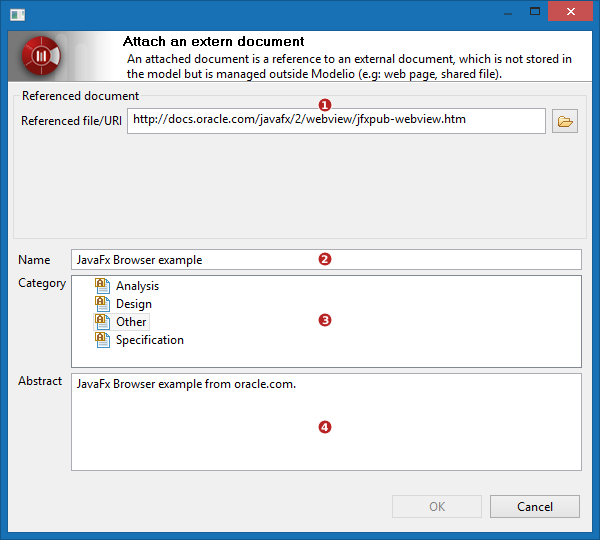

// Disable all captions for figures.
:!figure-caption:
// Path to the stylesheet files
:stylesdir: .

= Using the Document View

In the following description of the Document View commands, the currently selected model element will be noted *ELT* for text concision.

=== Adding a description note to ELT

The _"first"_ description note on a model element is provided freely by Modelio, meaning that no particular action is required from the end-user excepted providing the description text in the preview area. Modelio will create the description note as soon as some contents is provided. This is why, whatever the selected model element is and whether or not it actually has a description note, the document view will show a (potentially empty) description note that can be directly edited to describe the model element.

The end-user can add supplementary description notes when required by following the procedure described below:

1.  Click on the image:images/attachment/modeliocom41/User_Documentation_en/Document_view/Using_the_Document_View/adddescription.png[] button in the document view toolbar.
2.  A new description note appears in the documentation item list, the note is selected in the list.
3.  The note contents can be directly edited in the preview area which is now displaying a HTML editor.

_*Advice:*_ _Especially when a model element has several description notes, rename the notes using significant names to further help the future readers of the model._

Additional interactions for description notes: ::

1.  a *right click* on the description note in the documentation item list pops a command menu that allows to copy, cut, delete or switch the HTML/Text type of the note.
2.  a *double click* on the description note in the documentation item list pops the note properties edition dialog box where typically *the note can be renamed*.
3.  *F2* on the description note in the documentation item list enables direct renaming of the note.

=== Adding an embedded document to ELT

The end-user can add embedded documents to ELT by following the procedure described below:

1.  Click on the image:images/attachment/modeliocom41/User_Documentation_en/Document_view/Using_the_Document_View/document.png[] button in the document view toolbar.
2.  The "Create an embedded document" dialog box appears
3.  Fill the dialog form fields and validate
4.  A new document appears in the documentation items list, it is selected in the list, the preview area shows the document contents (as an approximation preview)

image::images/attachment/modeliocom41/User_Documentation_en/Document_view/Using_the_Document_View/CreateAnEmbeddedDocumentPuces.png[]

1. *Document name* : enter a name of the document. +
_This name is the one that appears in the documentation item list, choosing a short but significant name is highly recommended._
2. *Document category* : choose a category for the document. +
_The document category will help sorting the documentation items list, it is also an indication of the document purpose._ +
The proposed categories depend on the project configuration (modules), by default they are:
* Analysis
* Design
* Specification
* Other
3. *Document abstract* : Fill this field with a short text summarizing the document abstract: content summary, document role, document origin and so on. +
_The abstract will appear in the tooltip of the documentation item in the documentation items list._ +
_It is also displayed when the document is unmasked in a diagram._ +
_The use of the abstract is highly recommended._
4. *Document MIME format* : The available MIME formats depend on the applications installed on your workstation.
* MS Office: Word, Excell, Power Point, etc.
* Libre/Open Office: Writer, Calc, Presentation, etc.
5. *Initialize document contents* : Check this option to initialize new document contents with some provided initial contents. +
_When you check this option, the field 'Initialization document' becomes enabled. This field is used to enter a local file path to a document of the same format as the document to create. The contents of this initialization document will be copied in the new document. The initialization document will remained untouched._

=== Attaching an external document to ELT

The end-user can add attach any document to ELT by following one of the two procedures described below:

Procedure 1 - Toolbar command

1. Click on the image:images/attachment/modeliocom41/User_Documentation_en/Document_view/Using_the_Document_View/attachdocument.png[attachdocument.png] button in the document view toolbar.
2. The Attach an external document dialog box appears
3. Fill the dialog form fields and validate
4. A new document reference appears in the documentation items list, it is selected in the list, the preview area shows the document contents (as an approximation preview)

Procedure 2 - Drag and drop

1. Select the model element you are willing to attach an external document to in the model
2. From a file browser, drag and drop a file directly in the Document View
3. The Attach an external document dialog box appears
4. Complete the dialog form fields and validate
5. The dropped document is now attached as an external document to the model element

1.  *Reference file/url* : Enter a reference to the document to attach to ELT. +
_The reference can be a file path that you can either enter directly in the field or select by using the browser image:images/attachment/modeliocom41/User_Documentation_en/Document_view/Using_the_Document_View/filechooser.png[filechooser.png] button. Network file paths are supported depending on the platform._ +
_The reference can be an URL, in which case it has to be entered manually. Modelio checks the accessibility of the URL and indicate unreachable URL when the situation occurs._
2.  *Document name* : enter a name of the document. +
_This name is the one that appears in the documentation item list, choosing a short but significant name is highly recommended.If left empty, the file/URI name will be used._
3.  *Document category* : choose a category for the document. +
_The document category will help sorting the documentation items list, it is also an indication of the document purpose._ +
The proposed categories depend on the project configuration (modules), by default they are:
* Analysis
* Design
* Specification
* Other
4.  *Document abstract* : Fill this field with a short text summarizing the document abstract: content summary, document role, document origin and so on. +
_The abstract will appear in the tooltip of the documentation item in the documentation items list._ +
_It is also displayed when the document is unmasked in a diagram._ +
_The use of the abstract is highly recommended._ +

=== Editing an existing document of ELT

The edition of a document differs whether it is an embedded document or an external document. In both cases, the preview area cannot be used for editing.

===== Description notes

Description notes are directly editable in the preview area. When a description is selected, the preview area displays an HTML or a simple text editor that is enabled to edit the note contents.

Remember however that the edition remains conditioned to 'write' permissions on the note and the element. For example, you can neither edit the note of a read-only model element from a RAMC nor the notes of a CMS locked element.

===== Embedded documents

1.  double-click the document in the document items list +
(or right-click the document in the document items list and choose the open editor command from the popup menu)
2.  The document is opened in a dedicated editor in Modelio *at the mandatory condition that its format is supported by your system.*
3.  Just edit the document in the editor view and save changes.
4.  Note that CMS locking applies and that check-outing an embedded document is required prior to modify it.

===== Diagrams

The documentation items list displays both direct and relative diagrams of ELT, an indication is provided in the displayed icon that the diagram is either direct or relative.

To open/edit a diagram just double click on it in the documentation items list or right-click on it and choose the open editor command from the popup menu

===  Delete a documentation item

Deleting documentation items is conditioned by the 'write' permissions on the element being granted to the current user.

Simply select a documentation item in the documentation items list and either press the __delete__ key or click the image:images/attachment/modeliocom41/User_Documentation_en/Document_view/Using_the_Document_View/delete.png[delete.png] button in the document view toolbar.

What is deleted exactly ? ::

* for a description note +
_the note is deleted and removed from the model._
* for an embedded document +
_the document is deleted, its contents are lost._
* for an external document attachment +
_only the attachment is deleted, the external document remains obviously untouched._
* for a diagram ^1^ +
_the diagram itself is deleted and removed from the model._

^1^ For safety reasons and to avoid unintentional or untimely deletions , deleting diagrams from the document view is only supported for 'direct diagrams', the command will not operate on 'relative diagrams'.
