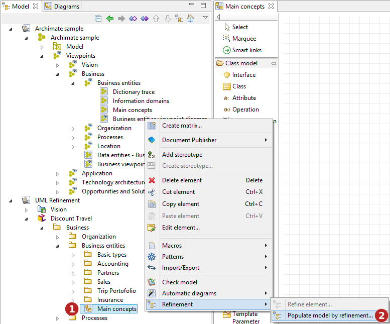

// Disable all captions for figures.
:!figure-caption:
// Path to the stylesheet files
:stylesdir: .

= Populate by refinement

In addition to starting a refinement process from a specific element in the model, *Modelio Refinement* offers a functionality to populate a part of the model from multiple source elements at the same time.

Refining a whole set of elements in a unique operation involves a specific process. +
 +
The keypoints are:

* select or define the set of elements to transform
* for each element to transform, choose the transformed element to produce (when several options exist)
* run the transformation

When transforming a large set of elements, choosing the transformed element among several options for each element of the set quickly becomes a very boring and annoying task. In order to limit this burden, the refinement wizard will be run on the target element, i.e. the element that will be the parent of the future new created elements. By choosing the parent, a lot of transformation choices are automatically made as only some kind of elements can be created under a given parent. This method greatly simplifies the process of choosing the elements to produce. +
 +

*Steps:*

1. Right-click on the element to populate using the refinement wizard. This is 'where' the new created element will appear, it will be the parent element for all elements you want to create. Note that the type of this 'parent' element will determine which transformation are allowed or not. +
2. Run the *"Populate model by refinement..."* command.

*Note:* Selecting a diagram as the 'parent' element creates all new elements in the diagram's owner in the model, and also unmasks them in the diagram itself.

image::images/attachment/modeliocom41/User_Documentation_en/Element_creation_wizard/Populate_by_refinement/Populate-02.png[Populate-02.png]

*Steps:*

1. Drag & drop in the table one or several element(s) you want to refine. The refine wizard automatically filters elements not having any applicable refine rules in the selected parent.

*Note:* Adding a diagram to the table automatically adds every model element that is unmasked in it.

The diagram "Main concepts" added in our example contains the following ArchiMate model:

image::images/attachment/modeliocom41/User_Documentation_en/Element_creation_wizard/Populate_by_refinement/Populate-03.png[Populate-03.png]

It contains several BusinessObjects, linked with a few Association and Composition relationships.

After the drag & drop, the table shows all elements that can be refined, according to the <<User_Documentation_en_Element_creation_wizard_Refinement_concept.adoc#,refine rules>>. 

image::images/attachment/modeliocom41/User_Documentation_en/Element_creation_wizard/Populate_by_refinement/Populate-04.png[Populate-04.png]

*Steps:*

1. Check this box to indicate this element should be refined.
2. The element's kind in the model.
3. Name of the element being refined.
4. Whether or not this element is already redefined in the model.
5. If the element was added from a diagram, the diagram's name is indicated as a context reminder.
6. Choose which kind of element to create (drop-down list). Each list is automatically filtered according to the refine rules and the selected parent.
7. Set the name of the refined element to be created (free text).
8. A filter zone can be unfolded here, and is very usefull when you try refining only a few elements at a time.
9. Click the *OK* button to create the refined elements.

Let's take a closer look at the filter zone:

image::images/attachment/modeliocom41/User_Documentation_en/Element_creation_wizard/Populate_by_refinement/Populate-05.png[Populate-05.png]

*Steps:*

1. Choose which element kind to display in the wizard. By default, all elements that were drag & dropped in the wizard are shown.
2. Indicate whether or not elements that have already been refined should be shown in the wizard or not.
3. Let us select the "BusinessObject" kind in the filter.
4. The filters indicates how many elements are still visible in the wizard.

*Note:* Only visible elements will be refined when the wizard is validated.

image::images/attachment/modeliocom41/User_Documentation_en/Element_creation_wizard/Populate_by_refinement/Populate-06.png[Populate-06.png]

In our example, five Classes (from UML) are now created in the "Business entities" Package, next to the diagram. Each of them owns a «refine» Dependency link towards the BusinessObject (from ArchiMate) it refines. Same goes for the Association and Composition links between them.

All refined elements have been automatically unmasked in the diagram, and placed just like in the original ArchiMate view.
