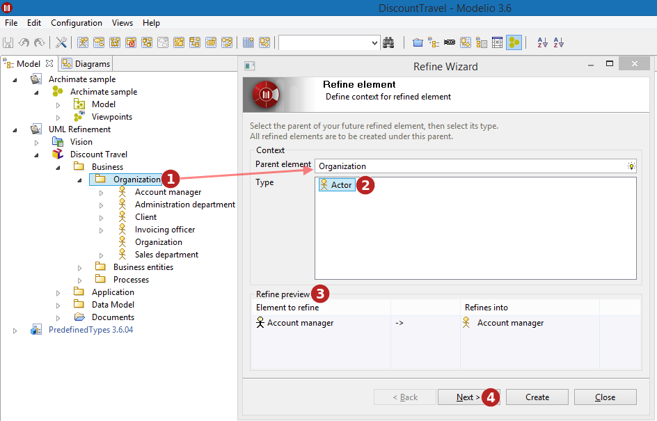
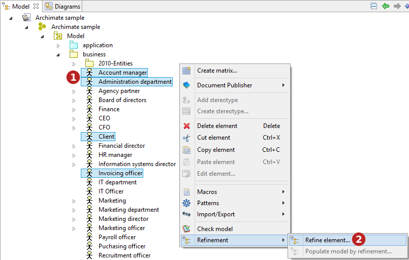
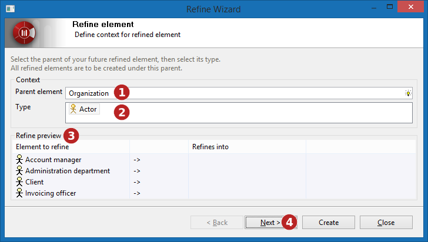
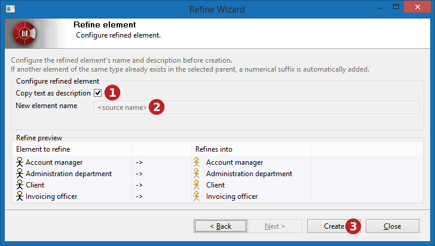

// Disable all captions for figures.
:!figure-caption:
// Path to the stylesheet files
:stylesdir: .

= Refine element

According to the number or elements to refine, the refine wizard can have two slightly different versions.

= Refine one element

To refine one element, use the following procedure:

image::images/attachment/modeliocom41/User_Documentation_en/Element_creation_wizard/Refine_element/Refine-01.png[Refine-01.png]

*Steps:*

1. Right-click on the element which you want to refine.
2. Run the *"Refine element..."* command.

The following wizard opens to configure the refinement process:

*Steps:*

1. Choose (using picking) the parent element for the element you want to create. This is 'where' the new created element will appear. Note that the type of this 'parent' element will determine which transformation are allowed or not and modify the list of proposed types. (  ) 
2. Choose the type of the element you want to create from the list.
3. The preview shows the elements to refine, and the elements to be created. Here, 'Account Manager' from the ArchiMate model will be transformed into 'Account Manager' in the UML model. Remember that the initial element remains unchanged by the transformation and that a new model is created by the transformation.
4. Click the *"Next"* button.

image::images/attachment/modeliocom41/User_Documentation_en/Element_creation_wizard/Refine_element/Refine-03.png[Refine-03.png]

*Steps:*

1. Indicate whether or not to use the refined element's description for the newly created one. If this box is checked, the description of the element being refined will be copied as the description of the newly created element.
2. Enter the name for the new element. In this field you have the opportunity to define the name of the new created element. By default this name is the name of the element being refined. A very common reason why you would like to change this name is that a valid name in one formalism might be invalid in another formalism. For example, white spaces are allowed in ArchiMate element names, if you transform such an element into a Java class, these white space characters will raise issues when generating the code, this can be avoided here easily by changing the new created element name.
3. Finally, click on the *"Create"* button.

As a result in our example:

* an _Account manager_ UML Actor is now created in the _Organization_ 's Package.
* it owns a «refine» Dependency link towards the _Account manager_ ArchiMate Actor.

*Note:* The dialog does not close when the "Create"button is pressed, making easy to refine a single model element into several model elements at the same time.

= Refine several elements

Refining several model element at the same time is a little more complex:

*Steps:*

1. Right-click on the elements which you want to refine. +
2. Run the *"Refine element..."* command.

*Steps:*

1. Choose (using picking) the parent element for the element you want to create.
2. Choose the type of the element you want to create from the list.
3. The preview shows nothing yet.
4. Click the *"Next"* button.

image::images/attachment/modeliocom41/User_Documentation_en/Element_creation_wizard/Refine_element/Refine-06.png[Refine-06.png]

*Steps:*

1. Choose the creation mode, which could be:
* Single, create only one element
* Multiple, create a different element for each element to refine
2. Once the creation mode is chosen, the preview is filled.
3. Click the *"Next"* button.

*Steps:*

1. Indicate whether or not to use the refined element's description for the newly created one.
2. Enter the name for the new element. +
3. Finally, click on the *"Create"* button.

In our example, four Actors (from UML) are now created in the _Organization_ 's Package. Each of them owns a «refine» Dependency link towards the Actor (from ArchiMate) it refines.

*Note:* in Single creation mode, the description copy is deactivated because it would be weird to have several description notes at the same time on an element. On the contrary, in Multiple creation mode, the name field is deactivated because each created element is created with the same name as the element it refines.
