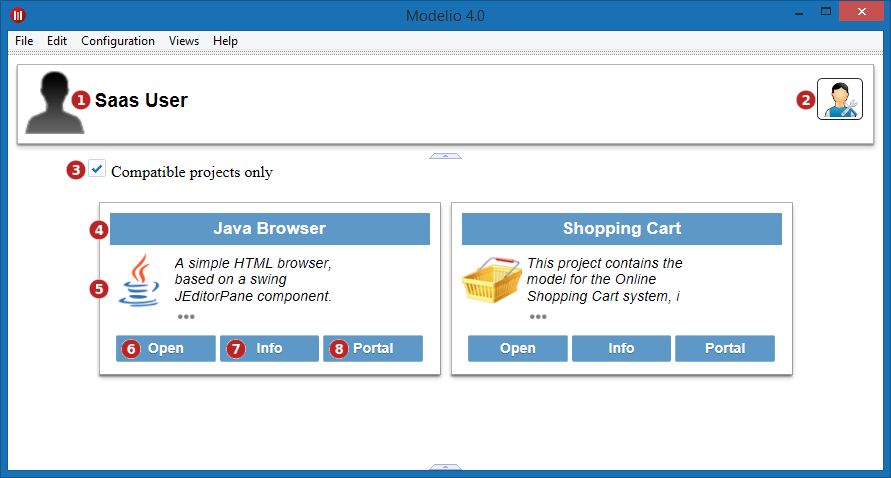

// Disable all captions for figures.
:!figure-caption:
// Path to the stylesheet files
:stylesdir: .

= Home Page

Once you're logged-in using the Modelio SaaS login window, the list of the SaaS projects existing on the server and which you are a member of will appear as well as your local projects.

.Home page

*Keys:*

. User picture, first and last name.
. Modelio Server adress and local workspace containing the projects.
. Check this option to display the incompatible projects (i.e. project requiring a different version of Modelio SaaS client).
. Order of the displayed projects:
.. *By date*: last modified projects first or last.
.. *By type*: local projects first, then server projects.
.. *By name*
. Display mode of the project cards.
. <<User_Documentation_en_LocalProject_SaaS.adoc#,Local project>> creation
. Project label
. Project icon and description (hover the mouse over the *...* to display the complete description in a bubble).
. Click on the project itself to display details about the project.
. *Open* button to open the <<User_Documentation_en_ServerProject_SaaS.adoc#,project>>.
. Contextual commands to apply on this project:
.. *Rename* a local project.
.. *Share* a local project on the server.
.. *Delete* the project from the workspace.
