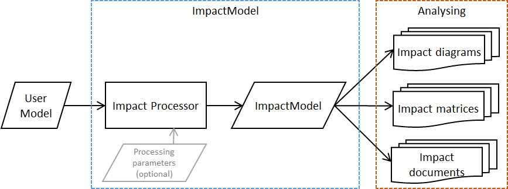
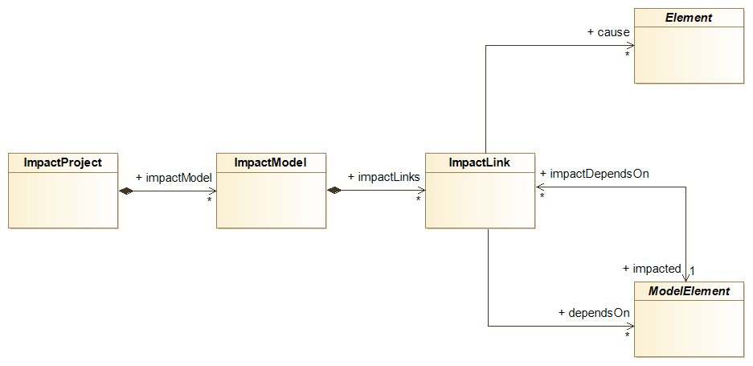
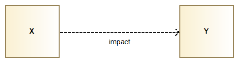
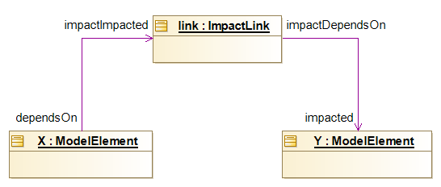
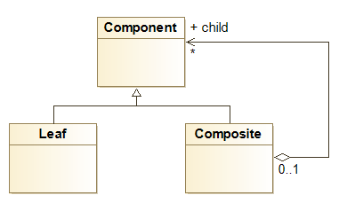
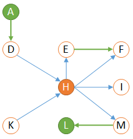
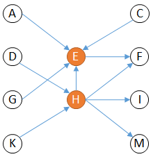

// Disable all captions for figures.
:!figure-caption:
// Path to the stylesheet files
:stylesdir: .

= Impact Analysis Concepts

== Introduction

*Modelio Impact Analysis* is a feature that allows to explore a Modelio model in order to extract information called " Impact ".

From the impact analysis, the user can, for example, find out which model elements will be impacted if a modification occurs on another particular element in the model.

Examples of impact analysis can be found in different areas as shown in the following examples.

Development example: ::

_A Java class 'Person' implements an interface 'HumanBeing'. It is clear that any modification on the 'HumanBeing' interface will impact the 'Person' class.Adding a method on the interface may require a corresponding implementation on the 'Person' class. This example, based on an inheritance link is trivial, but if to think carefully about it, many impacts may be hidden in a model as far less trivial relations like attribute type or method parameter type. Modelio impact analysis model can be useful here._

Requirement and testing example: ::

_When the requirements of a system are properly defined, traceability links can be added between individual requirements and test cases. The goal is to be able to identify which tests might need a revision is a requirement is modified. Of course, when direct traceability links are simply drawn between requirements and tests, this goal can be easy to achieve. However, in real life, such links are not often so well and directly established and a thorough exploration of the model might be needed to find all the impacted tests, just imagine for example that the unit tests are linked to implementation classes rather than to requirements. Modelio impact analysis model can be useful here._

The two examples shows that the concept of 'impact' highly depends on the model semantics, the user point of view (developer or tester) and many other specific factors.

This is why Modelio Impact Analysis is mainly based on the three following principles:

1. An agnostic representation of the impact model is provided that neither relies on any particular formalism (UML, BPMN, Requirements and so on) nor on the user's profile or business. This representation is based on the <<#HModelioImpactAnalysisMetamodel,Modelio Impact Analysis Metamodel>>.
2. A specific process to analyze the model and extract a relevant _ImpactModel_ by interpreting only those model elements and relations that are relevant to the user's case. This process consists in running a specific so called _Impact Processor_.
3. Several means of displaying, filtering, analyzing the resulting Impact Model. Modelio provides _Impact Diagrams and Impact Matrices._ These features are advantageously based only on the agnostic representation of point 1.

=== Synoptic of the Modelio Impact Analysis tool

The synoptic shows how the user model is scanned and processed by an impact processor to produce a resulting _ImpactModel_. The resulting _ImpactModel_ can later be visualized and analyzed either as impact diagrams, impact matrices or even impact documentation.

The key point here, is that the produced _ImpactModel_ is entirely determined by the impact processor (and the user model input of course). Using different impact processors allow different interpretation and analysis of the same user model.

== The Impact Model

=== Modelio Impact Analysis Metamodel

Here is a simplified representation of the Modelio Impact meta model. This meta model is the support of the representation and the persistence of impact models.

See link:../../org.modelio.documentation.metamodel.uml/html/Metamodel_HTML/sitemap.html[Modelio Metamodel documentation] for a complete description of the impact metamodel.

==== ImpactProject

The impact project will hold all the _ImpactModel_ that you might create in your Modelio project. Practically the impact project is a sub-project of type impact, created in a modifiable fragment of your Modelio project.

Note that an impact project may store several _ImpactModel_ instances.

==== ImpactModel

The impact model has two main roles:

1.  Impact model content: store the computed impact links. In fact, the _ImpactModel_ is composed of all the _ImpactLink_ that the Impact processor has computed from the user model.
2.  Impact model configuration: store all the required information about which _impact processor_ and which processing options to use.

The impact model configuration data is persisted, therefore the production of the impact model can be 'replayed' , should modifications occur in the user model. This latter use case is called 'updating the impact model'.

As there is only one processor for a given _ImpactModel_ and because the processor defines the impact model semantics, each instance of _ImpactModel_ expresses one and only one specific semantic and analysis.

An impact model must first be created and configured (processor and processing options) and then be populated by running its processor. Usually, well designed impact processors can smartly deal with later updating the impact model, deleting obsolete impact links and adding newly appeared ones.

==== ImpactLink

_ImpactLink_ are computed relations between model elements.

They are oriented. The direction of the arrow from X to Y means "X impacts Y" or "Y depends on X" or even "Y is impacted by X". +
Beware of all these terms which are very often interchangeably used by users and leading to some confusion.

Let's illustrate how "X impacts Y" is represented.

The figure below illustrates how our impact link is displayed graphically in an impact diagram and its orientation. Here the figure is read "X impacts Y".

The next figure shows the "X impacts Y" thing represented internally according to the impact metamodel.

The above instance diagram displays the _ImpactLink_ instance (named 'link') that represents the impact of X towards Y.

All relations are navigable in any direction, this means for example that given Y, it is possible to find the elements that are impacting Y , just by following the path Y.getImpactDependsOn().getDependsOn() => returns X

==== Causes

The relation 'causes' is established between an _ImpactLink_ and a set of elements. The semantic is easy to guess as the causes are the reasons why the impact processor has created the _ImpactLink_. Causes for a given ImpactLink may be multiple and indeed they are in most cases. This mechanism is used to reduce the number of _ImpactLink_ instances in the model.

Let's take an example based on the NameSpaceUse Impact processor the following UML model (UML composite pattern):

The *Composite* class obviously depends on the *Component* class because of its inheritance graph. However, the *Composite* class also depends on *Component* because of the *child* aggregation link.

Instead of creating two impact links between *Composite* and *Component*, the NameSpaceUse impact processor will simply create a unique _ImpactLink_ instance and add two causes (here the inheritance link and the child aggregation link).

Reducing the total number of impact link by grouping causes is an essential feature of Modelio impact analysis.

== Update strategies

An impact model is populated by running its impact processor. This operation can be carried out at any moment on an existing and already populated impact model. This is called updating the impact model.

If an impact model is never updated after its initial creation and population, it becomes obsolete when the user evolves. Any analysis of this impact model or any data extraction from it will give wrong results obviously. This is why impact models must be updated regularly. However, some impact models can be long to compute and a regular update might be an issue because of all this consumed processing time.

Modelio supports two update modes for a given impact model:

1.  real-time update
2.  manual update

The mode can be chosen specifically for each impact model and modified at any moment.

Real-time update mode: ::

An impact model in reatime update mode will be refreshed each time the model is modified whatever the reason and the nature of the modification. +
The biggest benefit of real-time update is that it guarantees that the impact model will remain up to date at anytime, since the update is synchronous with the model modification. +
The biggest drawback of realtime update is that its processing will be perceived by the end-user as this update is carried out synchronously with the model modification. Should the update processing time gets high, and the the tool would become slow and uncomfortable. +
When the impact model is used in circumstances like 'code refactoring to eliminate abusive or unwanted dependencies or to track down dependency cycles', the real-time mode is the way to go. Of course on one hand for each refactoring action the user might have to wait for the update to be completed. This a small price to pay as on the other hand, the user will immediately see the effect of his refactoring action, a precious feedback in such cases.

Manual update mode: ::

This mode consists in manually running the update when needed. +
The obvious biggest benefit of the manual update is that it does not consume any resources unless you run it. This is quite comfortable. +
The biggest drawback is clearly that the impact model is not permanently up to date. +
When an impact model is only used to produce occasional reports, the manual mode is the way to go. The user simply has to run the update before produce the report, the rest of the time the imapct model has no influence on the tool's performance.+

Which update mode should I use ? ::

There is no absolute answer to this question as the answer highly depends on how the impact models are exploited,what they are used for and so on. +
However the following advice are worth to be considered:
* prefer manual mode unless you have a good reason not to do so. This is even more true if you have many impact models in your project.
* do not hesitate to change the update mode on the basis on your activities. When refactoring a model, real-time mode really helps to monitor what you are doing.

== Analyzing an Impact Model

Analyzing an impact model mainly consists in viewing its contents. However, viewing the whole contents of an impact model is not realistic as an impact model may contain thousands on impact links. This is why impact model views are also scoped to a subset of the whole impact model contents.

=== Impact root, upstream links, downstream links

Consider the following (small) impact model shown in the following figure:

image::images/attachment/modeliocom41/User_Documentation_en/Impact_Analysis/ImpactAnalysisConcepts/WebHome/Impact_root_upstream_links_downstream_links_2.png[6- Impact root, upstream links, downstream links 1.png]

Although the impact model is quite small, it is already hard to read. +
Let see how we can smartly scope this view:

1.  consider a particular element in the impact model, this particular element is called a 'root', let's choose the 'H' element for example.
2.  from the graph read that 'H' impacts the 'E', 'F', 'I' and 'M' elements by following the 'outgoing' links of 'H'. Such links are called the 'downstream' links of 'H'.
3.  from the graph, read that 'H' is impacted by the 'D' and 'K' elements by following the 'incoming' links of 'H'. Such links are called the 'upstream' links of 'H'.

We get a new simplified graph, much mode readable:

image::images/attachment/modeliocom41/User_Documentation_en/Impact_Analysis/ImpactAnalysisConcepts/WebHome/Impact_root_upstream_links_downstream_links_3.png[7- Impact root, upstream links, downstream links 2.png]

Such a view is said to be based on the root node 'H'.

It provides a clear understanding of the elements impacted in case of a modification on 'H' (which are 'E','F','I, and 'M'). It also shows that any modification to 'D' or 'K' will affect our root 'H'.

Modelio provides diagrams that show such scoped view of an impact model.

==== Analysis depth level

Using our previous example, we can try to increase our analysis level by also considering the downstream links of the 'E', 'F', 'I', 'M' which were identified when analyzing our root 'H'.

We get the following graph:

image::images/attachment/modeliocom41/User_Documentation_en/Impact_Analysis/ImpactAnalysisConcepts/WebHome/Impact_root_upstream_links_downstream_links_4.png[8- Impact root, upstream links, downstream links 3.png]

The added elements are drawn in green.

Here the downstream analysis is said to be 'level 2' as we continued the downstream analysis starting from 'H' for one additional level.

Of course the same logic may be applied to upstream analysis as shown below (again the added elements are drawn in green):

Now we can predict that a modification on 'A' will possibly impact our root 'H' because 'A' impacts 'D' which impacts 'H'.

Modelio impact diagrams are configurable for upstream and downstream depth.

=== Multiple roots views

Modelio also supports viewing the impact analysis of several roots in a unique view.

Applied to our previous example and selecting 'H' and 'E' as root, a level 1 upstream and downstream analysis would give:

Note that until now, all the displayed impact links were originated from the same unique Impact Model, meaning that all these links have the same semantics since the were produced by the same impact processor.

=== Multiple impact model views

Multiple impact model views allows for analyzing a given element (root) for different impact models, ie for different semantics.

For example, in a development context for a given Package, a user might need to consider both its technical impact dependencies and its test and validation impacts. Modelio allows representing the impact links from different impact models in a unique view.

Modelio impact diagrams and matrices and their options are fully described here:

*  <<User_Documentation_en_Impact_Analysis_Impact_diagrams.adoc#,Impact diagrams>>
*  <<User_Documentation_en_Impact_Analysis_Impact_matrix.adoc#,Impact matrices>>
