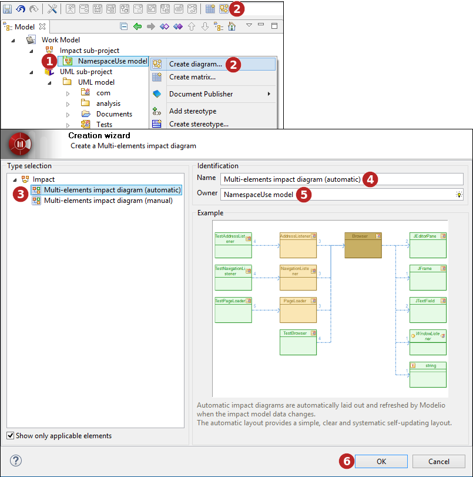
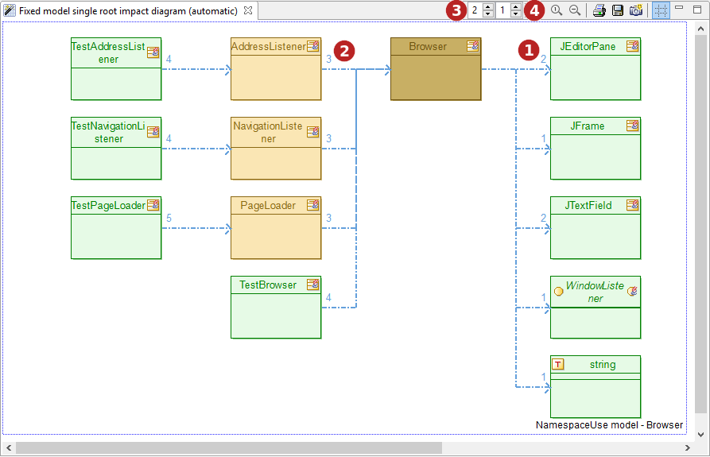
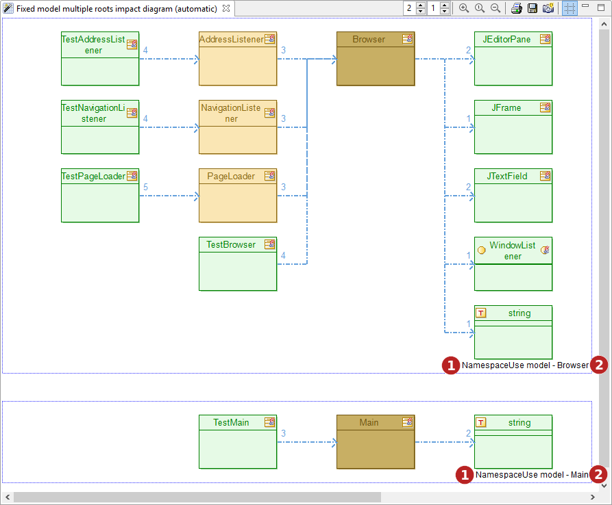
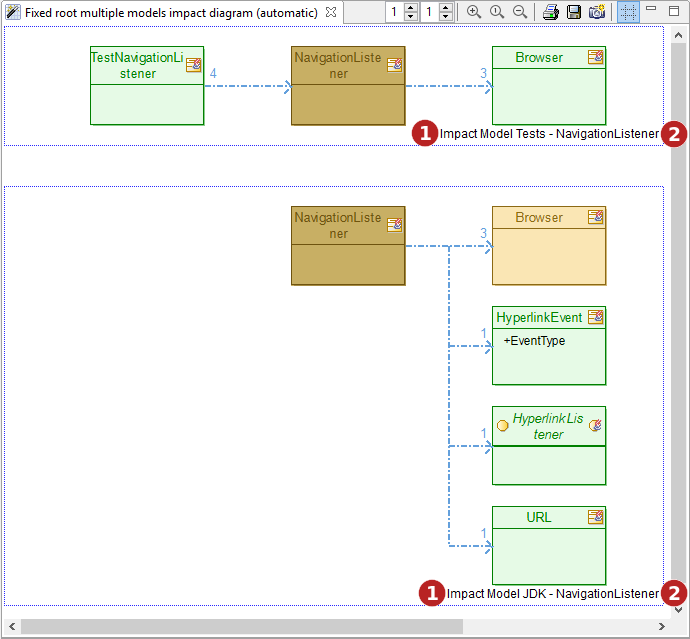
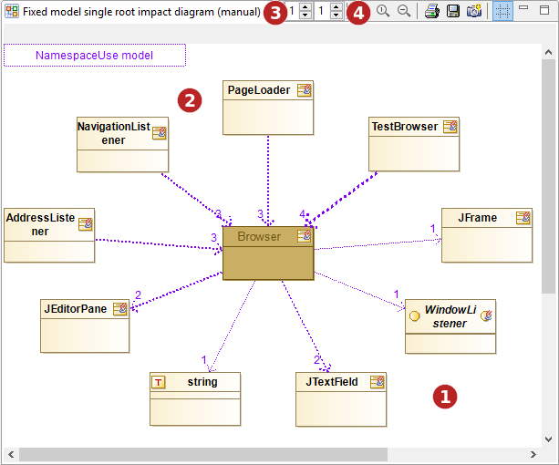
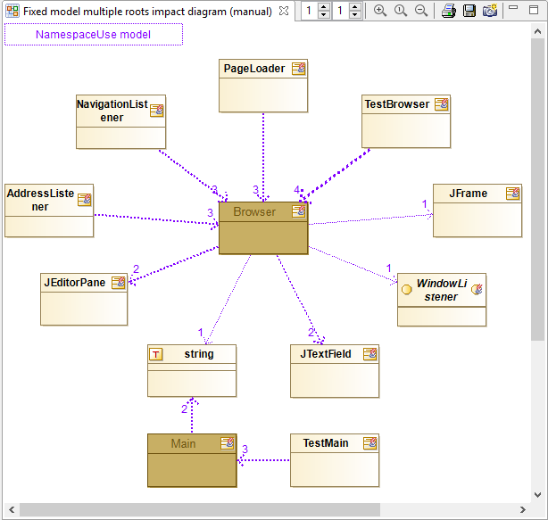
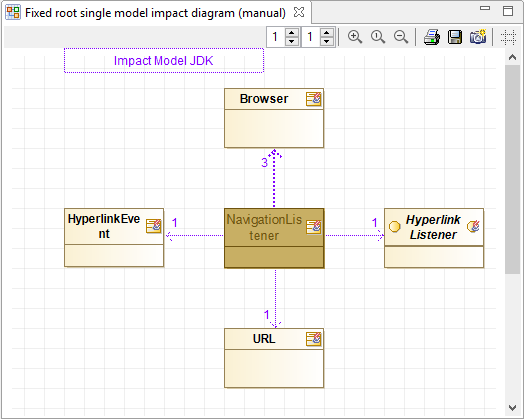
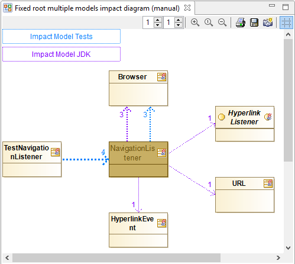

// Disable all captions for figures.
:!figure-caption:
// Path to the stylesheet files
:stylesdir: .

= Impact diagrams

There are several type of impact diagrams in Modelio.

The <<User_Documentation_en_Impact_Analysis_ImpactAnalysisConcepts.adoc#,Impact Concepts>> chapter, a must read before this page, explains that impact diagrams can display impact links from one or several impact models starting with one or several 'root' elements ^[[x_footnote_ref_1]] <<#x_footnote_1#,1>> ^ .

The impact diagrams can also be <<#HCreatinganimpactdiagram,created>> in either 'automatic' layout or 'manual' layout mode.

When combined, the different configurations of an impact diagram lead to the following capabilities table in Modelio:

[width="100%",cols="20%,20%,20%,20%,20%",options="header",]
|===================================================================================================
| |Fixed model +
Single root |Fixed model +
Multiple roots |Fixed root +
Single model |Fixed root +
Multiple models
|Automatic +
layout diagrams a|
* create the diagram under an impact model
* drag an element in the diagram to define the root element
* see an example <<#HFixedmodel2Csingleroot2Cautomaticlayoutdiagram,here>>

 a|
* create the diagram under an impact model
* drag several elements in the diagram to define the root elements
* see an example <<#HFixedmodel2Cmultipleroots2Cautomaticlayoutdiagram,here>>

 a|
* create the diagram under a model element that will be the unique root of the diagram
* drag an impact model in the diagram whose impact links for the chosen root will be displayed
* see an example <<#HFixedroot2Csinglemodel2Cautomaticlayoutdiagram,here>>

 a|
* create the diagram under a model element that will be the unique root of the diagram
* drag several impact models in the diagram whose impact links for the chosen root will be displayed
* see an example <<#HFixedroot2Cmultiplemodels2Cautomaticlayoutdiagram,here>>

|Manual layout diagrams a|
* create the diagram under an impact model
* drag an element in the diagram to define the root element
* see an example <<#HFixedmodel2Csingleroot2Cmanuallayoutdiagram,here>>

 a|
* create the diagram under an impact model
* drag several elements in the diagram to define the root elements
* see an example <<#HFixedmodel2Cmultipleroots2Cmanuallayoutdiagram,here>>

 a|
* create the diagram under a model element that will be the unique root of the diagram
* drag several impact models in the diagram whose impact links for the chosen root will be displayed
* see an example <<#HFixedroot2Csinglemodel2Cmanuallayoutdiagram,here>>

 a|
* create the diagram under a model element that will be the unique root of the diagram
* drag several impact models in the diagram whose impact links for the chosen root will be displayed
* see an example <<#HFixedroot2Cmultiplemodels2Cmanuallayoutdiagram,here>>

|===================================================================================================

1.   <<#x_footnote_ref_1#,^>> There are no 'multiple roots, multiple models' diagrams as those would be really hard to read and to define.

= Creating an impact diagram

.Creating an impact diagram using the creation wizard

*Steps:*

1. Select the element on which you want to create a diagram.
2. Click on the " image:images/attachment/modeliocom41/User_Documentation_en/Impact_Analysis/Impact_diagrams/creatediagram.png[creatediagram.png] Create diagram..." button in the tool bar or use the one of the selected element contextual menu.
3. Select a type of diagram.
4. Enter a name for the new diagram or leave the default name.
5. If the diagram owner is different from the selected model element, indicate the diagram owner.
6. Click on "OK" to complete the new diagram creation.

= Automatic diagrams studied examples

Automatic mode diagrams are automatically laid out and refreshed by Modelio when the impact model data changes. The automatic layout provides a simple, clear and systematic self-updating layout.

Automatic diagrams have a special characteristic that is worth to be known. If an element appears in several areas of the impact graph, its representation is duplicated (it appears several times in the diagram) in order to keep the impact links well aligned and to forbid crossing links. This specificity increases the readability of the graph links by allowing a simple rectangular layout.

The user cannot modify the diagram layout by moving any element of the diagram. However, several layout options exist in the <<#HDiagramproperties,symbol view for the diagram>> : node spacing, node size, and so on.

== Fixed model, single root, automatic layout diagram

The following diagram:

* was created on the 'NamespaceUse model' impact model => it is a fixed model diagram.

* received (by drop) the 'Browser' class as its 'root' element. The class was dragged from the model into the diagram => it is a single root diagram.

* is auto-laid out.

The diagram shows that, in terms of namespace usage, the class 'Browser' depends on the JDK classes ' _JEditorPane_ ', ' _JFrame_ ', ' _JTextField_ ' and the JDK interface ' _WindowListener_ '. 

From the diagram, it can easily be seen that the classes ' _AdressListener_ ', ' _NavigationListener_ ', ' _PageLoader_ ' and ' _TestBrowser_ ' depends on the ' _Browser_ ' class. The impact links are drawn as blue dotted arrows. The number on the arrow size, indicates how many 'causes' this link is representing. As a rule of thumb the higher the number, the stronger the dependency. image:images/attachment/modeliocom41/User_Documentation_en/Impact_Analysis/Impact_diagrams/2.png[2.png]

A right-click on any impact link pops a menu where a 'Show causes' command is available. This command open a dialog box listing details about the 'causes' of the selected link.

Note how the 'upstream links graph', drawn on the left of the root, has a depth level of two  while the 'downstream links graph', drawn on the right of the root, has a depth limited to one ,

=== Color scheme

* The dark brown color indicates the 'root' element. Here the ' _Browser_ ' class.
* The light green color indicates 'leaves' elements. A leaf element in the impact analysis is an element which has no successor in the downstream links graph (or no predecessor in the upstream links graph) for the chosen impact model.
* Now, guess what lies between the root of a tree and its leaves ? Its branches, colored in light brown. A light brown colored element is an element which has at least one successor in the downstream links graph (or one predecessor in the upstream links graph) for the chosen impact model.

Let's translate the coloring scheme in natural language for our example.

* The ' _JEditorPane_ ' is a leaf. This means that in the analyzed impact model, ' _JEditorPane_ ' does not depend on any further element in the chosen impact model. This not surprising if you think that, being a class from the JDK, the 'JEditorPane' is most likely an external library element whose dependencies are not in the model.
* The ' _AdressListener_ ' is not a leaf because the ' _TestAdressListener_ ' class depends on it in the chosen impact model. The ' _TestAdressListener_ ' class is probably a generated test class that naturally depends on its tested object.
* As no one depends of the ' _TestAdressListener_ ' test class, it is shown in green as a leaf. Remember that the ' _TestAdressListener_ ' class appears in the diagram only because the upstream links graph depth is set to two ,
* Should the upstream links graph depth have been set to one, the ' _TestAdressListener_ ' test class would not have been displayed. However, the ' _AdressListener_ ' would still have been displayed as a branch node (light brown color) because in the current impact model, some elements indeed depends on it even if not currently displayed because of the limited depth.

The root, branch and leaf colors can be customized in the <<#HDiagramproperties,symbol view for the diagram>>.

== Fixed model, multiple roots, automatic layout diagram

The following diagram:

* was created on the 'NamespaceUse model' impact model => it is a fixed model diagram.

* received (by drop) the 'Browser' and the 'Main' classes as 'root' elements. The classes were dragged from the model into the diagram => it is a multiple roots diagram.

* is auto-laid out.

Practically, Modelio will show two impact graphs in the diagram, one for each root element.

Each graph is framed by a drawn box with a title indicating the impact model  and the considered root element image:images/attachment/modeliocom41/User_Documentation_en/Impact_Analysis/Impact_diagrams/2.png[2.png] of the graph.

Apart from that, each individual graph is analog to a single model, single root graph. The same coloring scheme and semantics apply.

== Fixed root, single model, automatic layout diagram

The following diagram:

* was created on the 'NavigationListener' model element => it is a fixed root diagram.

* received (by drop) the 'Impact Model Tests' impact model as fixed model. The impact model was dragged from the model into the diagram => it is a single model diagram.

* is auto-laid out.

image::images/attachment/modeliocom41/User_Documentation_en/Impact_Analysis/Impact_diagrams/automonorootmonomodelmodelelement.png[automonorootmonomodelmodelelement.png]

Basically, the results are very similar to the previous 'Fixed model, single root, automatic layout diagram' above. The same coloring scheme and semantics apply.

However, in this case the root element is fixed and unique (the 'Navigation Listener' class owning the diagram). Dropping another impact model in this diagram will transform it into a <<#HFixedroot2Cmultiplemodels2Cautomaticlayoutdiagram,'Multi models, fixed root' diagram>>'.

*Note:* Both downstream and upstream depths are set to one.

== Fixed root, multiple models, automatic layout diagram

The following diagram:

* was created on the 'NavigationListener' model element => it is a fixed root diagram.

* received (by drop) the 'Impact Model Tests' and 'Impact Model JDK' impact models as multiple models. The impact models were dragged from the model into the diagram => it is a multiple models diagram.

* is auto-laid out.

Practically, Modelio will show two impact graphs in the diagram, one for each impact model.

Each graph is framed by a drawn box with a title indicating the considered impact model  and the root element image:images/attachment/modeliocom41/User_Documentation_en/Impact_Analysis/Impact_diagrams/2.png[2.png] of the graph.

Apart from that, each individual graph is analog to a single model, single root graph. The same coloring scheme and semantics apply.

= Manual diagrams studied examples

Manual layout mode diagrams are laid out by the user. However, their content is still refreshed automatically by Modelio when the impact model data changes.

The manual layout mode allows a specific presentation of the diagram in order to illustrate a particular structure of the impact graph.

Unlike automatic diagrams, manual diagrams do not duplicate the representation of a given element. therefore if an element participates to several impact links it will be displayed only once. This may lead to crossing links or unclear layout unless the user puts a little order in the diagram. This is why such diagrams are said to be manual, the user has to fix their layout for a correct display of the links.

The user can modify the diagram layout by moving any element of the diagram. Once an element has been moved to a specific location in the diagram, Modelio will not move when refreshing the diagram after a change in the impact model .

== Fixed model, single root, manual layout diagram

The following diagram:

* was created on the 'NamespaceUse model' impact model => it is a fixed model diagram.

* received (by drop) the 'Browser' class as its 'root' element. The class was dragged from the model into the diagram => it is a single root diagram.

* is manually laid out by the user

The diagram shows that, in terms of namespace usage, the class 'Browser' depends on the JDK classes ' _JEditorPane_ ', ' _JFrame_ ', ' _JTextField_ ', the JDK interface ' _WindowListener_ ' and the datatype 'string'. 

From the diagram, it can easily be seen that the classes ' _AdressListener_ ', ' _NavigationListener_ ', ' _PageLoader_ ' and ' _TestBrowser_ ' depends on the ' _Browser_ ' class.

The impact links are drawn as blue dotted arrows. The number on the arrow size, indicates how many 'causes' this link is representing. As a rule of thumb the higher the number, the stronger the dependency. image:images/attachment/modeliocom41/User_Documentation_en/Impact_Analysis/Impact_diagrams/2.png[2.png]

A right-click on any impact link pops a menu where a 'Show causes' command is available. This command open a dialog box listing details about the 'causes' of the selected link.

Note that the 'upstream links graph', has a depth level of one  like the 'downstream links graph' ,

In the diagram, the user chose to place the root element 'Browser' in the center of the diagram and the dependent/impacted elements on a circle around the root. any other option might have been chosen as the mayout of the diagram is entirely under the end-user's control and responsibility.

=== Color scheme

* The dark brown color indicates the 'root' element. Here the ' _Browser_ ' class.
* Only the root node is colored specifically.
* Impact links are purple in our example diagram. This color correspond to the color of legend (upper left of the diagram)
* When two elements have reciprocal impact links, the links are colored in red to indicate a possible problematic impact cycle between the two elements.
* The thickness of the impact is linked to the number of cause for the link. The more causes, the thicker the link.

The root color can be customized in the <<#HDiagramproperties,symbol view for the diagram>>.

== Fixed model, multiple roots, manual layout diagram

The following diagram:

* was created on the 'NamespaceUse model' impact model => it is a fixed model diagram.
* received (by drop) the 'Browser' and the 'Main' classes as 'root' elements. The classes were dragged from the model into the diagram => it is a multiple roots diagram.
* is manually laid out by the user

Practically, Modelio will merge the impact graphs of the two roots in the diagram the user being responsible for organizing the diagram layout for good readability.

Apart from that, the graph is analog to a single model, single root graph. The same root coloring scheme and semantics apply.

== Fixed root, single model, manual layout diagram

The following diagram:

* was created on the 'NavigationListener' model element => it is a fixed root diagram.

* received (by drop) the 'Impact Model JDK' impact model as single model. The impact model was dragged from the model into the diagram => it is a single model diagram.

* is manually laid out by the user

Basically, the results are very similar to the previous 'Fixed model, single root, manual layout diagram' above.

However, in this case the root element is fixed and unique (the 'Navigation Listener' class owning the diagram).

Dropping another impact model in this diagram will transform it into a ' <<#HFixedroot2Cmultiplemodels2Cmanuallayoutdiagram,Fixed root, multiple models diagram>> '.

== Fixed root, multiple models, manual layout diagram

The following diagram:

* was created on the 'NavigationListener' model element => it is a fixed root diagram.

* received (by drop) the 'Impact Model Tests' and 'Impact Model JDK' impact models as multiple models. The impact models were dragged from the model into the diagram => it is a multiple models diagram.

* is manually laid out by the user

This diagram looks like other manual diagrams with some noticeable differences:

* There are two labels in the diagram legend (upper left of the diagram) that indicates the two impact models that are currently being displayed for the 'Navigation Listener' root
* Each label of the legend uses its own color (blue for 'Impact Model Tests' and purple for 'Impact Model JDK'
* The impact links are colored depending on their origin impact model. The user can easily distinguish between links from one model or the other.
* Impact links are colored in red to indicate a possible problematic impact cycle between the two elements, but please note that cycles are only considered inside a given impact model, in other words cycles won't be detected between links from several impact models.

= Diagram properties

The symbol view for an impact diagram allows for conguring several aspects of the diagram.

image::images/attachment/modeliocom41/User_Documentation_en/Impact_Analysis/Impact_diagrams/SymbolView.png[SymbolView.png]

===== Colors and fonts

For each flavor of node (root, branch, leaf), proposed graphics options are:

* fill color : the background color for the node
* fill mode : how the background must be drawn ie solid, with a gradient or none
* line color : the colot for the node lines
* font : the font used to display the node text
* text color : the color for the node text

===== Layout options

The diagram layout can be customized:

* Max upstream depth: This is the analysis recursion depth to display in the diagram, for the left subtree. This value can also be set using the similar 'spinner' control in the diagram toolbar.
* Max downstream depth: This is the analysis recursion depth to display in the diagram, for the right subtree. This value can also be set using the similar 'spinner' control in the diagram toolbar.
* Node size: This option defines the size of the displayed nodes. Value is one of Small ~ 50x40, Medium ~ 75x60, Large ~ 115x80, Extra large ~ 170x120
* Horizontal spacing: This value defines the horizontal gap between nodes as a percentage of the node width.
* Vertical spacing: This value defines the vertical gap between nodes as a percentage of the node height.
* Sorting model: The sort model defines the ordering of the children nodes of a given node. Options are:
** Model order : just the order in which the impact links have been found in the model.
** Alphabetical order, Reverse alphabetical order : the children nodes are sorted on their names.
** Ascending number of causes, descending number of causes: the nodes are sorted on the number of causes of the link they are attached to.
** Ascending number of links, descending number of links: the nodes are sorted on the number of links they are attached to.
* Children top alignement: When checked, the displayed tree will align subtrees on their top most node otherwise subtrees will be centered on their originating node.
