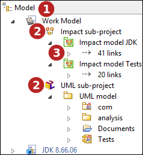
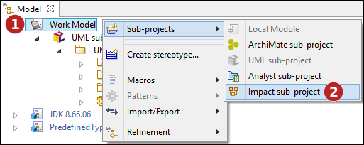
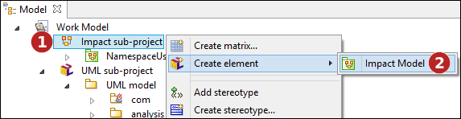
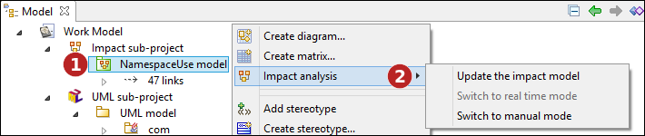

// Disable all captions for figures.
:!figure-caption:
// Path to the stylesheet files
:stylesdir: .

= Impact models

== Projects, work models and sub-projects

===  Modelio project image:images/attachment/modeliocom41/User_Documentation_en/Impact_Analysis/Impact_models/modelioproject.png[modelioproject.png]

In Modelio, a project is similar to a document in Word: you open it, modify its contents and save the changes (or not) before closing it. From the end user point of view, the project is the unit of work and persistence of his/her contributions. Once opened, the project appears to the end user as a unique model, composed of many model elements, usually organized into packages and other high level containers. The "Save" operation also appears to be applied to the unique model proposed by the opened project. However, behind the scenes, the manipulated model elements may be provided by several model fragments and their physical repositories, and Modelio is in charge of managing these repositories transparently as a unique model.

===  Work models 

Work models are groups of higher level model elements. Model designers attribute logical consistency to work models, but their primary function is to autonomously store a part of a model. A model element from a given work model can be linked to model elements from another work model, but this link must be a simple reference, and not a containment or composition link. +
 +
A model element really belongs to a work model, but its ownership is not definitive. It can be moved to another work model, according to the organizational needs of the designers. Work models are tightly coupled with repositories. Modelio supports several repository technologies (Local, SVN, Model Components...). Each technology has specific characteristics that must be understood when choosing one of them for a particular repository.

===  Impact sub-project 

Since version 3.6, Modelio supports several kind of sub-projects (UML, MDA, ArchiMate, Analyst, Impact...). These sub-projects can coexist within the same work model. An Impact sub-project therefore organizes all Impact elements created under a work model.

===  Impact models 

The following figure, a Modelio model browser screenshot, shows several impact models in a project fragment.

*Keys:*

1. The 'Model' tab.
2. One work model of the opened project. It is named "Work Model". It has two sub-projects "Impact sub-project" and "UML sub-project".
3. The impact sub-project holds two Impact models named "Impact model JDK" and "Impact model Tests".

=== Creating an impact Model

==== Create an Impact sub-project

The first step consists in creating an Impact sub-project if it does not already exists.

*Steps:*

1. Right click on the project fragment (work model) to pop the browser contextual menu as shown in the above figure.
2. In the 'Sub-projects' entry of the contextual menu run the 'Impact sub-project' command.

The new impact sub-project appears in the browser. You can rename it if needed using the F2 key..

==== Create an Impact Model

*Steps:*

1. Right click on the impact sub-project to pop the browser contextual menu as shown in the above figure.
2. In the 'Create element' entry of the contextual menu select 'Impact model'.

The Impact Model appears in the browser.

*Note:* Modelio supports only one kind of impact model, the former 'NameSpaceUse' analysis. Future Modelio version will provide additionnal anlysis capabilities. This should results in some additional steps in the process of creating an impact model like choosing which analysis algorythm to use.

==== Choosing the impact model update strategy

A very important configuration of the Impact Model is its update strategy. The different update strategies and their use and characteristics are <<User_Documentation_en_Impact_Analysis_ImpactAnalysisConcepts.adoc#,explained at length here>>.

*Steps:*

1. Right click on an impact model to pop the browser contextual menu as shown in the above figure.
2. In the 'Impact analysis' entry of the contextual menu select the preferred update strategy:

* *Switch to realtime mode* : activate the 'realtime update strategy'. This option is greyed if the 'realtime update strategy' is the current one.
* *Switch to manual mode* : activate the 'manual update strategy'. Thi soption is greyed if the 'manual update strategy' is the current one.
* *Update the impact model* : perform an immediate update of the impact model. This command does not modify the current update strategy.
