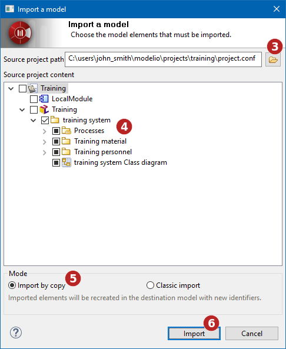

// Disable all captions for figures.
:!figure-caption:
// Path to the stylesheet files
:stylesdir: .

= Importing elements from existing projects

===== Overview of element import

The element import feature is used to import elements from other projects into your current project.

There are two import modes:

* The import by copy, which performs a copy of the elements to import (i.e. the elements are recreated in the target model)
* The classic import, which keeps the imported elements identifiers. +

*Note:* this import mode is only available to users with a valid Modelio Teamwork license.

===== Importing elements from another project with the 'Import by copy' mode

image::images/attachment/modeliocom41/User_Documentation_en/Importing_elements_from_existing_projects/ModelImport_001.png[ModelImport_001.png]
.Running an element import by copy operation

1.  Select the work model into which you wish to import model elements.
2.  Launch the *Import/Export > Import > Import model...* command.
3.  Select the 'project.conf' file of the project you wish to import elements from.
4.  Select the elements you wish to import.
5.  Choose the 'Import by copy' option
6.  Launch the Import. [[Imported-elements]]

===== Importing elements from another project with the 'classic' mode

image::images/attachment/modeliocom41/User_Documentation_en/Importing_elements_from_existing_projects/ModelImport_001.png[ModelImport_001.png]

.Running a classic element import operation
image::images/attachment/modeliocom41/User_Documentation_en/Importing_elements_from_existing_projects/ModelImport_003.png[ModelImport_003.png]

*Steps:*

1.  Select the work model into which you wish to import model elements.
2.  Launch the Import/Export > Import > Import model... command.
3.  Select the 'project.conf' file of the project you wish to import elements from.
4.  Select the elements you wish to import.
5.  Choose the 'Classic import' option
6.  Launch the Import.

===== Imported elements

Elements that can be imported into your project are presented in a standard hierarchy (packages containing classes). To view the classes contained in an importable package, simply click on the "+" on the left of the package name.

The following list describes exactly what is imported for each type of element.

* Project : The entire project (packages, classes, ...)
* Package : Classes (with their operations, attributes, "visible" associations), documents, tagged values, diagrams
* Class : Operations, attributes, "visible" associations, documents, tagged values, diagrams

Non-imported objects are:

* Reference links from a package to another element that is not imported and that does not already exist in the current project
* Non-oriented associations (no visibility on either side)

The import will fail if there is any inconsistency between imported elements.
