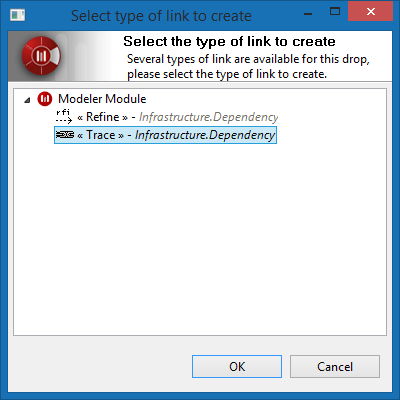

// Disable all captions for figures.
:!figure-caption:
// Path to the stylesheet files
:stylesdir: .

= Editing links

== Creating links

Creating new links in the model using the links editor is very easy. the overall procedure is as follows:

1.  Set the link editor in "edit" mode, ie "pinned" using the pin button image:images/attachment/modeliocom41/User_Documentation_en/Link_Editor/Editing_links/EditionMode.png[EditionMode.png], +
As a consequence the link editor will no longer update its contents if the selection changes in the application in order to allow independent navigation in the other views of the model. The current central element is somewhat "locked" in place.
2.  Drag any element from another view (e.g. the link:../../org.modelio.documentation.modeliomodeler/html/Modeler-_modeler_interface_uml_view.html[UML explorer view] ) and drop it into the link editor view to create a new link between the dropped element and the central element. Note that you *can even drop several elements* at the same time, provided they are all instances of the same meta class (eg: several classes, or several packages at once, but not a class AND a package at the same time)
3.  The orientation of the created link (whether it is going *from* the central node's element *to* the dropped element or vice versa) is defined by the point at which you drop the element, with relation to the central node (left or right in horizontal layout mode, above or below in vertical layout mode).
4.  The links editor tries to determine the type of the created link based on the types of link visible at the time of the drop, and on the meta class of both the dropped element and the central node element. If several types among those visible are valid, a dialog will open, asking you to choose the exact type to use for the creation.
5.  Unpin the link editor view (unless you need to create more links for the same central element).

== Usage example

Let's say you want to add several trace links between some requirements and your implementation classes in order to identify which implementation classes are currently fulfilling which requirements.

First of all, you might consider switching to the link:../../org.modelio.documentation.modeliomodeler/html/Modeler-_modeler_interface_perspectives.html#Trace-Perspective[Trace perspective] which organizes views in an optimal way for this kind of task, the trace perspective places the link editor view in the center, maximizing its size for usage comfort, and positions other views around it. This perspective switch is optional and what is described below can be carried out without switching the perspective.

Next, you'll want to configure the links editor by carrying out the following two operations:

1.  Configure the link editor so that trace links are displayed. This can be achieved by selecting the proper predefined configuration ( image:images/attachment/modeliocom41/User_Documentation_en/Link_Editor/Editing_links/traceability.png[traceability.png] button is the simplest and recommended way) or by using a custom configuration previously defined to show the kind of links you need).
2.  Select the requirement toward which you want to define one or more implementation link(s).
3.  Pin the link editor view using the pin button image:images/attachment/modeliocom41/User_Documentation_en/Link_Editor/Editing_links/EditionMode.png[EditionMode.png] to set the editor in edition mode. Starting from now the editor central element is locked to the requirement you chose.
4.  Navigate in the model, for example in the model browser, up to the implementation class(es) you want to link to the chosen requirement.
5.  Select the implementation class(es) and drop it (them) in the link editor view. Depending on which side of the central element you drop the class(es) a trace link will be created either: +
* *from* the requirement *to* the dropped class(es): drop on the right side in horizontal layout.
* *from* the dropped class(es) *to* the requirement: drop on the left side in horizontal layout.
6.  Because the selected "trace and refine" predefined configuration supports two kind of links (trace and refine links), Modelio will prompt you for choosing which link to actually want to create. This choice in carried out in the popped dialog "Select link type to create" .

image::images/attachment/modeliocom41/User_Documentation_en/Link_Editor/Editing_links/LinkEditorTracePuces.png[LinkEditorTracePuces.png]

.Select link type prompt dialog

Using this select link type prompt dialog is really straightforward, just select the type of link to create in the proposed list and validate.

Note that the proposed list is structured on a tree that groups link types by modules.

== Deleting Links

The link editor view can also be used to delete links. Simply select a link in the like editor view and press the 'delete' key.

This should delete the link from the model unless the operation is not allowed (for example because of read-only or CMS-locked model elements).
