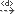
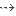
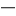
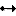
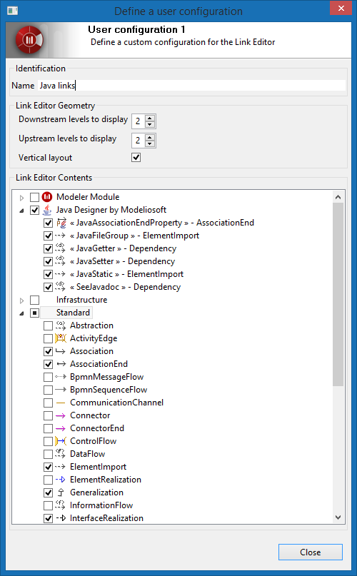
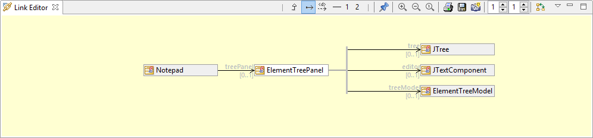
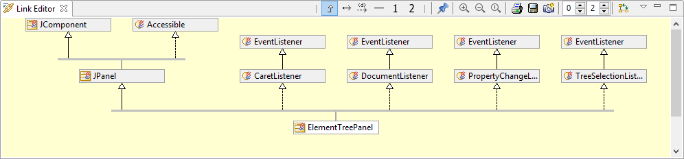

// Disable all captions for figures.
:!figure-caption:
// Path to the stylesheet files
:stylesdir: .

= Links Editor configuration

The link editor view can be configured, the configuration of the Link Editor applies to:

* the appearance of the view
* the contents displayed by the view

Configuring the appearance of the view is straightforward, using the toolbar button, the zoom factor and the layout orientation (vertical or horizontal) can be directly modified to suit the user's needs or taste.

Configuring the displayed contents, consists of choosing which kind of links are to be displayed among the many different kinds of link that Modelio supports. There are so many kinds of link in Modelio that displaying them all is not usable. Therefore, configuring the contents consists in filtering the links to be displayed.

The filter is based on the link meta class and optionally on its stereotype.

Defining a filter is a perfectly feasible operation that can however become a burden if the user wants a sophisticated configuration based on several meta classes and stereotypes.

Modelio helps the end-user by supporting predefined and custom configurations and making them directly accessible as a dedicated button in the view toolbar.

Just by clicking a configuration button in the toolbar the user can switch the link editor view to the contents he wants to see.

== Predefined configurations

Predefined link editor view configurations are "off the shelf" standard configurations of the link editor view that are provided by Modelio. The predefined configurations have been designed to suit most common situations. Furthermore, specific predefined configurations have been designed for the different standard workbenches and expertise that comes with Modelio. As the link editor view will switch the proposed predefined configurations depending on the current workbench, the user is guaranteed to always keep at his fingertips the contents he wants and needs to see.

This is an important feature of the link editor view that it shows *only the relevant predefined configurations for the current workbench*.

The following table lists the predefined configurations available for the standard expertises:

[width="100%",cols="16%,14%,14%,14%,14%,14%,14%"]
|============================================================================================================================================================================================
|*UML*|
image:images/attachment/modeliocom41/User_Documentation_en/Link_Editor/Link_Editor_configuration/inheritance.png[inheritance.png] Inheritance: +
_Interface Realization and_ +
_Generalization._
 |
image:images/attachment/modeliocom41/User_Documentation_en/Link_Editor/Link_Editor_configuration/association.png[association.png] Associations: +
_Association, (Aggregation and_ +
_Composition are only displayed)._ +
 |
 Dependencies: +
_Any kind of dependencies._ +
 |
image:images/attachment/modeliocom41/User_Documentation_en/Link_Editor/Link_Editor_configuration/traceability.png[traceability.png] Traceability and refinement: +
«trace» and «refine» stereotyped dependencies. +
 |  |
|*BPMN* |
image:images/attachment/modeliocom41/User_Documentation_en/Link_Editor/Link_Editor_configuration/bpmnsequenceflow.png[bpmnsequenceflow.png] Flows: +
_Sequence Flow_, and _Message Flow_. +
 |
image:images/attachment/modeliocom41/User_Documentation_en/Link_Editor/Link_Editor_configuration/traceability.png[traceability.png] Traceability and refinement: +
«trace» and «refine» stereotyped dependencies. +
 |  | | |
|*Analyst* |
  Links: +
_Analyst's profile stereotyped dependencies._
 |
image:images/attachment/modeliocom41/User_Documentation_en/Link_Editor/Link_Editor_configuration/traceability.png[traceability.png] Traceability and refinement: +
«trace» and «refine» stereotyped dependencies. +
 | | | |
|*ArchiMate* a|
 All: +
_All ArchiMate relationships._ +
 |
image:images/attachment/modeliocom41/User_Documentation_en/Link_Editor/Link_Editor_configuration/archimate.flow.png[archimate.flow.png] Dynamic: +
_Flow and Triggering relationships._ +
 |
 Structural: +
_Association, Aggregation, Composition, Assignment, Realization, and Specialization._ +
 |
image:images/attachment/modeliocom41/User_Documentation_en/Link_Editor/Link_Editor_configuration/archimate.access.png[archimate.access.png] Dependencies: +
_Access, Influence and Serving relationships._ +
 |
image:images/attachment/modeliocom41/User_Documentation_en/Link_Editor/Link_Editor_configuration/traceability.png[traceability.png] Traceability and refinement: +
«trace» and «refine» stereotyped dependencies. +
 |
|============================================================================================================================================================================================

== Custom configurations

While predefined configurations that do not require any special effort from the end-user are most often sufficient to cover the user's need, it may happen that a specific hybrid configuration is needed, in which several kinds of links, usually independent, must be displayed together for some reason. In such situation, the end user can define a custom configuration.

Modelio LinkEditor View supports two custom configurations custom1 and custom2 which can by definition be redefined to the user's needs.

To define a custom configuration, click on the view menu button image:images/attachment/modeliocom41/User_Documentation_en/Link_Editor/Link_Editor_configuration/View.png[View.png], this will pop-up a menu with two commands: one for each custom configuration. This command opens the "Define a user configuration" dialog illustrated below:

In the custom configuration dialog , the user can:

1.  Define a name for the configuration. This name will appear in the custom configuration button tool tip. Choosing a significant name later helps the user to remember what the configuration deals with. +
_In the example figure the chosen name is "Java links" clear indication that the configuration is focused on Java specific links in Modelio (mainly those from the UML static model plus several dependencies with specific stereotypes)._
2.  Choose the layout parameters: upstream depth, downstream depth and layout orientation. Users should prefer small values for depth, in order to keep the graph readable without scrolling and to keep a good level of reactivity of Modelio, remember that the Link Editor View is refreshed each time the selection changes in the application. Layout orientation is a matter of taste and convenience. +
_In the example figure, both upstream and downstream depth are set to 2, producing a symmetric graph around the central element._
3.  Choose which links are to be displayed. Just check the boxes corresponding to the link kinds to display. The tree proposes all the available kind of links, including stereotyped links (depending on the deployed modules). Link types are grouped by meta model and modules. +
_In the example figure, the user clearly chose the UML structural links (association and heritage) along with specific dependencies stereotyped by the Java Module. No surprising if to consider the name given to the configuration "Java links". This configuration is typical for a Java developer willing to explore or manipulate a Java UML Model._

== Presentation preferences

The figure below shows an example of the Link Editor View using an *horizontal layout* and symmetrically drawn by setting both *downstream and upstream depth levels* to the same value (here value is 'one').

The figure below shows an example of the Link Editor View using an *vertical layout*. The view is currently displaying the inheritance tree of the 'ElementTreePanel' class.

Note how the user configured the view to focus on the parent classes and interface implementations only by setting depth level to 'zero' for sub-classes and to 'two' for parent classes.

