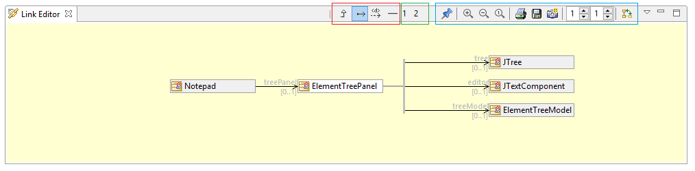
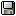
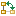

// Disable all captions for figures.
:!figure-caption:
// Path to the stylesheet files
:stylesdir: .

= Links Editor view

The figure below shows the Link Editor View. The view is composed of a main display area where the link graph is drawn, and has a toolbar where configuration commands are available.

The toolbar is structured in three areas:

1.  The Link Editor View management commands (blue rectangle in the figure) which are from left to right:
* *Pin/Unpin selected element* image:images/attachment/modeliocom41/User_Documentation_en/Link_Editor/The_Link_Editor_view/EditionMode.png[EditionMode.png] : Switches the Links Editor from Visualize to Edit mode.
* *Zoom in* image:images/attachment/modeliocom41/User_Documentation_en/Link_Editor/The_Link_Editor_view/zoom_in.png[zoom_in.png] : Zoom in.
* *Zoom out* image:images/attachment/modeliocom41/User_Documentation_en/Link_Editor/The_Link_Editor_view/zoom_out.png[zoom_out.png] : Zoom out.
* *Zoom to 1:1*  : Reset zoom level to 1:1 scale.
* *Print*  : Print the current contents of the Links Editor as an image.
* *Save in a file*  : Save the Link Editor contents in an image file.
* *Copy as a graphic*  : Copy Links Editor contents as an image in the clipboard.
* *Downstream levels displayed* : Defines the number of linked elements that will be displayed downstream from the selected element.
* *Upstream levels displayed* : Defines the number of linked elements that will be displayed upstream from the selected element.
* *Flip layout orientation*  : Flip the graph layout (horizontal/vertical).
2.  The Link Editor custom configurations (green rectangle in the figure) which are user-defined configurations of the Link Editor View contents (ie: which link kinds are to be displayed). +
Just click on the command button to switch to the chosen custom configuration. See <<User_Documentation_en_Link_Editor_Link_Editor_configuration.adoc#HCustomconfigurations,Custom configurations>> below.
3.  The Link Editor predefined configurations (red rectangle in the figure) which are 'of the shelf' available configurations provided by Modelio. +
Just click on the command button to switch to the chosen predefined configuration. See <<User_Documentation_en_Link_Editor_Link_Editor_configuration.adoc#HPredefinedconfigurations,Predefined configurations>> below
