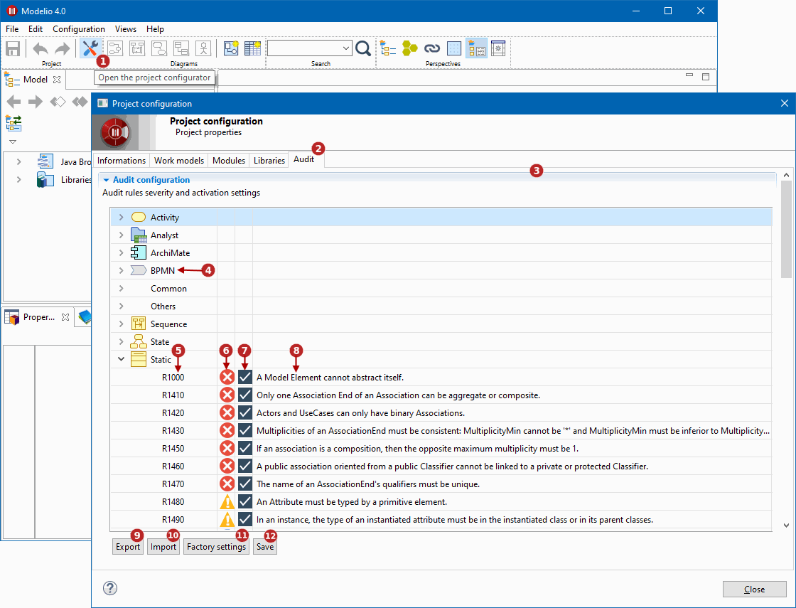

// Disable all captions for figures.
:!figure-caption:
// Path to the stylesheet files
:stylesdir: .

= Configuring project audit

Modelio comes with an extensive set of predefined audit rules to help you build sound, correct models. +
Each of these rules can be enabled, disabled or configured for different severity levels.

*Keys:*

1. Click on the image:images/attachment/modeliocom41/User_Documentation_en/Project_SaaS/Configuring_project_audit_SaaS/ConsultingProjectInformation_002.png[ConsultingProjectInformation_002.png] ('Project configurator') button in the toobar
2. Open the 'Audit' tab
3. The Audit rules list
4. Rules are organized by metaclass
5. Audit rule number
6. Audit rule severity. This can be set to *Error*, *Warning*, or *Advice*. This is the severity of the diagnostics that this rule will produce
7. This tickbox enables/disables the rule. A disabled rule is never controlled and produces no diagnostics
8. Rule description
9. Export the current configuration into a file (for example for re-use in another project)
10. Import configuration from a file
11. Restore factory settings
12. Save Audit configuration, apply the currently displayed configuration to the project
