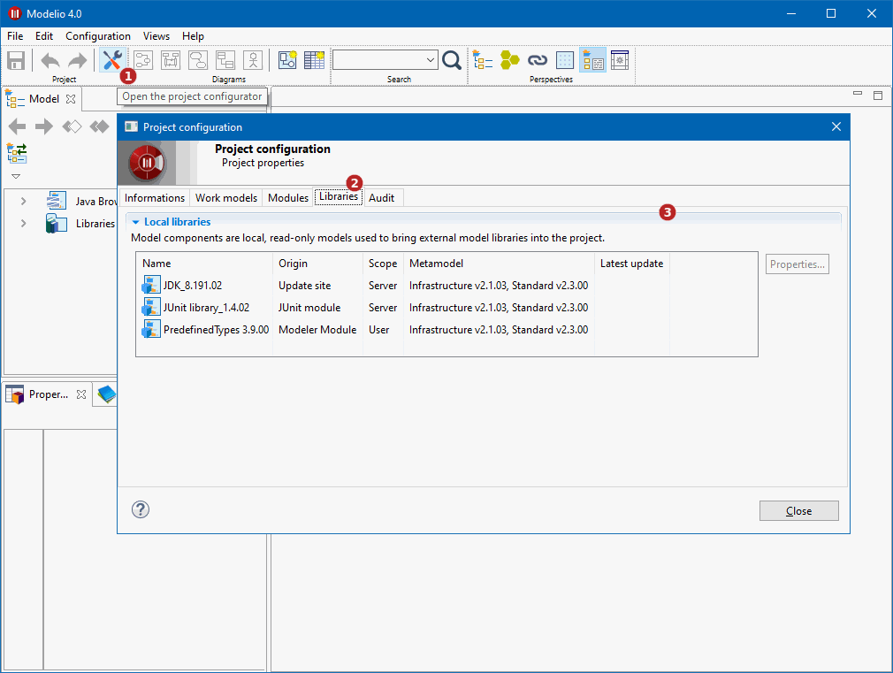

// Disable all captions for figures.
:!figure-caption:
// Path to the stylesheet files
:stylesdir: .

= Configuring project libraries

A *model library* or *library* is a set of non-modifiable model elements that is required for the development of your project, packaged in a single artefact.

A very basic example for Java projects is the JDK. In order to properly model a Java application, many classes from the JDK are used either for extension by inheritance or as parts in the compositions and associations of your model. These required JDK classes are brought into your project via a *model library*. Obviously, your intention is not to edit or modify the JDK model, which is why the models provided by libraries are *read-only*.

To get details regarding the libraries of the project, open the *Libraries* tab of the *Project configurator* window:

Keys:

. Click on the image:images/attachment/modeliocom41/User_Documentation_en/Project_SaaS/Consulting_project_libraries_SaaS/ConsultingProjectInformation_002.png[ConsultingProjectInformation_002.png] ('Project configurator') button in the toobar +
. Open the 'Libraries' tab +
. List of the libraries deployed in the project
. Add a model component from a local ramc file
. Show the details of the selected model component
. Remove the selected model component from the project
