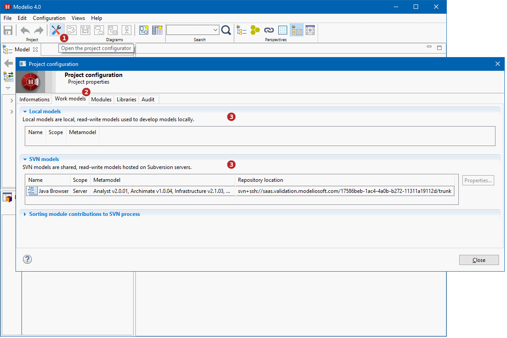

// Disable all captions for figures.
:!figure-caption:
// Path to the stylesheet files
:stylesdir: .

= Configuring project work models

In a Modelio project, a *work model* is a modifiable model. +
To get details regarding the work models of the project, open the *Work models* tab of the *Project configurator* window:

*Keys:*

. Click on the image:images/attachment/modeliocom41/User_Documentation_en/Project_SaaS/Consulting_project_work_models_SaaS/ConsultingProjectInformation_002.png[ConsultingProjectInformation_002.png] ('Project configurator') button in the toobar +
. Open the 'Work models' tab +
. The page gives information regarding the work models of the project
. Add a new local work model to the project
. Rename the selected local work model
. Remove the selected local work model from the project
. View properties of the selected shared work model
. Manage module contributions to SVN commands
