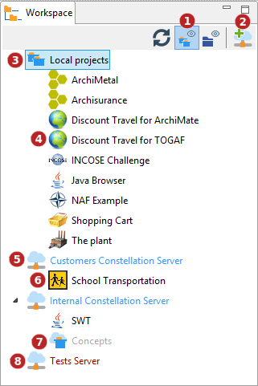
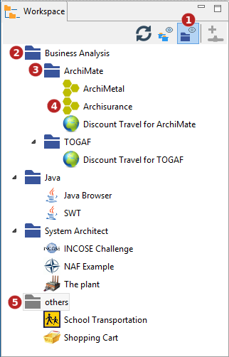
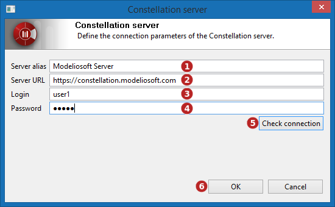

// Disable all captions for figures.
:!figure-caption:
// Path to the stylesheet files
:stylesdir: .

= Managing projects workspace

Since its version 3.8, Modelio features a new workspace view adding functionalities:

1.  Two visualization modes: "physical representation mode" and "working sets mode".
2.  User defined projects organization based on a hierarchical "workings sets" structure.
3.  New facilities to manage projects, especially Modelio Server hosted projects.

= Representation modes

== Physical representation mode

The physical representation mode shows:

* the local projects physically available in the workspace in a folder named "Local projects"
* the Modelio Servers declared in the workspace, an entry folder for each Modelio Server

Under the "Local projects" folder, the projects available in the workspace are listed in alphabetical order. For those projects, physical material exists in the workspace.

Under each Modelio Server entry folder, the workspace displays the projects that available to the user declared in the server configuration, whether these projects have been already joined or not.

The following figure shows the workspace view in "Physical representation mode":

*Keys:*

1. Check this button to select the "Physical representation mode" of the workspace view.
2. This button is used to configure a Modelio Server entry.
3. The "Local projects" folder.
4. A local project.
5. A Modelio Server entry. The server is displayed in blue meaning that it is currently reachable for the user that it was configured for.
6. An available Modelio Server project. As its name is not greyed and its icon displayed, this project has already been joined.
7. An available Modelio Server project. Being greyed, this project has not been joined yet on the workstation.
8. An unavailable Modelio Server entry. Red label means that this Modelio Server is currently unreachable, either because its provided authentication credentials are not correct, or because of some network failure.

*Commands:*

Workspace entries have a popup menu that displays applicable commands.

See <<User_Documentation_en_Managing_projects_workspace.adoc#HPop-upmenucommands,Pop-up Menu Commands>>.

== Working sets representation mode

The working sets representation mode is a user customizable view mode that allows the user to organize the projects based on his personal preferences or habits. A working set is a folder where projects references can be stored. Projects references appears as the project they refer to and allow most operations on projects: opening, clouding, renaming and so on. A working set can also contain sub-working sets for a finer structuration of the user's project portfolio.

In this representation mode, only the logical view defined and chosen by the end-user is visible, whatever the physical layout of the projects: local, Modelio Server projects...

A default working set named 'others' is always present and contains all the workspace projects that have not been placed in a user defined working set, providing an easy way to find such non working set assigned projects.

The following figure shows the workspace view in "Working set representation mode":

*Keys:*

1. Check this button to select the "Working Sets representation mode" of the workspace view.
2. A user-defined working set named "Business Analysis".
3. A sub-working set of the "Business Analysis" working set, named "ArchiMate".
4. Projects organised under the "ArchiMate" sub-working set.
5. The "others" projects default working set that will show all the projects not already assigned to a user-defined working set.

*Commands:*

Workspace entries have a popup menu that displays applicable commands.

See <<User_Documentation_en_Managing_projects_workspace.adoc#HPop-upmenucommands,Pop-up Menu Commands>>.

=== Working set management

Users can create as many working sets and sub-working sets as needed. They can add as many project reference they want in a working set, including adding a given project to several working sets.

Most operations on working sets are available in the pop-up menu that appears on project reference and working set entries. See <<User_Documentation_en_Managing_projects_workspace.adoc#HPop-upmenucommands,Pop-up Menu Commands>>.

However, a few specific interactions are possible in the workspace when in "working set representation mode":

1.  Drag and drop a project reference from any working set into another working set will move that reference to the targeted working set. The source working set can be the 'others' default working set.
2.  CTRL - Drag and drop a project reference from a working set into another working set will duplicate the reference in the targeted working set.

*Note:* Whatever the Drag and drop mode, ie CTRL or not, projects dragged from 'others' and dropped into a working set always disappear from 'others'.

= Modelio Servers

=====  image:images/attachment/modeliocom41/User_Documentation_en/Managing_projects_workspace/connectconstellation.png[connectconstellation.png] Add Modelio Server

This command configures a Modelio Server entry. Once the Modelio Server has been configured, all the projects accessible to the defined user will appear.

*Keys:*

1.  *Server alias* : Enter a server alias name to be displayed in the workspace browser. If left empty the server URL will be displayed.
2.  *Server URL* : Enter the URL of the Modelio Server.
3.  *Login* : Enter the user login to use for the connection to the Modelio Server.
4.  *Password* : Enter the password associated to the login.
5.  *Check connection* : Click on this button to test the connection to the server.
6.  *Ok* : Once the connection to the server has been tested successfully, click on Ok.

= Pop-up menu commands

The workspace pop-up menu only displays available commands on the currently selected entry. Strictly unavailable commands just do not show, greyed commands are commands that might have been available but are currently not applicable (eg: Close project on a non-opened project is an available command on a project that is simply not applicable on an already closed project).

=====  image:images/attachment/modeliocom41/User_Documentation_en/Managing_projects_workspace/newproject.png[newproject.png] Create a project

This command creates a new project.

*Available on:*

* The "Local projects" folder in physical representation mode
* Any working set, including 'others', in working set representation mode

=====  image:images/attachment/modeliocom41/User_Documentation_en/Managing_projects_workspace/import_project.png[import_project.png] Import a project

This command Imports a full project (*.zip) in the current workspace.

*Available on:*

* The "Local projects" folder in physical representation mode
* Any working set, including 'others', in working set representation mode

=====   Open project

This command open an existing project. The selected project must be closed.

*Available on:*

* Any project entry in the "Local projects" folder in physical representation mode
* Any project reference from any working set (including 'others'), in working set representation mode

=====  image:images/attachment/modeliocom41/User_Documentation_en/Managing_projects_workspace/export_project.png[export_project.png] Export the project

This command exports a full project into a zip archive. The selected project must be closed.

*Available on:*

* Any project entry in the "Local projects" folder in physical representation mode
* Any project reference from any working set (including 'others'), in working set representation mode

=====  image:images/attachment/modeliocom41/User_Documentation_en/Managing_projects_workspace/closedproject.png[closedproject.png] Close project

This command closes the current project. The selected project must be opened.

*Available on:*

* Any project entry in the "Local projects" folder in physical representation mode
* Any project reference from any working set (including 'others'), in working set representation mode

=====   Rename project

This command renames a project.The selected project must be closed.

*Available on:*

* Any project entry in the "Local projects" folder in physical representation mode
* Any project reference from any working set (including 'others'), in working set representation mode

=====  image:images/attachment/modeliocom41/User_Documentation_en/Managing_projects_workspace/delete.png[delete.png] Delete project

This command deletes an existing project. The selected project must be closed. The user is prompted for a confirmation as this operation cannot be undone.

*Available on:*

* Any project entry in the "Local projects" folder in physical representation mode
* Any project reference from any working set (including 'others'), in working set representation mode

=====  image:images/attachment/modeliocom41/User_Documentation_en/Managing_projects_workspace/newworkingset.png[newworkingset.png] Create a working set

This command creates a new working set.

*Available on:*

1.  A selection of one or more projects in the "Local projects" folder in physical representation mode
2.  A selection of one or more *joined* projects a Modelio Server folder in physical representation mode
3.  A selection of project references in a working set, including 'others', in working set representation mode
4.  A working set, excluding 'others'

For cases 1, 2 and 3, the newly created working set is created as a first level entry in the workspace view and it is automatically populated with references to the selected projects.

For case 4, the newly created working set is a child of the selected working set. It is created empty.

=====  image:images/attachment/modeliocom41/User_Documentation_en/Managing_projects_workspace/delete.png[delete.png] Delete a working set

This command deletes a working set. All the reference and sub-working sets contained in the working set are deleted too. This command is safe as it does NOT DELETE any project.

*Available on:*

* A working set, excluding 'others'

=====  image:images/attachment/modeliocom41/User_Documentation_en/Managing_projects_workspace/removeworkingset.png[removeworkingset.png] Remove a Modelio Server

This command removes a Modelio Server configuration. This will NOT delete any previously joined project on this server.

*Available on:*

* A Modelio Server entry in physical representation mode

=====  image:images/attachment/modeliocom41/User_Documentation_en/Managing_projects_workspace/editconstellation.png[editconstellation.png] Edit connection parameter

This command configures a Modelio Server entry. A dialog is displayed that allows modifying the Modelio Server attributes:

* Server alias (name in the workspace view)
* Server URL
* User name
* User password

*Available on:*

* A Modelio Server entry in physical representation mode

=====   Join project

This command joins a Modelio Server project.

*Available on:*

* A unique non-already-joined project in a Modelio Server folder in physical representation mode

=====  image:images/attachment/modeliocom41/User_Documentation_en/Managing_projects_workspace/removeworkingset.png[removeworkingset.png] Remove project reference from working set.

This command removes a project reference from a working set. The project IS NOT DELETED, only its reference is.

*Available on:*

* Any project reference from any working set (excluding 'others'), in working set representation mode
