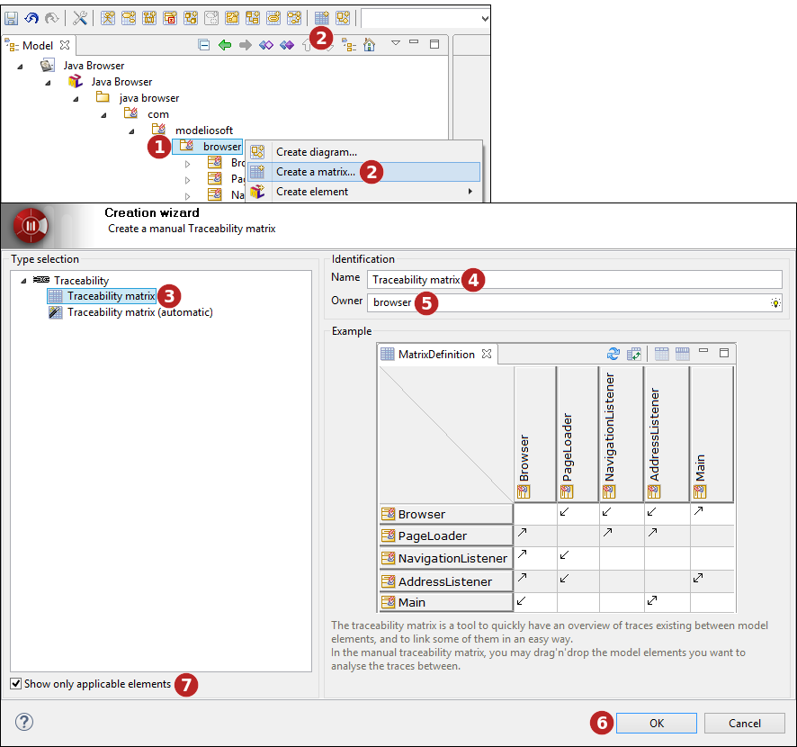
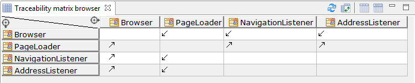

// Disable all captions for figures.
:!figure-caption:
// Path to the stylesheet files
:stylesdir: .

= Traceability matrices

 The traceability matrix is a tool to quickly have an overview of traces existing between model elements, and to link some of them in an easy way.

On each cell, an arrow indicates the direction of the traceability links. A bidirectional link indicates both elements relate each other. Further modifications of the model will make the matrix refresh automatically as the traces are modified.

.Creating an automatic traceability matrix using the creation wizard

*Keys:*

1. Select the element on which you want to create a matrix.
2. Click on the "  Create matrix..." button in the tool bar or use the one of the selected elements contextual menu.
3. Select a type of matrix.
4. Enter a name for the new matrix or leave the default name.
5. If the matrix owner is different from the selected model element, indicate the matrix owner.
6. Click on "OK" to complete the new matrix creation.
7. Non-applicable matrices are greyed and can be masked by checking the "Show only applicable diagrams and matrices" tickbox.

Two variants exist for this matrix: automatic and manual. [[Automatic-traceability-matrix]]

===== Automatic traceability matrix

The automatic traceability matrix is a square matrix showing all children of a Package or Class, and the «trace» links between them.

.Automatic matrix
image::images/attachment/modeliocom41/User_Documentation_en/Matrices/Modeler-_modeler_Matrices_matrix2.png[Modeler-_modeler_Matrices_matrix2.png]

===== Manual traceability matrix

In the manual traceability matrix, you may drag & drop the model elements you want to analyse the traces between. They can be added freely as line or column, to display exactly what you need.

.Drag'n'drop elements in a manual matrix
image::images/attachment/modeliocom41/User_Documentation_en/Matrices/Modeler-_modeler_Matrices_matrix3.png[Modeler-_modeler_Matrices_matrix3.png]

*Steps:*

1. Select some elements in the "Model" tab.
2. Drag the elements into the image:images/attachment/modeliocom41/User_Documentation_en/Matrices/droparea.png[droparea.png] symbol of the column or line and release the mouse button.

.Manual matrix

A typical use of the manual matrix is to stack Requirements in one axis, and implementation Classes in the other axis to ensure all Requirements are fulfilled.
