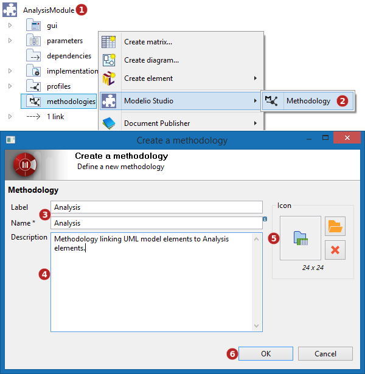
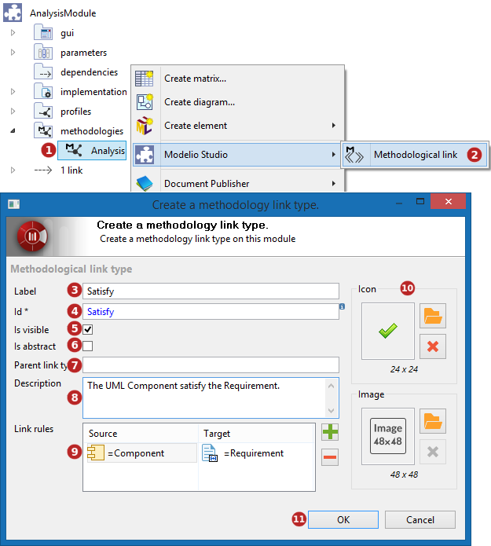

// Disable all captions for figures.
:!figure-caption:
// Path to the stylesheet files
:stylesdir: .

= Custom methodology

In a Modelio Studio project, it is possible to define new methodologies as well as methodological link types in a module.

Once the module has been deployed, all the link types are available in the model.

===== Create a methodology

Methodologies can be created on a module  or a methodology container ,

*Keys:*

1.  Select the  module in which you want to create a  methodology.
2.  On the  methodology container, run the 'Modelio Studio \  Methodology' command from the context menu.
3.  Enter a name and a label.
4.  Enter a description that explains the purpose of the new methodology.
5.  Choose an icon to associate to the methodology.
6.  Click on 'OK' to validate the creation.

===== Create a methodological link type

*Keys:*

1.  Select a  méthodology.
2.  Run the 'Modelio Studio > image:images/attachment/modeliocom41/User_Documentation_en/Methodology/Custom_methodology/methodologylinktype.png[methodologylinktype.png] Methodological link' command from the context menu.
3.  Enter a label.
4.  Change the automated id if it does not suit you.
5.  Indicate whether or not the link type has to be visible from users for manual addition/removal.
6.  Indicate whether the type has to be concrete or abstract.
7.  Enter a parent stereotype if the new type has to extend an existing one (optional).
8.  Enter a description.
9.  Define the *link rules* that indicate which elements the new link will bind.
10. Choose an icon and an image to associate to the link type.
11. Click on 'OK' to validate the creation.

*Note:* for new link rules, or modified ones, to be taken into account upon module deployment, the module's MDA API has to be generated at least once during the Studio generation of the module.
