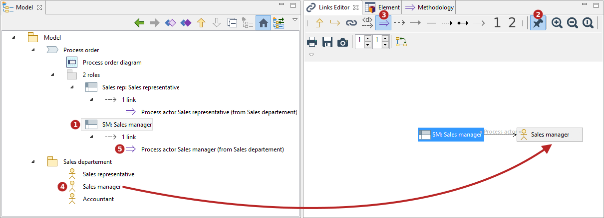
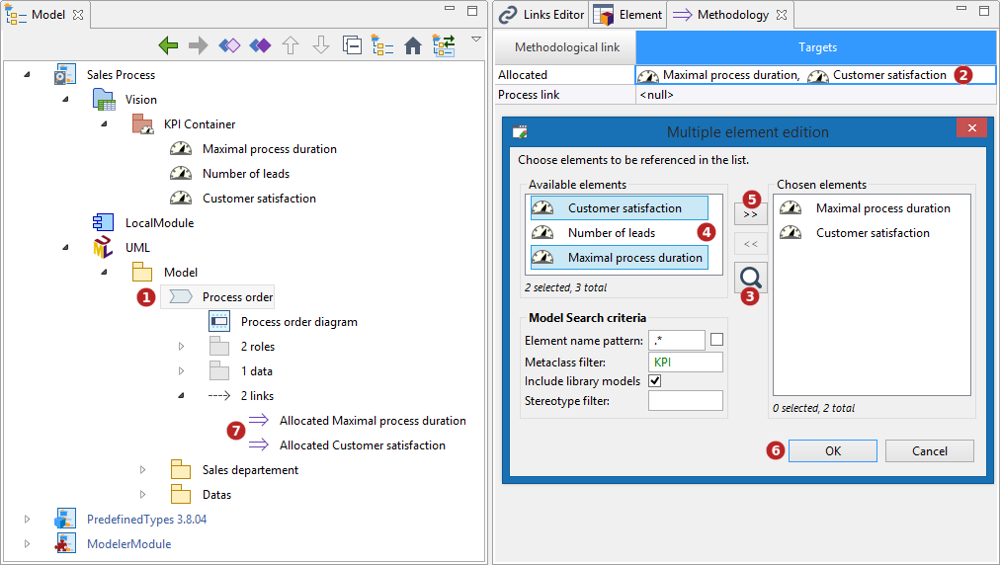

// Disable all captions for figures.
:!figure-caption:
// Path to the stylesheet files
:stylesdir: .

= Using methodological links

There are several ways of creating methodological links.

===== Smart Interactions

Methodological links can easily be created by drag&dropping elements in diagrams.

For example, drag&dropping a UML Actor into a BPMN Process diagram will create the corresponding Lane in the diagram, and the relevant methodological link between the Lane and the Actor.

image::images/attachment/modeliocom41/User_Documentation_en/Methodology/Methodology_view/SmartPuces.png[SmartPuces.png]

*Keys:*

1. Drag&drop an Actor into a BPMN Process diagram.
2. A Lane is created in the BPMN diagram.
3. A 'Process actor' methodological link is created from the Lane to the Actor.

===== Links Editor

Methodological links can also be created thanks to the Link Editor.

For example to link a Lane to an Actor, pin the Lane in the Link Editor and drag&drop the actor into it.

*Keys:*

1. Select a Lane.
2. Freeze the Link Editor Editor (pin the element).
3. Select the methodological links.
4. Drag&drop the Actor after the pinned Lane.
5. A 'Process actor' methodological link is created from the Lane to the Actor.

===== Element View

Methodological links can also be created in the Element view.

For example to link a Data Object to a Class and/or a State, just click in the appropriate fields in the Element view.

image::images/attachment/modeliocom41/User_Documentation_en/Methodology/Methodology_view/ElementPuces.png[ElementPuces.png]

*Keys:*

1. Select a Data Object.
2. Using CTRL+Space or the picking feature, select the elements to be linked.
3. A 'Represents' methodological link is created from the Data Object to the Class, and a 'State' methodological link is created from the Data Object to the State.

===== Methodology View

Methodological links can also be created in the Methodology view.

For example to link a BPMN Process to several KPIs, just click in the appropriate field in the Methodology view.

*Keys:*

1. Select a Process.
2. Click on the 'Allocated' field in its Methodology view.
3. Click on the Search button to display all the KPIs.
4. Select the relevant KPIs.
5. Click on the '>>' button.
6. Click on the 'OK' button.
7. 'Allocated' methodological links are created from the Process to the KPIs.
