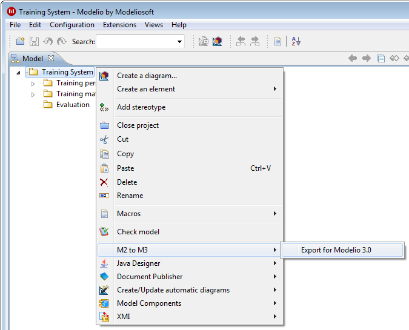

// Disable all captions for figures.
:!figure-caption:
// Path to the stylesheet files
:stylesdir: .

= Migrating earlier Modelio Teamwork projects

Modelio 2.2.1 and 2.2.2 projects can be migrated to Modelio 4.

To migrate pre-Modelio 2.2.1 projects, it is necessary to first migrate them to Modelio 2.2.1 using the proper migration procedure.

===== Prerequisites

* An operational installation of Modelio 2.2.1 or 2.2.2
* An operational installation of Modelio 4
* The migration module *M2toM3*.

For those using projects on a teamwork context, it is necessary to prepare these projects and the repositories to which they are connected. It is essential that all users working with teamwork manager use the same version of Modelio. Before updating Modelio and for each repository:

1.  All users must commit their work so the repository will contain full projects' content.
2.  An appointed project manager must update his project. This project will contain full repository content and will be used as a project reference. [[Launching-the-migration-procedure]]

===== Launching the migration procedure

The following screenshot shows how to launch the procedure for migrating a Modelio 2.2.1 project to Modelio 4.

 

 [[HInModelio2.2.1ou2.2.2]]
===== In Modelio 2.2.1 or 2.2.2

1.  Start Modelio 2 and open the project reference to migrate.
2.  Install the M2toM3 module in the project.
3.  From the project root, run the *"M2 to M3\Export for Modelio 3"* command.
4.  In the file selection dialog, select a path and a name for the zip file that will contain the migrated project.
5.  When the command has finished running, the migrated project is available in the (zip) file chosen in the previous step.
6.  Close the project and close Modelio 2, and carefully note the migrated project file name and path.

That's all for Modelio 2! [[In-Modelio-3]]

===== In Modelio 4

1.  Start Modelio 4.
2.  From the _File_ menu, run the *"Import a project"* command.
3.  In the file selection dialog, select the path and name of the zip file containing the migrated project.
4.  When the command ends, the migrated project appears in the list of projects in the workspace.
5.  Open the migrated project.
6.  Proceed to the final steps as described below.

*Note:* The very first opening of a migrated project might take a while, due to Modelio 4's different storage technology which requires some first-time initialization of the migrated project. [[Final-steps]]

===== Final steps

The new migrated project in Modelio 4 should contain all the data from the Modelio 2 project without any loss. However, the newly migrated project is still referencing modules from Modelio 2 and these modules are obsolete.

This can be easily diagnosed in the *Modules* tab of the *Project configurator* dialog as shown in the figure below:

image::images/attachment/modeliocom41/User_Documentation_en/Migrating_earlier_Modelio_Subversion_projects/TW_013_deploy_modules.png[TW_013_deploy_modules.png]

*Steps:*

1. In 'Configuration > Modules', click on the 'Add' button
2. Choose the modules to add
3. Validate to deploy the chosen modules in the project

*Note:* The *Modeling Wizard*, *Analyst*, *Analyst Administrator*, and *Subversion* modules are now an integral part of Modelio, they are obsolete and can simply be removed from the project. [[Création-du-nouveau-référentiel-SVN-pour-Modelio-3]]

===== New Teamwork repository creation for Modelio 4

1.  In the reference project migrated for Modelio 4 (with updated modules), the project manager creates a shared work model and connect it to the new teamwork repository.
2.  The project manager moves (using drag'n,drop) the content of the migrated local model into the shared model then save and close the project.
3.  The project manager reopen the project, delete the empty local model and commit the shared model content.
4.  All other users start up Modelio 4 and create a new project, making sure they deploy all the necessary modules, create an shared model and connect it to the new repository.
