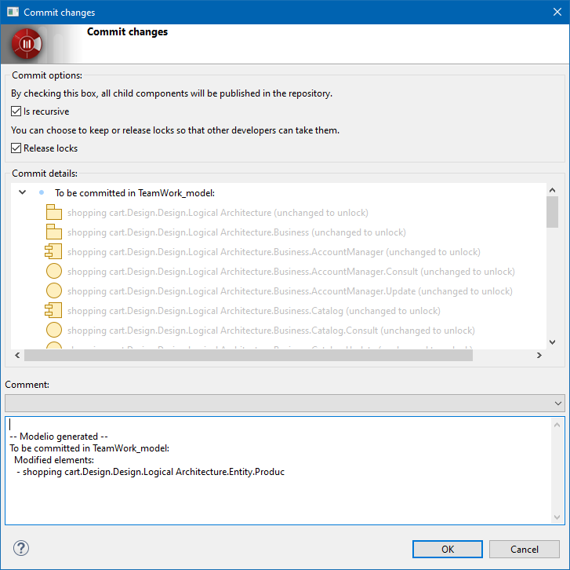

// Disable all captions for figures.
:!figure-caption:
// Path to the stylesheet files
:stylesdir: .

= The "Commit" command

===== Description

The "Commit" command publishes the modifications that have been locally carried out on an atomic unit. At the end of this operation, those elements on which the command has been run are unlocked and are available for locking by another user.

When the "Commit" command is run on one or several elements, they are subsequently put into read-only mode. However, in certain cases, additional elements can also be automatically committed. These additional units are the elements that directly depend on the initial elements on which the commit is run and that are also currently locked. This behavior ensures perfect project consistency after the commit operation. [[Conditions-and-restrictions]]

===== Conditions and restrictions

This command can only be run on components that have been previously locked or modified in non lock mode.

However, the command is still available on read-only elements. In this case, when run, the "Commit" command will simply commit the modified sub-elements, if any. [[User-interface]]

===== User interface

The "Commit" command opens the following window:

.The "Commit" window

This window includes an "Is recursive" option, a "Release locks" option and a multi-line text field named "Comment" that can be used to enter information regarding the modifications that have been carried out on the committed elements. This is often helpful for other users or the project manager, who are made aware of exactly what has been changed in the project and who carried out the changes.

*Note:* The "Comment" field is not mandatory.

Note the "Commit details" area that lists the elements being published in the repository. The displayed list takes into account all the dependent elements that are about to be published intelligently, along with the elements initially selected for committing. This gives you the possibility of checking which elements you are about to publish, and the opportunity of canceling the operation if this list does not correspond to your expectations. [[Behavior]]

===== Behavior

The options available in the "Commit" window can modify the behavior of the command as described below.

* *Is recursive* : +
The element AND all its sub-elements will be committed. +
Example: a package and all its classes.
* *Release locks* : +
The locks on elements will be released after the commit operation. If you do not check this tickbox, you retain the locks after the commit operation, and can continue to work on the elements that you have just committed. This can be practical if you want to carry out intermediate deliveries, while continuing your work on the same classes, packages and so on.
