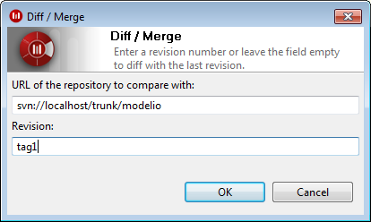
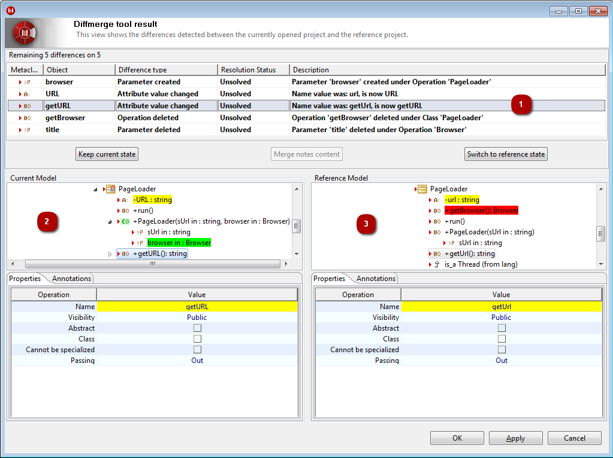
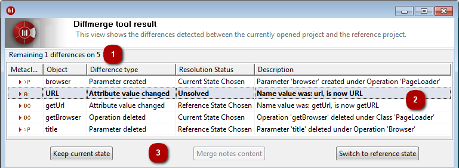

// Disable all captions for figures.
:!figure-caption:
// Path to the stylesheet files
:stylesdir: .

= The Diff/Merge command

===== Description

The "Diff/Merge" command compares the current model to a "reference" model. This "reference" model can be extracted from any revision or tag of the Teamwork repository the current project is connected to, or from a branch.

The "Diff/Merge" command then produces a dialog where the computed differences between the current model and the reference one can be visualized and resolved.

Resolution is the act of deciding for each detected difference whether to:

* apply changes in the current model so that it corresponds to the reference model, or
* keep the local modifications

Each computed difference can have one of the following resolution states:

* *Unsolved* : No resolution choice has been made for this difference yet and it is possible to make a choice for it.
* *Current State Chosen* : The resolution choice has been made earlier for this difference to keep the local modification. This means that the current model will continue to differ from the reference model, but the difference is considered resolved.
* *Reference State Chosen* : A resolution choice has been made earlier for this difference to cancel the local modification. This means that changes have been made to the current model so that it no longer differs from the reference model. The difference is considered resolved.
* *Merged* (only possible for a difference concerning the content of a note): A resolution choice has been made earlier for this difference to merge the content of the note in the current model with the content of the note in the reference model. The difference is considered resolved.
* *Not Applicable* : The current model is in a state where it is not possible to make a resolution choice for the difference.
** Example: A class is handled by Teamwork and it has not been locked in the current model, so it cannot be modified. If its name in the current model differs from its name in the reference model, then a difference on the Name attribute of the class would be listed. However, this difference would be in a "Not Applicable" state because the class cannot be modified and therefore it is not possible to make a resolution choice.

*Notes :* Making a resolution choice on a difference can impact the resolution state of other differences.

More precisely, a difference might become "Not Applicable", whatever its previous state, because of the choice made on another difference.

Likewise, a difference that was "Not Applicable" can become applicable, because of the choice made on another difference. Its resolution state would

become the one it had before being "Not Applicable" (by default, "Unsolved"). [[Conditions-and-restrictions]]

===== Conditions and restrictions

This command can be launched on any atomic element of the model, and only the selected element and its composed elements (recursively) will be compared to the reference model. [[User-Interface]]

===== User Interface

The "Diff/Merge" command opens the following window:

.The "Diff/Merge" window

The "URL of the repository to compare with" field can be used to specify a branch as reference model.

The "Revision" field can be used to indicate which revision of the Teamwork repository to use as reference model.

*Notes:* Either a revision number or a tag name can be used.

If the "Revision" field is left empty, then the "Diff/Merge" command will use the last available revision (often known as the "HEAD" revision) as reference model.

When the "OK" button is pressed, the actual computing of differences is made, and then the result window is opened:

.An example of the result window of the "Diff/Merge" command

*Keys:*

1. Differences: All detected differences are listed and described here. This is also where resolution choices for differences are made.
2. Current model: This zone shows the current state of the local model, including the result of resolution decisions made so far.
3. Reference model: This zone shows the state of the reference model, which can be useful, for example, when context is needed to make a decision on a particular difference.

At the bottom of the result window are the "OK", "Apply" and "Cancel" buttons.

On pressing the "OK" button, the resolution decisions made so far are actually applied to the model of the current project. The result window is then closed.

On pressing the "Apply" button, the resolution decisions made so far are actually applied to the model of the current project. Differences to the (same) reference model are then computed again. The result window is updated with the result of this new computation.

On pressing the "Cancel" button (or the cross in the upper-right corner of the result windows), the resolution decisions made so far are ignored and the model of the current project is left unchanged.

*Note:* When using the "Apply" button, the model of the current project can be modified, and these modifications will be retained even if the "Cancel" button is pressed afterwards. [[Difference-zone]]

===== Difference zone

Although the "Current Model" and "Reference Model" zones can be used to navigate both models, the main interaction zone of the result window is the difference zone:

.Details of the difference zone

*Keys:*

1. Remaining differences counter: This counter informs you of how many differences have not yet been resolved (i.e. the number of "Unsolved" differences with regard to the total number of differences).
2. Difference details: Selecting a particular difference in this list will select the most relevant element in current model zone and the reference model zone. For each difference, information is provided:
* The main object involved in this difference.
* The exact type of difference (e.g. the creation of an element, the reordering of composed elements, the changing of an attribute value, etc).
* The current resolution status.
* A short text description.
3. Action buttons: These buttons are used to express a resolution decision on the difference(s) selected in the difference list.
* The "Switch to reference state" button is used to express that the current model should reflect the reference model. This usually implies modifying the current model.
* Conversely, the "Keep current state" button is used to express that the current model should reflect the model as it was before the "Diff/Merge" command was launched. This implies no modification of the current model, except if the difference was previously in the "Reference" or "Merged" state in which case the modifications made are simply undone.
* Finally, the "Merge notes content" button is only available when the currently selected difference concerns the content of a note, and opens an external text merge tool to allow for accurate merging of the content.

*Notes:* The resolution state of a difference can always be modified, as long as the difference is not in the "Not Applicable" state.

On *Mac OS X*, XCode is required for the "Merge notes" feature.
