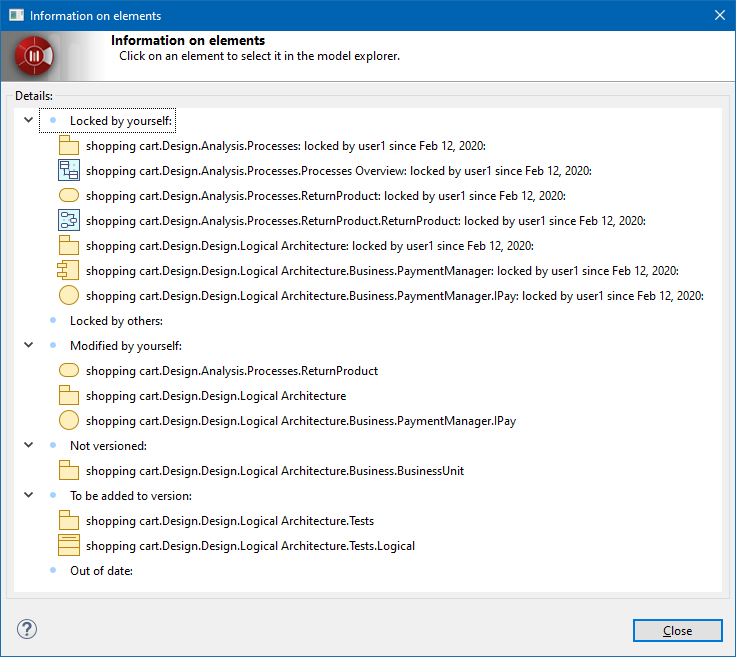

// Disable all captions for figures.
:!figure-caption:
// Path to the stylesheet files
:stylesdir: .

= The "Information" command

===== Description

The "Get information" command reports the state of elements with regard to the repository. Elements are grouped according to the following states:

* Locked by yourself: elements which are checked-out by the current user.
* Locked by others: elements which are checked-out by another user.
* Not versioned: newly created elements or elements which have not yet been added to version or committed in the repository.
* To be added to version: elements which have been added to version but have not yet been committed in the repository.
* Out of date: elements which have been modified by another user. [[Conditions-and-restrictions]]

===== Conditions and restrictions

No particular conditions. [[User-interface]]

===== User interface

The "Information" command opens the following results window at the end of execution:

.The results window displayed after running the "Information" command

