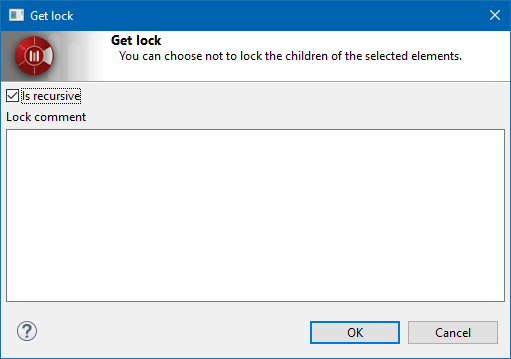

// Disable all captions for figures.
:!figure-caption:
// Path to the stylesheet files
:stylesdir: .

= The "Get lock" command

===== Description

The "Get lock" command enables you to mark one or more <<User_Documentation_en_Introducing_SVN_work_models_Atomic_units.adoc#,units>> as being locked, putting them in read-write mode and therefore locally modifiable.

Usage of this command is mandatory when the work model is configured in " <<User_Documentation_en_Introducing_SVN_work_models_Lock_modes.adoc#,lock mode>> ", and optional in the other case.

Only one user in the workgroup can lock a given element. Therefore, if another user tries to subsequently lock an element, the "Get lock" command will not work. [[Conditions-and-restrictions]]

===== Conditions and restrictions

* The "Get lock" command is only available on not already locked <<User_Documentation_en_Introducing_SVN_work_models_Atomic_units.adoc#,atomic units>>.
* The "Get lock" will fail if the elements to locks are not up-to-date. You may then run the <<User_Documentation_en_Overview_of_Subversion_commands_Update.adoc#,Update command>> before trying again. [[User-interface]]

===== User interface

The "Get lock" command opens the following window:

.The "Get lock" window

This window includes one "Is recursive" option (see details in the "Behavior" paragraph) and a multi-line text field named "Lock comment" that is used to enter information on your intention when locking the element. For example, you can indicate a task identifier from the project management system or a bug report number related to the reason why you are about to modify the locked element.

*Note:* The "Lock comment" field is not mandatory. 

===== Behavior

The "Get lock" command options modify command behavior as described below.

* *Is recursive* : +
The element AND all its sub-elements will be locked by the command. +
Example: a package and all its classes.

Note that the "Is recursive" option is checked by default, since this is most often the desired option. However, consider that if applied to a very high- level element such as a top level package or the project itself, the "Get lock" command and the "Is recursive" option will lock a huge part of the model. This can be troublesome for other users, who will not be allowed to modify any of these numerous locked elements.

As a rule of thumb, you should always try to minimize the number of elements you are locking, so don't hesitate to uncheck the "Is recursive" option where necessary. For example, instead of locking a complete package in order to modify a single class inside it, why not just lock the class itself?

*Note:* In a recursive "Get lock" operation, if some elements on which this command is run are already locked by another user, the command will not fail, but will simply indicate that these already locked elements cannot get locked locally.

*Modelio 2 users* : On Modelio 3 the "Get lock" does not run an " <<User_Documentation_en_Overview_of_Subversion_commands_Update.adoc#,Update>> " anymore. The "Get lock" will fail if the elements to locks are not up-to-date.
