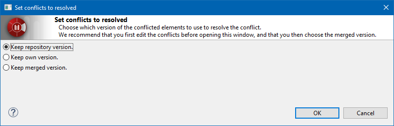

// Disable all captions for figures.
:!figure-caption:
// Path to the stylesheet files
:stylesdir: .

= The "Set conflicts resolved" command

===== Description

Resolve the conflicts for whole <<User_Documentation_en_Introducing_SVN_work_models_Atomic_units.adoc#,atomic units>> at once. [[Conditions-and-restrictions]]

===== Conditions and restrictions

This command can be run only on conflicted <<User_Documentation_en_Introducing_SVN_work_models_Atomic_units.adoc#,atomic elements>>. [[Behavior]]

===== Behavior

This command allows the user to resolve all conflicts at once in one operation by choosing once the version to keep.

The command then displays the following dialog:

.The "Set conflicts resolved" dialog

The dialog gives 3 options:

* *keep repository version* : 
** All selected conflicted elements will be replaced by their repository version.
** All local modifications will be lost.
** This is usually the safest option for the team but your have to redo you work again from the up-to-date element.

* *keep own version* : 
** Keep the local version.
** The repository version will be overwritten by the local version on next commit.
** All local modifications to the selected elements done after they went to conflict state will be lost, including previous <<User_Documentation_en_Overview_of_Subversion_commands_Solve_conflicts.adoc#,Solve conflicts>>.
** This is usually not the best option to choose as other users modification will be overwritten.

* *Keep merged version* : 
** Keeps the model as it is currently and set the conflicts as resolved.
** You should use it only after having used the <<User_Documentation_en_Overview_of_Subversion_commands_Solve_conflicts.adoc#,Solve conflicts>> command on the conflicted elements.

Validating the dialog will replace the selected elements with the chosen version and remove the conflict state of all of them.
