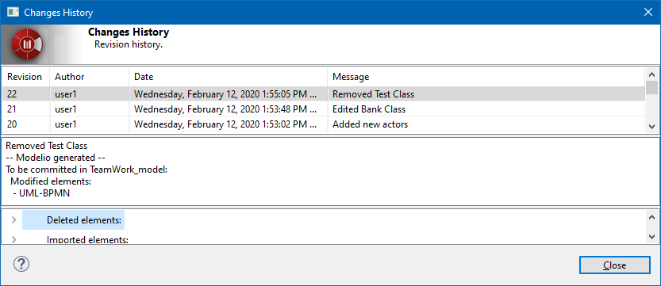

// Disable all captions for figures.
:!figure-caption:
// Path to the stylesheet files
:stylesdir: .

= The "Show log" command

===== Description

The "Show log" command is used to display the revision log for the element on which it is run. The revision log provides details on all the Teamwork operations carried out on the element in question, including:

* the revision number
* the author of the revision
* the date on which the revision was carried out
* the explanatory message associated with the revision [[Conditions-and-restrictions]]

===== Conditions and restrictions

The "Show log" command can be run on any <<User_Documentation_en_Introducing_SVN_work_models_Atomic_units.adoc#,atomic element>>. [[User-interface]]

===== User interface

The "Show log" command opens the following window:

.The "Changes History" window

 

===== Behavior

The "Show log" command displays the revision log for the element on which it is run. If the command is run on the root package of the project, all revisions of all project elements are listed. However, if the command is run on a particular atomic element, then only the revisions carried out on this particular element are listed.

If you right-click on a revision line in the "Log" window, a pop-up menu appears, from which you can run a "Diff/Merge" operation on the element concerned.
