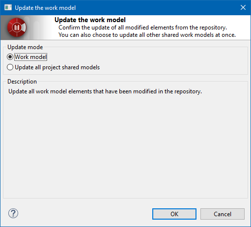

// Disable all captions for figures.
:!figure-caption:
// Path to the stylesheet files
:stylesdir: .

= The "Update" command

===== Description

The "Update" command updates the whole shared work model with the content present in the repository. It is used to retrieve all the modifications made to the work model and published by other workgroup users. [[Conditions-and-restrictions]]

===== Conditions and restrictions

This command is only available on non locally modified atomic units. [[User-interface]]

===== User interface

The "Update" command opens the following window:

.The "Update the project" window

===== Behavior

The "Update mode" modifies command behavior as described below.

* *Work model* : +
Update all work model elements that have been modified in the repository.

* *Update all project shared models* : +
Update all project shared models at once.

Note that the "Update" command will never modify elements that are currently locked in your model, nor will it modify non versioned elements in your model.
