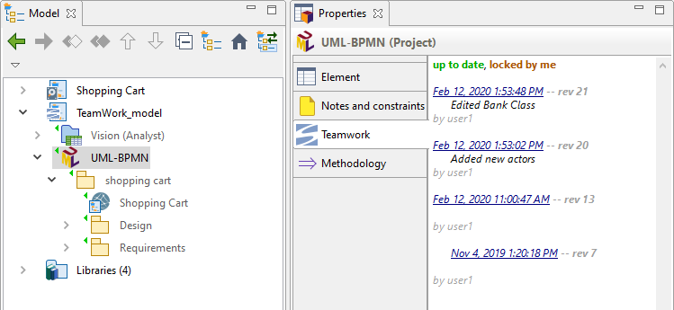

// Disable all captions for figures.
:!figure-caption:
// Path to the stylesheet files
:stylesdir: .

= Teamwork view

The Teamwork view is a precious helper when working on model in a team by providing the end-user with immediate and up to date information about any model element's SVN state.

The view appears as a dedicated tab, labeled *Teamwork*, in the Modelio standard *Properties* view as soon as a Teamwork managed model elements is selected (otherwise the Teamwork tab is not visible).

The tab displays the current Teamwork state of the selected element, along with a short history (limited to 8 records) of the last Teamwork operations that have been carried out lately. For each operation a summary of the log message is also displayed.

The following figure shows the Teamwork Log view for the *UML-BPMN* model element:

* the *UML-BPMN* element appears to be locked by the current user.
* the *UML-BPMN* element is up to date.
* the last commit carried out on the *UML-BPMN* model element is dated from the _12th february 2020_.

