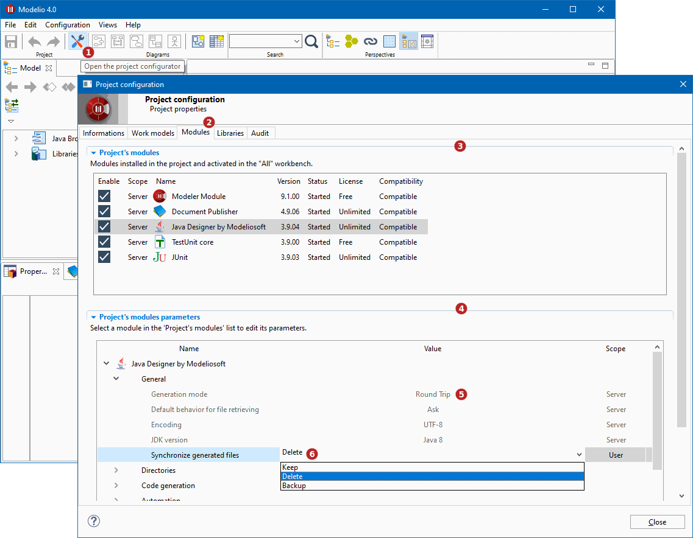

// Disable all captions for figures.
:!figure-caption:
// Path to the stylesheet files
:stylesdir: .

= Configuring project modules

Modelio modules are complementary components, each of which providing specific services tailored for a particular modeling need.

Modelio provides a number of modules, all of which exploit a model for a specialized need (for example, documentation or Java code generation).

When a module is installed, it provides specific menus, icons and specialized annotations. +
Some modules also add their own property view, designed to make it even easier to enter module-specific elements, such as dedicated notes and tagged values.

To get details regarding the modules of the project, open the *Modules* tab of the *Project configurator* window:

*Keys:*

1. Click on the  ('Project configurator') button in the toobar
2. Open the 'Modules' tab
3. List of the modules deployed in the project
4. Parameters of the module selected in the list
5. Parameter in read-only mode because it's managed at server level
6. Modifiable parameter

