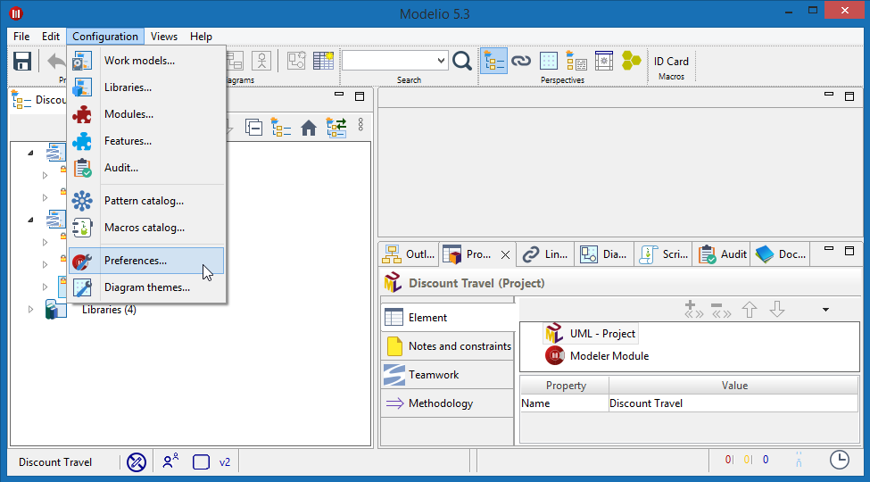
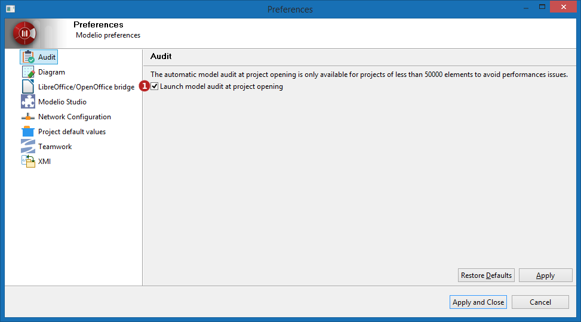
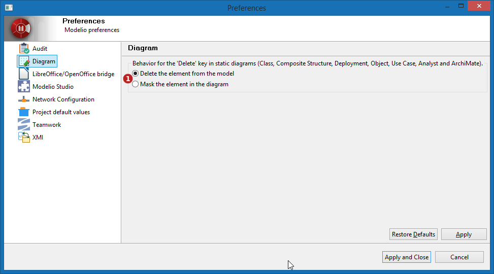
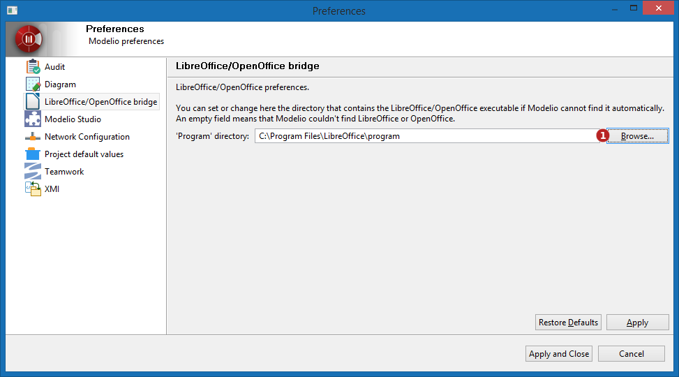
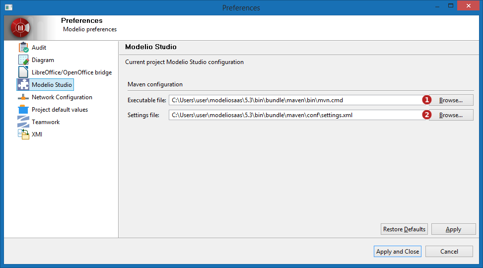
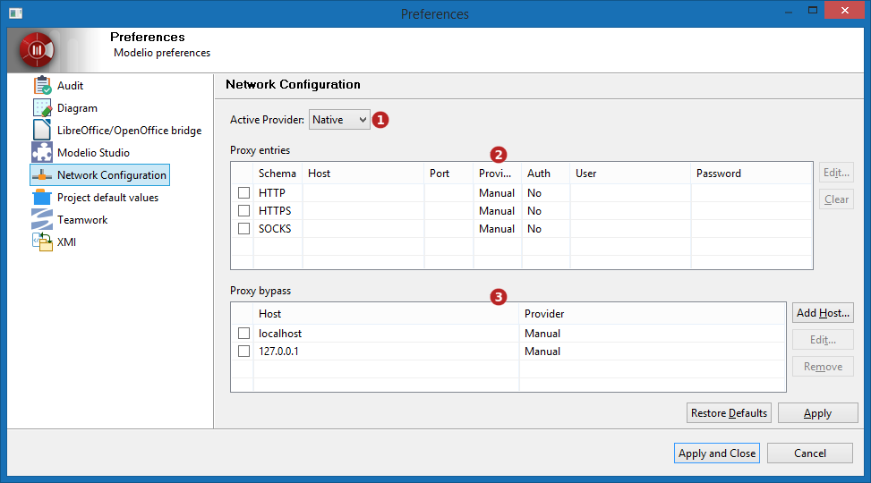
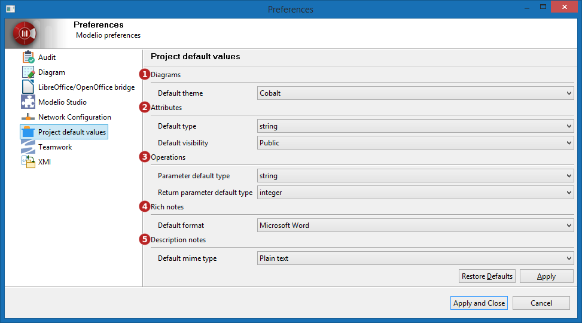
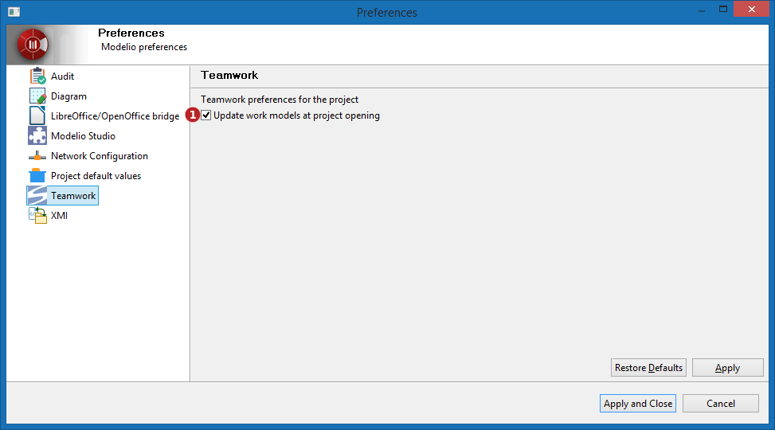
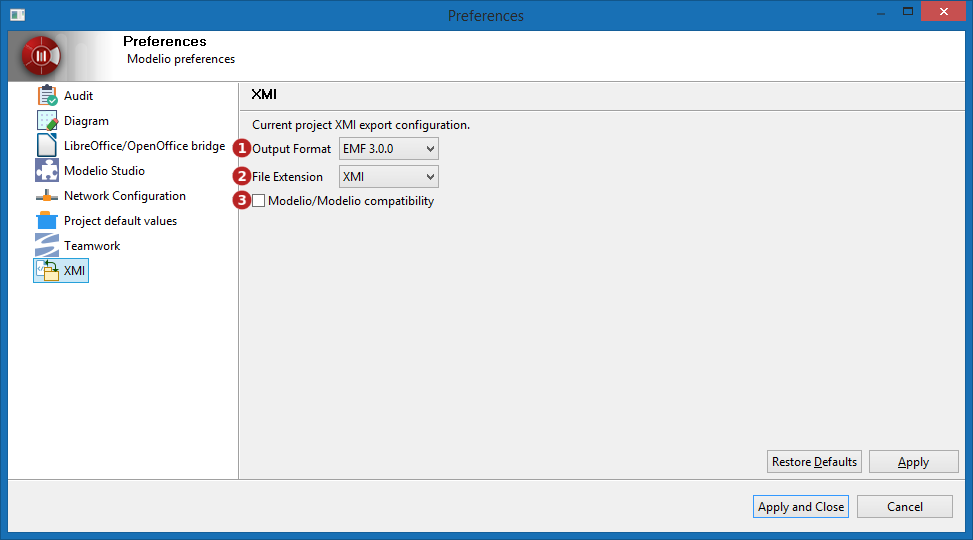

// Disable all captions for figures.
:!figure-caption:
// Path to the stylesheet files
:stylesdir: .

= Configuring project preferences

Additional parameters can be consulted or modified in the 'Preferences' window.

To access Modelio's preferences, go to 'Configuration > Preferences':

== Audit

*Keys:*

. Choose whether or not Modelio should launch a model audit at project opening

*Note:* this option is only available for projects of less than 50000 elements to avoid performances issues.

== Diagram

*Keys:*

. Choose which behavior Modelio should use when the 'Delete' key is used in a static diagram:
* Delete the element in the model and remove it from the diagram.
* Remove the element from the diagram only.

*Note:* this option is not taken into account in dynamics diagrams (Activity, Communication, State Machine, BPMN and Sequence). 

== LibreOffice/OpenOffice bridge

The LibreOffice/OpenOffice bridge preferences window.

Click on the ' _Browse_ ' button to change the path to the 'program' directory of the office suite.

== Modelio Studio

*Keys:*

. Choose the maven executable file to use when building custom modules.
. Define which maven settings file to use when building custom modules.+  
  The default file provided with Modelio references the modelio.org repositories for the current version of the application.

== Network configuration

*Keys:*

. Active Provider selector to choose from:
* Direct: if you don't need to use a proxy to connect.
* Manual: if you need to define manually the settings
* Native: if you want to use the OS settings.
. Proxy entries +
The table displays entries that are available for all providers. Checkboxes in the first column of the table indicate entries to be used for the currently selected provider.
When using Manual proxy provider there are three predefined schemas to set settings for: HTTP, HTTPS and SOCKS. Configuration for each schema is displayed in the Proxy entries table. To edit settings for a particular schema double-click the entry or select the entry and click Edit button. If Port field is left blank default port number will be used.
The list of default port numbers for each of the predefined schemas.
* HTTP : 80
* SSL : 443
* SOCKS : 1080
. Proxy bypass
Use this table to specify, either by name or pattern, which hosts should not use any proxy. A direct connection will always be used for matching hosts. Checkboxes in the first column of the table indicate entries to be used for the currently selected provider.

== Project default values

This page is used to define some default values for the new created elements:

. Diagrams: Defines the default theme for new diagrams.
. Attributes: Defines the default type and visibility for new attributes.
. Operations: Defines the default type for new operations parameters and return parameters.
. Rich Notes: Defines the default MIME type for new rich notes created via the spreadsheet editor.
. Description notes: Defines the default MIME type (either raw text or HTML) for Description notes.

== Teamwork

*Keys:*

. Choose whether or not Modelio should launch an update on all shared work models at project opening

== XMI

This page is used to define various options for the XMI import/export operations:

. Output format: Choose between a file compatible with the EMF 3.0.0 specification or the UML 2.1.1, UML 2.2, UML 2.3 or UML 2.4.1 specifications from the OMG.
. File extension: Specify the extension given to exported files (.xmi or .uml).
. Modelio/Modelio compatibility: Specifies whether or not maximum compatibility is activated when a re-import operation is run in Modelio.
