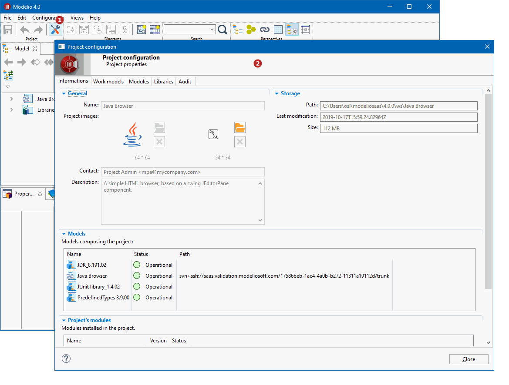

// Disable all captions for figures.
:!figure-caption:
// Path to the stylesheet files
:stylesdir: .

= Consulting project information

To get information about the opened project, open the 'Project configurator':

*Keys:*

1. Click on the image:images/attachment/modeliocom41/User_Documentation_en/Project_SaaS/Consulting_project_information_SaaS/ConsultingProjectInformation_002.png[ConsultingProjectInformation_002.png] ('Project configurator') button in the toobar
2. The page contains information about the project (Name and description, storage details, content, etc.)
