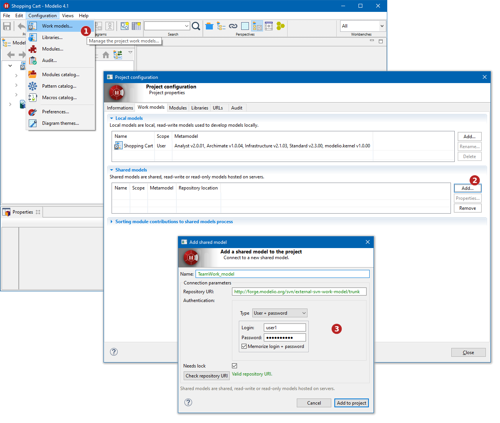

// Disable all captions for figures.
:!figure-caption:
// Path to the stylesheet files
:stylesdir: .

= Setting up a shared work model for teamwork activities

Preparing a model for teamwork is obviously the first action that has to be carried out. It will of course be run only once for each project, and is run directly from Modelio on the user workstation.

Shared Work models are managed in the work models tab of the Project configurator dialog.

It is the same procedure to connect to an existing shared model or to create a new one. The only requirement to create a new shared model on the repository is that the directory already exists on the repository (and of course the user must have sufficient rights to create the repository on the server)

To create a new shared model:

1.  Go to Configuration/Work models menu.
+
The Project configuration dialog then opens on the "Work models" tab
2.  In the "Shared models" section, click on the "Add..." button.
+
The shared model addition box then opens.
3.  Fill the dialog box fields:
* Give a name to the model
* Fill the URL of the model on the server.
+
Modelio supports _svn:_, _http_ : and _https_ : URLs to connect to a repository.
* Fill the authentication data if required
* Check the "locks needed" to enforce the uses of locks to modify model elements. See <<User_Documentation_en_Introducing_SVN_work_models_Lock_modes.adoc#,Locking modes>> for more informations.
* Confirm the creation.

If there was no work model on the repository yet, the repository is then initialized with an empty model. In the other case the repository work model is imported into the project.
