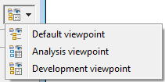
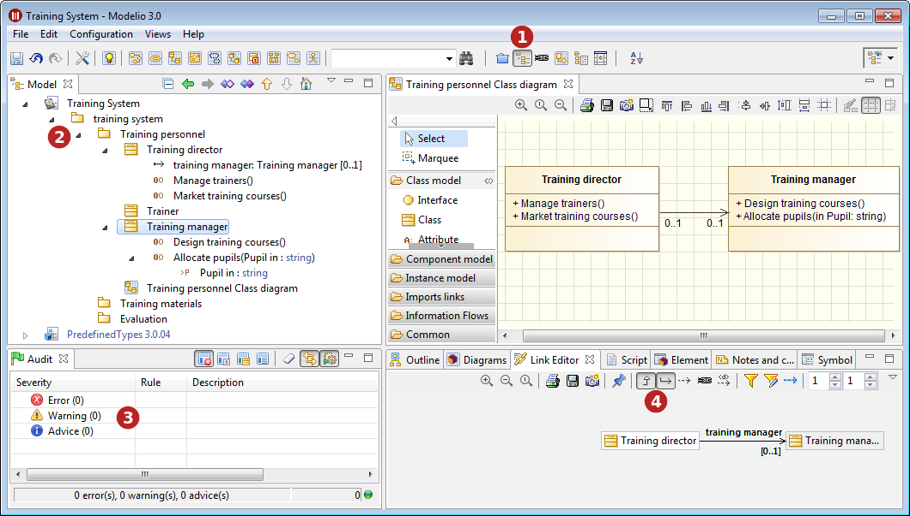
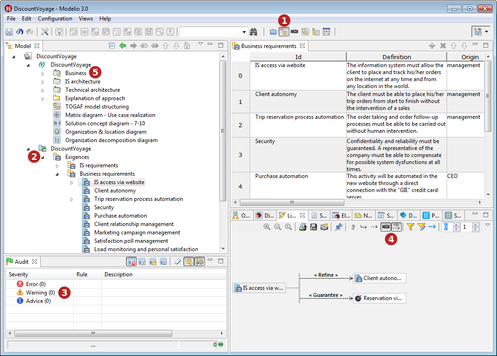
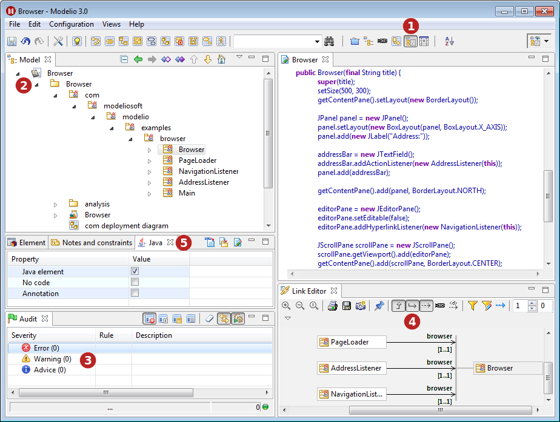

// Disable all captions for figures.
:!figure-caption:
// Path to the stylesheet files
:stylesdir: .

= Viewpoints

=== Introducing Modelio viewpoints

Modelio viewpoints provide users with a means of customizing the appearance and behavior of Modelio.

By selecting one of the available Modelio viewpoints, you can choose how you want the following elements to behave:

* Your project *perspective* : Perspectives define the set and layout of views displayed in Modelio, and according to the viewpoint you select, Modelio will automatically use a particular perspective.
* The *model browser* : Depending on the viewpoint you select, the model browser will display a particular set of elements.
* The *audit* : When you choose a viewpoint, the severity of certain Modelio audit rules will be altered (either "upgraded" or "downgraded") to better correspond to the work you will be carrying out.
* The *link editor* : The choice of a particular viewpoint will pre-select which type of links to show by default in the link editor view.
* *Modules* : Depending on the viewpoint you select, certain modules installed in your project will be activated or deactivated.

Three Modelio viewpoints are currently available:

* The <<#HSettingthecurrentviewpoint,*Default*>> viewpoint
* The <<User_Documentation_en_Viewpoints.adoc#,*Analysis*>> viewpoint
* The <<User_Documentation_en_Viewpoints.adoc#,*Development*>> viewpoint [[Choosing-a-viewpoint]]

=== Setting the current viewpoint

Use the viewpoint selection menu which is laid out on the right side of the Modelio main toolbar.

.Choosing a viewpoint

*Steps:*

1. In your project, click on the arrow on the right of the viewpoint selection field to open the viewpoint selection menu, and simply select the viewpoint of your choice.

*Note:* The icon displayed in the viewpoint selection field indicates which viewpoint is currently active.

=== The "Default" viewpoint

.The "Default" viewpoint

*Keys:*

1. The "Model" perspective is selected.
2. The model browser shows the UML model.
3. The severity of Modelio audit rules remains unchanged.
4. The link editor is configured to show inheritance links and associations.
5. No particular modules are activated or deactivated.

=== The "Analysis" viewpoint

.The "Analysis" viewpoint

*Keys:*

1. The "Model" perspective is selected.
2. The model browser shows the UML model and the Analyst model.
3. The severity of certain Modelio audit rules is altered (either "upgraded" or "downgraded") in order to provide help and advice which is adapted to analysis work.
4. The link editor is configured to show traceability links and dependencies.
5. All Modelio analysis modules installed in your project (for example, *TOGAF Architect* or *SysML Architect* ) are automatically activated, and all Modelio code generation modules installed in your project (for example, *Java Designer* or *C++ Designer* ) are automatically deactivated. [[The-ldquoDevelopmentrdquo-viewpoint]]

=== The "Development" viewpoint

.The "Development" viewpoint

*Keys:*

1. The "Development" perspective is selected.
2. The model browser shows the UML model.
3. The severity of certain Modelio audit rules is altered (either "upgraded" or "downgraded") in order to provide help and advice which is adapted to development work.
4. The link editor is configured to show inheritance links, associations and element imports.
5. All Modelio code generation modules installed in your project (for example, *Java Designer* or *C++ Designer* ) are automatically activated, and all Modelio analysis modules installed in your project (for example, *TOGAF Architect* or *SysML Architect* ) are automatically deactivated.
