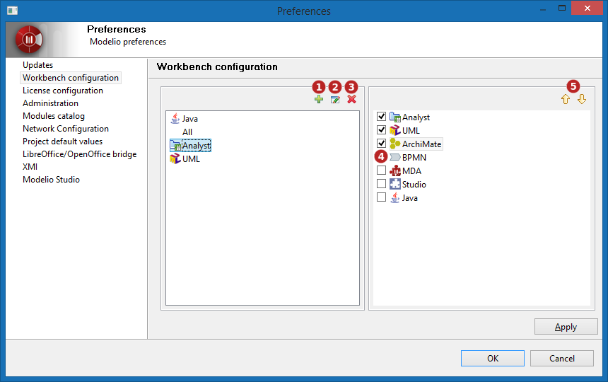
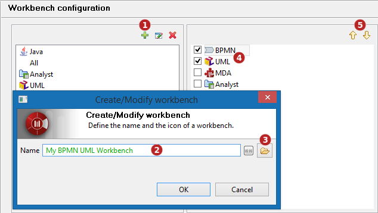
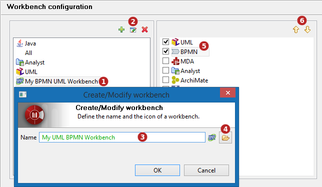
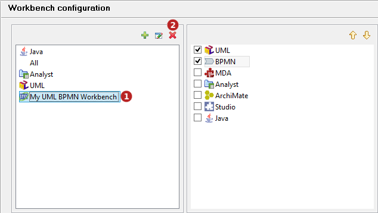

// Disable all captions for figures.
:!figure-caption:
// Path to the stylesheet files
:stylesdir: .

= Management of expertises

Modelio allows users to modify existing workbenches, and to create their own new workbenches.

== Managing workbenches

To add, modify, or remove a workbench, open the 'Configuration > Preferences...' menu and select 'Workbench configuration'.

.The 'Workbench configuration' window

*Keys:*

1. New workbench creation button
2. Workbench name and icon edition button
3. Workbench removal button
4. Workbench expertises activation (check boxes)
5. Workbench expertises sorting buttons

=== Workbench creation

*Steps:*

1. Click on the the  icon
2. Enter the workbench name (alpha-numeric characters only)
3. Optional yet recommended: choose an icon (size 16x16)
4. Select supported expertises among the available ones
5. Sort expertises to define their priority in the workbench if necessary

=== Workbench modification

*Steps:*

1. Select a workbench
2. Click on the  icon to modify the workbench name or icon
1. Edit the workbench name (alpha-numeric characters only)
2. Change the icon (size 16x16).
3. Select the supported expertises by checking the corresponding boxes in the right-hand panel
4. Sort the expertises

=== Removing a workbench

*Steps:*

1. Select a workbench in the left-hand panel
2. Click on the image:images/attachment/modeliocom41/User_Documentation_en/Workbenches/Manage_of_expertises/delete.png[delete.png] icon

*Note:* removing a workbench does not remove the expertises which remain available to configure other workbenches.
