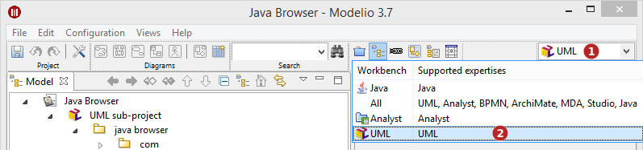
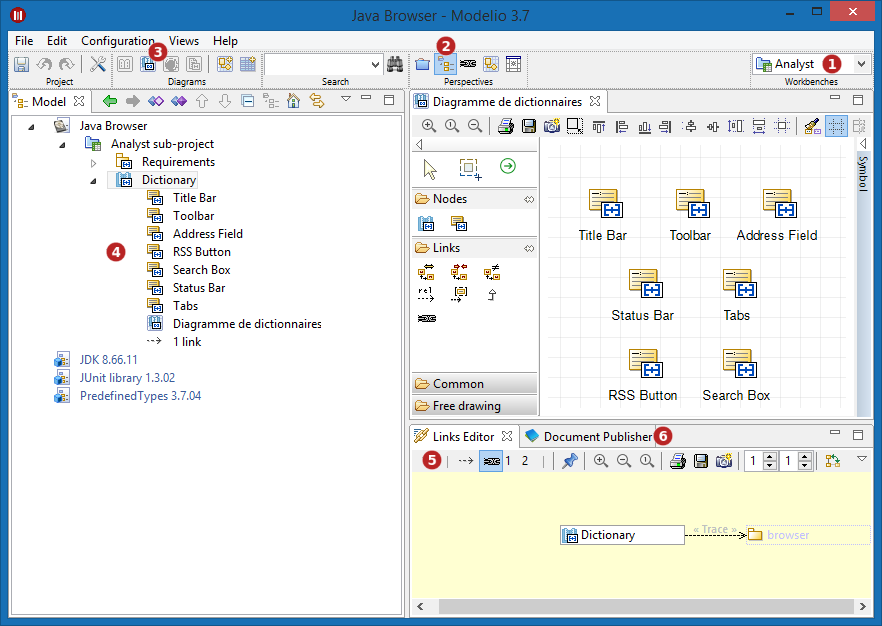
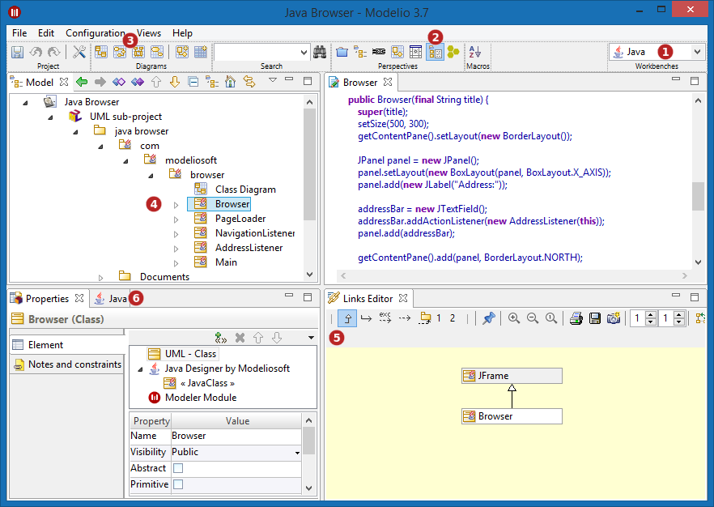

// Disable all captions for figures.
:!figure-caption:
// Path to the stylesheet files
:stylesdir: .

= Use of expertises

== Selecting a workbench

*Steps:*

1. Unfold drop-down menu. This menu lists the available workbenches, and for each of them, the supported expertises.
2. Select a workbench.

== Example

In the following example, we will switch workbenches from "Analyst" to "Java" (workbench that comes with the Java Designer module) and observe the changes that ensue.

===== Initial state - Current workbench is 'Analyst'

*Keys:*

1. The current workbench is 'Analyst'
2. The 'Model' perspective is selected by default
3. nly the 'Analyst' diagrams are proposed in the fast creation bar
4.  The model browser only shows the 'Analyst' elements, and their context menu only contains the corresponding commands
5. The link editor provides only links that are compatible with the 'Analyst' elements
6. The Document Publisher module is activated

===== Final state - the 'Java' workbench is activated

*Keys:*

1. The 'Java' workbench is activated.
2. The default perspective is 'Development'
3. Only diagrams that are relevant to the Java context are proposed in the fast creation bar
4. The model browser only shows the elements that are relevant in a Java context, and their context menu only contains the corresponding commands
5. The links editor only provides links that are useful in a Java context
6. The Java Designer module is activated, and the Document Publisher module has been deactivated
