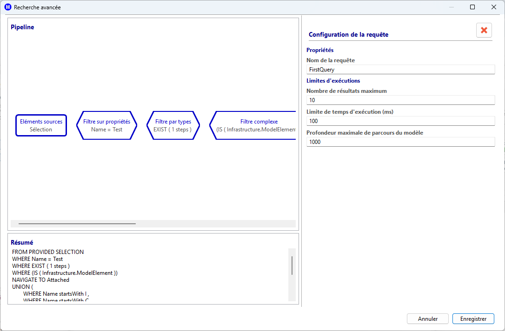
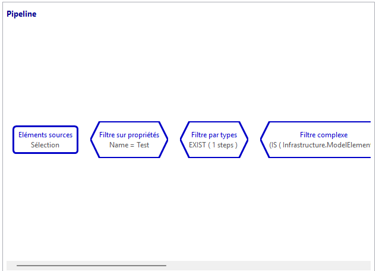
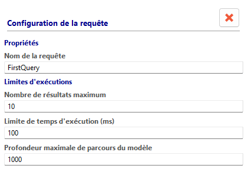
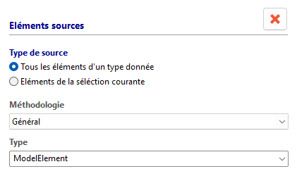
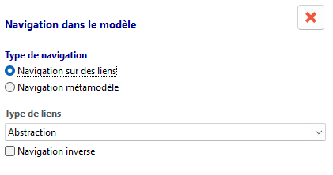
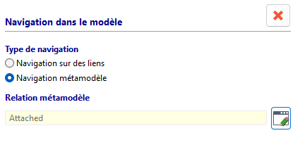
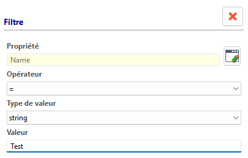
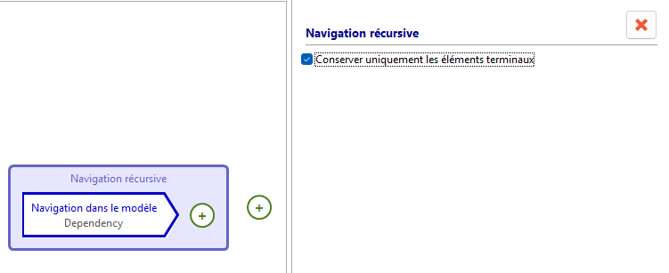
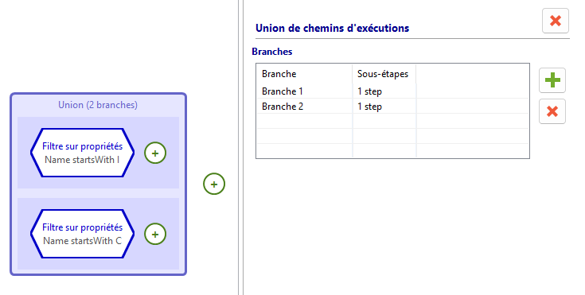

// Disable all captions for figures.
:!figure-caption:
// Path to the stylesheet files
:stylesdir: .

= Defining an MQL Query

== Introduction

The MQL Query Editor allows users to build and modify queries graphically.

It is based on a pipeline approach: the user defines a starting source and then chains together navigation, filtering, repetition, or branching steps until a coherent and executable search path is obtained.

== Functional Description

This query builder is organized into two main areas.

The left side contains the graphical pipeline and a summary area.

* The pipeline provides a visual representation of the source and the successive processing steps.
* The summary area displays a human-readable description of the query currently being built.

The right side contains a contextual properties panel whose content changes automatically according to the element selected in the pipeline.

If nothing is selected, the panel displays the general properties of the query, including its name and execution limits.

For example, when the source node is selected, the panel allows users to define how the query will be populated.

== How It Works

=== 1. Graphical Pipeline

The graphical pipeline is the core component of the query definition tool.

It visually represents the sequence of operations applied to model elements, from right to left.

* The *single mandatory source node* defines the starting point of the query.
* Step nodes represent the successive operations applied to the source.
* Insertion zones marked with an add symbol allow users to insert a new step into the main flow, an union branch, or the body of a repetition.
* Selecting a node controls the content displayed in the contextual properties panel on the right.
* A step can be deleted directly from the selected node.

[View of the MQL Pipeline]

=== 2. General Properties of an MQL Query

When no step node is selected, the tool displays the global configuration interface.

* The name field identifies the saved query.
* Limit fields allow users to control the maximum depth, maximum number of results, and maximum execution time.

This view defines the overall execution framework of the query.

=== 3. Defining the Source

When the source node is selected, a dedicated panel is displayed to define the origin of the elements to be processed.

* The *All elements of a type* mode allows users to select a metaclass as a global starting point.
* The *Provided source* mode indicates that input elements will come from the active selection within the Modelio environment.
* A metaclass selector allows users to refine the starting type when searching all elements of a given type.
* A message area displays diagnostics related to the source definition.

This panel is therefore used to precisely define the initial set of elements on which the query will operate.

=== 4. Navigation or Traversal

When a traversal step is selected, a navigation panel allows users to define how the query progresses through the model.

* A first mode is relationship-oriented, allowing the selection of a predefined relationship type.

* A second mode is model-oriented, allowing the selection or display of a metamodel relationship.

* A reverse direction option allows traversal of the relationship in the opposite direction.
* Help and error messages guide users when the navigation is not correctly defined.

This navigation mechanism describes how results propagate from one step to the next.

=== 5. Expression Filtering

When a filter step is selected, the expression panel allows users to build a selection condition.

* The filter may be simple, such as a property comparison.
* It may be type-based, such as a type test or a path existence test.
* It may also be composite, combining multiple conditions using logical operators.
* The content of the panel dynamically adapts to the type of expression being edited.

The purpose of this step is to reduce or qualify the intermediate results produced by the pipeline.

=== 6. Repetition

When a repetition step is selected, a dedicated panel allows users to configure a repeated traversal.

* An option controls whether results are emitted at each depth level or only at the final frontier.
* The repetition body may contain its own sub-steps.
* Internal sub-steps can themselves be selected and configured through the appropriate contextual panels.

This step makes it possible to express iterative traversals within the model.

=== 7. Union

When a union step is selected, a dedicated panel allows users to manage multiple parallel branches.

* Each branch represents a distinct sub-path.
* Users can add a new branch or remove an existing one.
* A branch table displays the existing branches and the number of steps contained in each.

This mechanism allows alternative traversal paths to be combined within a single query.

== Use Case

As part of a development project, the project manager wants to ensure that all requirements have been properly addressed.

In other words, every requirement should either have been decomposed into sub-requirements or be satisfied by another model element.

To verify this, we search for requirements that are not connected to any other model element—that is, requirements that have neither been decomposed nor satisfied.

The following figure illustrates the MQL query used to perform this search.

image::images/MQL_NoneRelatedRequirement.png[Query for Unrelated Requirements]

When executed on a simple model such as the one shown below:

image::images/query_MQL_model.png[Example Model]

The query returns only the requirement *Requirement3*.

image::images/MQL_Requete_result.png[Query Execution Result]
