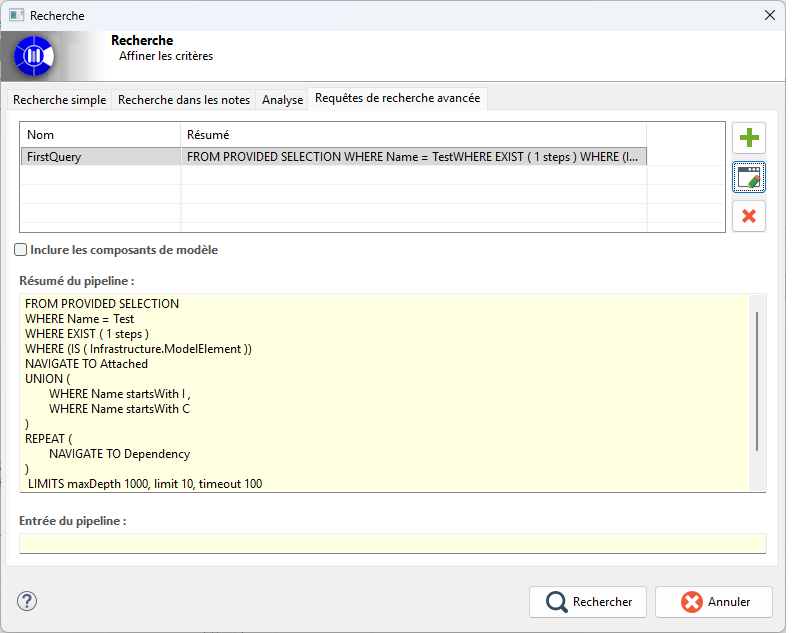

// Disable all captions for figures.
:!figure-caption:
// Path to the stylesheet files
:stylesdir: .

= MQL Query Search

== Introduction

The MQL Query Search feature allows users to save MQL search queries and execute them whenever needed.

== Interface Description

The tool is organized into two complementary sections.

The first section is the MQL Query Browser.

This view displays a table containing the saved queries, including at least their name and a functional summary of the pipeline.

Buttons located on the right side allow users to create a new query, edit the selected query, or delete it.

A checkbox also allows users to specify whether the search should include library elements (RAMC).

When a query is selected, a preview area displays its summary.

If the query expects input from the current model selection, an additional input area displays the currently selected elements.

These elements will be used as the input for query execution.

== How It Works

This interface is used to manage the lifecycle of previously defined MQL queries.

* The central table displays the list of available queries.
* The *Create* button opens a new link:Modeler-_modeler_handy_tools_MQL_definition.adoc[editor] with a default initialized query.
* The *Edit* button reloads the selected query into the graphical editor.
* The *Delete* button removes the query after confirmation.
* The preview panel provides a quick understanding of the query contents before execution.
* The input panel displays the current model selection when the query uses a *Selection-Based Source*.

This view is therefore primarily intended for query management, quick review, and launching query editing.

