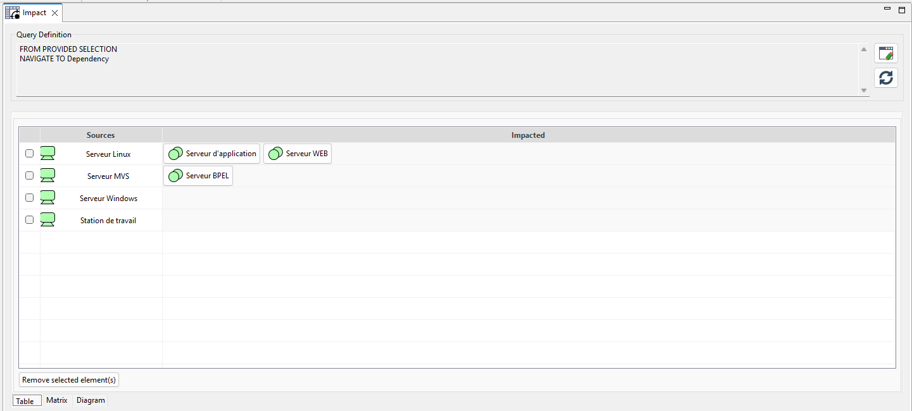
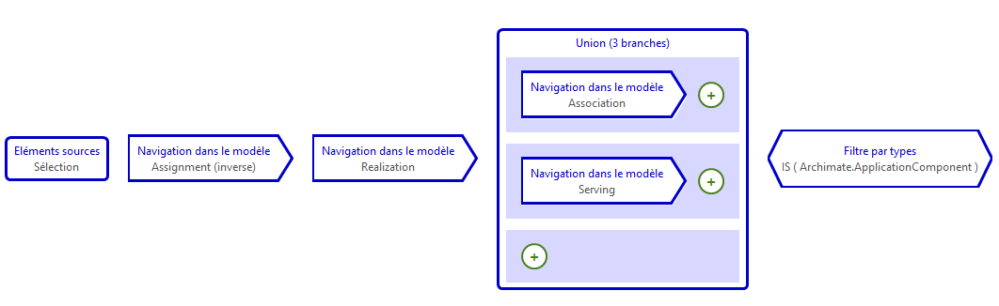
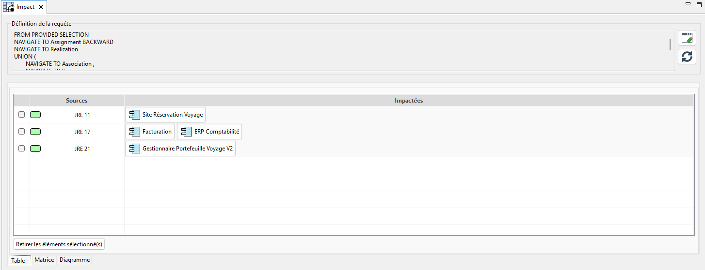
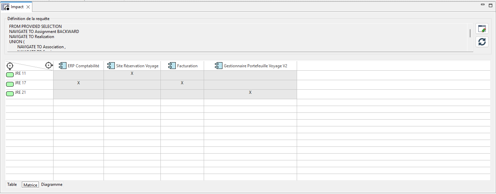
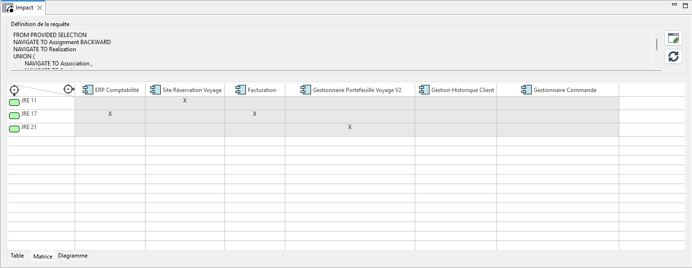

// Disable all captions for figures.
:!figure-caption:
// Path to the stylesheet files
:stylesdir: .

= Query-Based Impact Analysis

== Introduction

An impact analysis is an MQL query used to determine which elements of a model may be affected by modifications to one or more source elements.

This analysis executes a user-defined MQL query and presents the results in three complementary formats: a tabular list, a matrix view, and a propagation graph.

Each result visualization highlights a different aspect of the analysis.

== Functional Description

An impact analysis view is organized around three main concepts.

The first concept is the definition of the analysis sources- The user selects the model elements from which the MQL query will be executed.

These sources can be added by drag-and-drop from the model explorer or automatically preloaded when the analysis is created.

The second concept is the MQL query itself- An MQL query defines the relationship types to traverse, the traversal direction, and the element types to include in the results.

The query can be modified at any time and re-executed without changing the sources.

The third and final concept is result presentation- Elements identified as impacted are displayed through three tabs: Table, Matrix, and Diagram.

Each tab provides a different view of the same data, tailored to specific usage scenarios.

== Features

=== Analysis Configuration

The view allows users to define an analysis scope adapted to their needs.

Multiple independent analyses can coexist, each with its own sources and propagation rules.
Sources can be added or removed without resetting the query.
An existing analysis can be duplicated to create a variation with a different query.

=== Impacted Element Calculation

The execution engine computes the complete dependency graph from the defined sources and produces the full list of elements affected by the query.

All elements reachable according to the query are listed.
The computation is triggered manually using the Refresh button.

=== Identification of Sources for Each Impacted Element

For every impacted element, the view indicates which source(s) are responsible for the impact.

An element may be impacted by one or multiple sources simultaneously.
This information is available in the Table and Matrix tabs.

=== Visualization of Propagation Paths

The view traces the paths traversed between each source and impacted element.

Intermediate relationships are displayed in the Diagram tab.
Users can select a source to display only the paths originating from that source.

=== Scope Management

Users can modify the set of sources included in an analysis at any time.

A source is added by drag-and-drop from the model explorer.
A source is removed using the ✕ button in the Actions column of the Table tab.
Computation is only restarted on demand, allowing the scope to be adjusted before execution.

== Defining Propagation Rules

=== Role of the MQL Query

Each impact analysis is driven by an MQL query that determines which model relationships are traversed and in which direction- This query is the sole mechanism controlling the scope of the computation.

image::images/query_view_general.png[Specify the Rules]

=== Query Structure

==== Relationship Types

Users select the relationship types to traverse (usage, realization, association, deployment, etc.).
Each relationship type can be traversed in a specific direction: from source to target, or from target to source.
Propagation can be restricted to specific element types in order to limit the results.

==== Modification and Re-Execution

The query can be modified at any time using the Edit button in the Query Definition area.
After modification, users restart the computation using the Refresh button to update the results.
An existing analysis can be duplicated to test a query variation without losing the original version.

== Result Views

=== Overview

The results of an analysis are available through three tabs: Table, Matrix, and Diagram- These three views rely on the same computed data and complement each other depending on the desired level of detail.

=== Table Tab

The Table tab presents impacts as a detailed list.

For each source, impacted elements are listed individually.
Clicking an impacted element navigates directly to that element in the Modelio explorer.
Additional sources can be added by drag-and-drop from the explorer.

=== Matrix Tab

The Matrix tab presents impacts as a cross-reference table.

Sources are displayed as rows, impacted elements as columns.
An X marker is displayed at the intersection of a source and an impacted element.
This view allows comparison of impact coverage across multiple sources and helps identify the most exposed elements.

image::images/impact-matrix.png[Impact Analysis Matrix]

=== Diagram Tab

The Diagram tab displays propagation paths as a graph.

The left panel lists the analysis source elements.
The right panel displays the propagation graph for the selected source.
Clicking a source in the left panel centers the graph on that source.

image::images/impact-diagram.png[Impact Analysis Diagram]

== Step-by-Step User Guide

This section describes the steps required to create an impact analysis, define its propagation rules, and review its results.

=== Step 1 — Create the Analysis

- In the model explorer, right-click the element to analyze
(package, component, class, requirement, etc.).
- Select Create Impact from the context menu.

Modelio creates a new analysis- Its name is generated automatically (prefix Impact + unique suffix) and can be renamed from the explorer.

The direct child elements of the selected element are preloaded as sources in the Table tab- The analysis editor opens automatically.

=== Step 2 — Define the Propagation Query

The Query Definition area at the top of the editor displays a summary of the active query.

- Click Edit to open the MQL query editor.
- Define the propagation rules:

which relationship types to traverse (usage, realization, association, deployment, etc.),
in which direction to traverse them (source → target or target → source),
which element types to include in the results.
- Validate the query to return to the analysis editor.
- Add or remove sources as needed:
drag and drop an element from the explorer to add it,
use the ✕ button in the Actions column to remove a source.

=== Step 3 — Run the Analysis

Click Refresh in the Query Definition area.

Modelio executes the MQL query on all defined sources and populates the three result tabs.

=== Step 4 — Review the Results

==== Table Tab

The Table tab displays detailed results row by row:

[cols="1,4"]
|===
| Column | Content

| Actions
| ✕ button used to remove the corresponding source from the analysis.

| Sources
| The source element, with its icon and Modelio name.

| Impacted
| A clickable button for each impacted element.
Clicking a button navigates directly to that element in the Modelio explorer.
|===

==== Matrix Tab

The Matrix tab displays a cross-reference table: sources as rows, impacted elements as columns, with an X marker at active intersections.

This view makes it easy to compare impact coverage between multiple sources and identify the most exposed elements (columns containing the largest number of X markers).

==== Diagram Tab

The Diagram tab is divided into two panels:

Left panel: list of source elements included in the analysis.
Right panel: GEF graph representing propagation paths from the selected source.

Clicking a source in the left panel centers the graph on that source.

[TIP]
To compare multiple propagation strategies on the same scope, you can create several analyses (one per MQL query) and compare their results.

== Use Case

As part of maintaining a travel agency website, the IT department plans to migrate all JREs deployed on its servers to the latest LTS version.

To estimate the cost of such a migration, the lead architect performs an impact analysis to determine which application components may be affected by upgrading the deployed JREs.

The sources of the impact analysis are therefore the JREs deployed on one or more servers- Starting from these servers, the architect must identify the running application components as well as all connected components.

The MQL query is therefore defined as follows:

Once executed, the table displays all application components impacted by the migration.

The table allows visualization of which application components are impacted by each JRE version.

The matrix presents the same information in a more compact form.

It can even be enriched to provide a broader view.

Finally, the Diagram view provides a visual representation of the propagation path followed during the impact analysis computation.

image::images/impact_result_diagram.png[Impact Path for JRE 21]