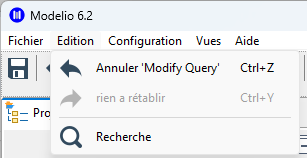
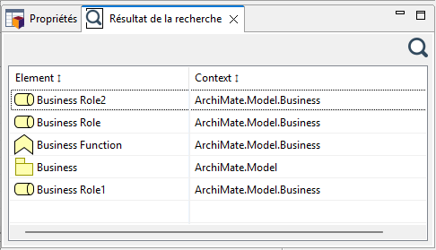

// Disable all captions for figures.
:!figure-caption:
// Path to the stylesheet files
:stylesdir: .

= Searching in Modelio

Modelio provides several ways to search for one or more elements. You can perform:

* A quick search using an element's name or identifier.
* link:./Modeler-_modeler_handy_tools_simple_search.adoc[A simple search] that filters elements according to their name, type, and properties.
* link:./Modeler-_modeler_handy_tools_notes_search.adoc[A notes search] that scans descriptions and documents associated with each element.
* link:./Modeler-_modeler_handy_tools_analyst_search.adoc[An Analyst search] that filters elements based on the values of their properties.
* link:./Modeler-_modeler_handy_tools_MQL_search.adoc[An *MQL* query search] that allows users to search, filter, and navigate through the model.

These different search types can be accessed through:

* The *Edit* menu:

* The application's dedicated search toolbar:

* And the *Search Results* view:

Regardless of their origin, search results are always displayed in a dedicated view named *Search Results*.

==== Quick Search

Modelio's Quick Search tool makes it easy to find elements in a model using only their name or identifier.

If no matching element is found, the link:./Modeler-_modeler_handy_tools_simple_search.adoc[Search dialog] is automatically opened.

If exactly one matching element is found, it is automatically selected in the explorer.

If several matching elements are found, they are displayed in the *Search Results* view.

The *Quick Search* feature also maintains a history of recent searches, allowing them to be easily executed again at any time.

