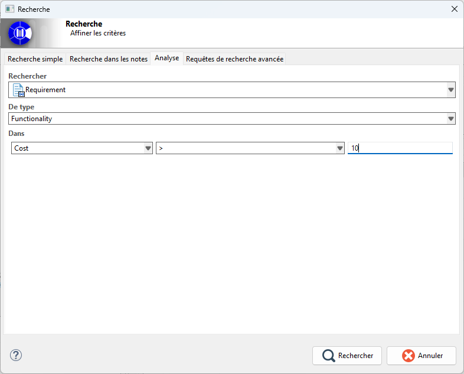
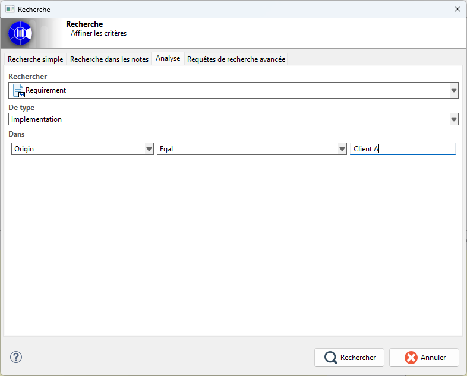

// Disable all captions for figures.
:!figure-caption:
// Path to the stylesheet files
:stylesdir: .

= Analyst Search

== Introduction

The Analyst Search interface allows users to quickly find Analyst model elements based on the textual content of their properties.

It provides an easy-to-use search mechanism that combines:

* the selection of an Analyst element type,
* the selection of a property table type,
* and the definition of a rule on one of the properties contained in that table.

== Search Interface

The first area is the input field used to specify the Analyst element type to search for. This field is the primary entry point of the search.

The second area allows users to select the property table associated with the Analyst element.

Finally, the third area allows users to define a constraint on one of the properties contained in the selected property table.

A drop-down list displays the properties available in the table. Users can then select a logical operator and enter a value to define the search expression.

== How It Works

=== 1. Element Type

This list is the primary entry point of the search.

* It allows users to specify the Analyst element type to search for (Requirement, Goal, Risk, etc.).

=== 2. Property Table

The second list allows users to select the property table used for the search.

This list is generated dynamically and corresponds to all property tables defined in the current project.

=== 3. Property Constraint Definition

The last section of the interface allows users to define a constraint on one of the Analyst element properties.

== Use Case

In an architecture model, each requirement contains metadata such as:

* a source: Customer A, ISO 27001 Standard, Security Team, etc.
* a version: v1.0, v1.2, v2.0, etc.
* a criticality level: High, Medium, Low

As the project evolves, these requirements may need to be reviewed, updated, or removed.

To prepare a review meeting with *Customer A*, the project manager wants to find all requirements whose source is equal to *Customer A*.

To achieve this, they perform an Analyst Search for all requirements typed by the *Implementation* property table and whose *Source* property is equal to *Customer A*.

